# **LR1110**

# **User Manual**

# **Table of Contents**

| 1. Ir | ntroduction                              | . 12 |
|-------|------------------------------------------|------|
|       | 1.1 Scope                                | . 12 |
|       | 1.2 Overview                             | . 12 |
| 2. S  | ystem Modes                              | . 14 |
|       | 2.1 Modes Description                    | . 14 |
|       | 2.1.1 Standby                            | . 14 |
|       | 2.1.2 Power Down                         | . 15 |
|       | 2.1.3 Sleep                              | . 15 |
|       | 2.1.4 RX Mode                            | . 17 |
|       | 2.1.5 TX Mode                            | . 17 |
|       | 2.1.6 FS Mode                            | . 18 |
|       | 2.1.7 GNSS Scanning Mode                 | . 18 |
|       | 2.1.8 Wi-Fi Passive Scanning Mode        | . 18 |
|       | 2.1.9 DSP Mode                           | . 18 |
|       | 2.2 Startup Sequence                     | . 18 |
|       | 2.3 Reset                                | . 18 |
|       | 2.3.1 Power-On-Reset and Brown-Out Reset | . 19 |
|       | 2.3.2 NRESET                             |      |
|       | 2.3.3 Reboot Command                     | . 19 |
|       | 2.4 Calibrations                         | . 19 |
|       | 2.4.1 CalibImage                         | . 20 |
|       | 2.4.2 Calibrate                          | . 20 |
|       | 2.5 GetVersion                           | . 21 |
|       | 2.6 Modes Transitions & Timings          |      |
| 3. H  | lost-Controller Interface                |      |
|       | 3.1 Write Commands                       |      |
|       | 3.2 Read Commands                        |      |
|       | 3.3 Status Registers                     |      |
|       | 3.3.1 Stat1                              |      |
|       | 3.3.2 Stat2                              |      |
|       | 3.4 BUSY                                 |      |
|       | 3.5 Errors                               |      |
|       | 3.5.1 GetErrors                          |      |
|       | 3.5.2 ClearErrors                        |      |
|       | 3.6 Memory Access                        |      |
|       | 3.6.1 WriteRegMem32                      |      |
|       | 3.6.2 ReadRegMem32                       |      |
|       | 3.6.3 WriteRegMemMask32                  |      |
|       | 3.6.4 WriteBuffer8                       |      |
|       | 3.6.5 ReadBuffer8                        |      |
|       | 3.6.6 ClearRxBuffer                      |      |
| 4 C   | PIOs                                     |      |
| r. U  | 4.1 Interrupts                           |      |
|       | 4.1.1 Description                        |      |
|       | 4.1.1 Description                        | . 50 |

| 4.1.2 Commands                         | 31 |
|----------------------------------------|----|
| 4.2 RF Switch Control                  | 33 |
| 4.2.1 SetDioAsRfSwitch                 | 33 |
| 4.3 Temperature Sensor                 | 34 |
| 5. Power Distribution                  | 35 |
| 5.1 Power Modes                        | 35 |
| 5.2 Over Current Protection            | 35 |
| 5.3 VBAT Measurement                   | 35 |
| 5.4 Power-On-Reset and Brown-Out-Reset | 36 |
| 5.5 Low Battery Detector               | 37 |
| 6. Clock Sources                       | 38 |
| 6.1 RC Oscillators Clock References    | 38 |
| 6.2 High-Precision Clock References    | 38 |
| 6.2.1 32.768 kHz Crystal               | 38 |
| 6.2.2 32 MHz Crystal                   | 39 |
| 6.2.3 32 MHz TCXO                      | 39 |
| 7. Sub GHz Radio                       | 41 |
| 7.1 Description                        | 41 |
| 7.2 Commands                           | 42 |
| 7.2.1 SetRfFrequency                   | 42 |
| 7.2.2 SetRx                            | 42 |
| 7.2.3 SetTx                            | 43 |
| 7.2.4 AutoTxRx                         | 43 |
| 7.2.5 SetRxTxFallbackMode              | 44 |
| 7.2.6 SetRxDutyCycle                   | 44 |
| 7.2.7 StopTimeoutOnPreamble            | 46 |
| 7.2.8 GetRssiInst                      | 47 |
| 7.2.9 GetStats                         | 47 |
| 7.2.10 ResetStats                      | 48 |
| 7.2.11 GetRxBufferStatus               | 48 |
| 7.2.12 SetRxBoosted                    | 49 |
| 8. Modems                              | 50 |
| 8.1 Modem Configuration                | 50 |
| 8.1.1 SetPacketType                    |    |
| 8.1.2 GetPacketType                    | 51 |
| 8.2 LoRa® Modem Description            |    |
| 8.2.1 LoRa® Modulation Principle       |    |
| 8.2.2 LoRa® Packet Format              |    |
| 8.2.3 Channel Activity Detection       |    |
| 8.3 LoRa® Commands                     |    |
| 8.3.1 SetModulationParam               |    |
| 8.3.2 SetPacketParam                   |    |
| 8.3.3 SetCad                           |    |
| 8.3.4 SetCadParams                     |    |
| 8.3.5 LoRaSynchTimeout                 |    |
| 8.3.6 SetLoRaPublicNetwork             |    |
|                                        |    |

| 8.3.7 GetPacketStatus                        | 59 |
|----------------------------------------------|----|
| 8.4 (G)FSK Modem Description                 | 59 |
| 8.4.1 (G)FSK Modulation Principle            | 59 |
| 8.4.2 (G)FSK Packet Engine                   | 60 |
| 8.4.3 (G)FSK Packet Format                   | 60 |
| 8.5 (G)FSK Commands                          | 62 |
| 8.5.1 SetModulationParam                     | 62 |
| 8.5.2 SetPacketParam                         | 64 |
| 8.5.3 SetGfskSyncWord                        | 66 |
| 8.5.4 SetPacketAdrs                          | 66 |
| 8.5.5 SetGfskCrcParams                       | 66 |
| 8.5.6 SetGfskWhitParams                      | 67 |
| 8.6 Data Buffer                              | 67 |
| 8.6.1 Data Buffer in Receive Mode            | 67 |
| 8.6.2 Data Buffer in Transmit Mode           | 69 |
| 8.7 RSSI Functionality                       | 69 |
| 9. Power Amplifiers                          | 71 |
| 9.1 PA Supply Scheme                         | 72 |
| 9.1.1 Low Power PA                           | 73 |
| 9.1.2 High Power PA                          | 73 |
| 9.2 PA Output Power                          | 74 |
| 9.2.1 Low Power PA                           | 74 |
| 9.2.2 High Power PA                          | 75 |
| 9.3 PA Current Consumption                   | 76 |
| 9.3.1 Low Power PA                           | 76 |
| 9.3.2 High Power PA                          | 78 |
| 9.4 Impedance Matching Networks              | 80 |
| 9.4.1 Multi-Band Operation                   | 80 |
| 9.4.2 RF Switch Implementation               |    |
| 9.4.3 Direct-Tie Implementation              |    |
| 9.5 Commands                                 |    |
| 9.5.1 SetPaConfig                            |    |
| 9.5.2 SetTxParams                            |    |
| 10. Wi-Fi Passive Scanning                   |    |
| 10.1 Principle Of Operation                  |    |
| 10.2 WifiScan                                |    |
| 10.3 Wi-Fi Passive Scanning Results          |    |
| 10.3.1 Wi-Fi Passive Scanning Result Formats |    |
| 10.3.2 Basic Result Format                   |    |
| 10.3.3 Full Result Format                    |    |
| 10.3.4 WifiGetNbResults                      |    |
| 10.3.5 WifiReadResults                       |    |
| 10.3.6 WifiResetCumulTimings                 |    |
| 10.3.7 WifiReadCumulTimings                  |    |
| 11. GNSS Scanning                            |    |
| 11.1 GNSS Geolocation System Overview        |    |
|                                              |    |

| 11.2 GNSS Principle Of Operation       | 95  |
|----------------------------------------|-----|
| 11.3 GNSS API Functions                | 96  |
| 11.3.1 SetGNSSConstellationToUse       | 96  |
| 11.3.2 GnssSetMode                     | 96  |
| 11.3.3 GnssAutonomous                  | 97  |
| 11.3.4 GnssAssisted                    | 97  |
| 11.3.5 GnssSetAssistancePosition       | 98  |
| 11.4 GNSS Scanning Results Description | 98  |
| 11.4.1 NAV Message Description         | 98  |
| 11.4.2 GnssGetResultSize Command       | 99  |
| 11.4.3 GnssReadResults                 | 100 |
| 11.4.4 GnssGetNbSvDetected             | 101 |
| 11.4.5 GnssGetSvDetected               | 101 |
| 11.4.6 GnssGetConsumption              | 102 |
| 11.5 GNSS Almanac                      | 102 |
| 11.5.1 Almanac Full Update             | 103 |
| 2. Crypto Engine                       | 105 |
| 12.1 Description                       | 105 |
| 12.2 Cryptographic Keys Definition     | 105 |
| 12.3 Commands                          | 107 |
| 12.3.1 CEStatus                        | 107 |
| 12.3.2 CryptoSetKey                    | 107 |
| 12.3.3 CryptoDeriveAndStoreKey         | 108 |
| 12.3.4 CryptoProcessJoinAccept         | 108 |
| 12.3.5 CryptoComputeAesCmac            | 109 |
| 12.3.6 CryptoVerifyAesCmac             | 110 |
| 12.3.7 CryptoAesEncrypt01              | 111 |
| 12.3.8 CryptoAesEncrypt                |     |
| 12.3.9 CryptoAesDecrypt                | 112 |
| 12.3.10 CryptoStoreToFlash             |     |
| 12.3.11 CryptoRestoreFromFlash         |     |
| 12.3.12 CryptoSetParam                 |     |
| 12.3.13 CryptoGetParam                 |     |
| 3. LR1110 Provisioning                 |     |
| 13.1 Description                       |     |
| 13.2 Provisioning Commands             |     |
| 13.2.1 GetDevEUI                       |     |
| 13.2.2 GetAppEUI                       |     |
| 13.2.3 ReadDevicePin                   |     |
| 14. Test Commands                      |     |
| 14.1 Regulatory Overview               |     |
| 14.1.1 ETSI                            |     |
| 14.1.2 FCC                             |     |
| 14.2 Commands                          |     |
| 14.2.1 SetTxCw                         |     |
| 14.2.2 SetTxInfinitePreamble           |     |
|                                        |     |

| 15. List Of Commands119                                 |  |
|---------------------------------------------------------|--|
| 15.1 Register / Memory Access Operations119             |  |
| 15.2 System Configuration / Status Operations119        |  |
| 15.3 Radio Configuration / Status Operations121         |  |
| 15.4 Wi-Fi Configuration / Status Operations123         |  |
| 15.5 GNSS Configuration / Status Operations124          |  |
| 15.6 CryptoElement Configuration / Status Operations124 |  |
| 16. Revision History126                                 |  |

# **List of Figures**

| Figure 1-1: LR1110 Block Diagram 12                                                 |  |
|-------------------------------------------------------------------------------------|--|
| Figure 2-1: LR1110 Modes and Transitions 14                                         |  |
| Figure 3-1: Write Command Timing Diagram 23                                         |  |
| Figure 3-2: Read Command Timing Diagram 23                                          |  |
| Figure 3-3: BUSY Timing Diagram 25                                                  |  |
| Figure 5-1: LR1110 POR and BRN Functions 37                                         |  |
| Figure 6-1: TCXO 39                                                                 |  |
| Figure 7-1: Sub-GHz Radio 41                                                        |  |
| Figure 7-2: LR1110 Current Profile During RX Duty Cycle Operation 45                |  |
| Figure 7-3: RX Duty Cycle Upon Preamble Detection 46                                |  |
| Figure 8-1: LoRa® /(G)FSK Command Order 50                                          |  |
| Figure 8-2: LoRa® Signal Bandwidth 52                                               |  |
| Figure 8-3: LoRa® Packet Format 53                                                  |  |
| Figure 8-4: Fixed-Length Packet 60                                                  |  |
| Figure 8-5: Variable-Length Packet 61                                               |  |
| Figure 8-6: (G)FSK Whitening 62                                                     |  |
| Figure 9-1: LR1110 Power Amplifiers 71                                              |  |
| Figure 9-2: PA Block Diagram 72                                                     |  |
| Figure 9-3: Low Power PA VR_PA Voltage vs. TxPower 73                               |  |
| Figure 9-4: High Power PA VR_PA Voltage vs. TxPower 74                              |  |
| Figure 9-5: Low Power PA Output Power vs. TxPower 75                                |  |
| Figure 9-6: HP PA Output Power vs. TxPower 76                                       |  |
| Figure 9-7: IDDTX vs TxPower, Low Power PA, DC-DC Configuration 77                  |  |
| Figure 9-8: IDDTX vs TxPower, Low Power PA, LDO Configuration 78                    |  |
| Figure 9-9: IDDTX vs TxPower, High Power PA, DC-DC Configuration 79                 |  |
| Figure 9-10: IDDTX vs TxPower, High Power PA, LDO Configuration 79                  |  |
| Figure 9-11: RF Switch, Double PA Operation 81                                      |  |
| Figure 9-12: RF Switch, Single PA Operation (High Power PA Example) 81              |  |
| Figure 9-13: Single Tie implementation: Only one PA Used (High Power PA Example) 81 |  |
| Figure 9-14: Single Tie implementation: Both PAs Used (High Power PA Example) 81    |  |
| Figure 10-1: Wi-Fi Passive Scanning Sequence 84                                     |  |
| Figure 11-1: GNSS System Overview 95                                                |  |
| Figure 11-2: NAV Message Format 99                                                  |  |
|                                                                                     |  |

# **List of Tables**

| Table 2-1: SetStandby Command                     |    |
|---------------------------------------------------|----|
| Table 2-2: SetSleep Command                       | 15 |
| Table 2-3: SleepConfig Parameter                  |    |
| Table 2-4: Sleep Mode Summary                     | 16 |
| Table 2-5: Reboot Command                         |    |
| Table 2-6: CalibImage Command                     |    |
| Table 2-7: ISM Band                               |    |
| Table 2-8: Calibrate Command                      | 20 |
| Table 2-9: CalibParams Command                    |    |
| Table 2-10: GetVersion Command                    |    |
| Table 2-11: GetVersion Response                   |    |
| Table 2-12: Mode Transitions                      |    |
| Table 3-1: Stat1                                  |    |
| Table 3-2: Stat2                                  |    |
| Table 3-3: GetErrors Command                      |    |
| Table 3-4: GetErrors Response                     |    |
| Table 3-5: ClearErrors Command                    |    |
| Table 3-6: WriteRegMem32 Command                  |    |
| Table 3-7: WriteRegMem32 Command (Cont.)          |    |
| Table 3-8: ReadRegMem32 Command                   |    |
| Table 3-9: ReadRegMem32 Response                  |    |
| Table 3-10: WriteRegMemMask32 Command             |    |
| Table 3-11: WriteRegMemMask32 Command(Cont.)      |    |
| Table 3-12: WriteBuffer8 Command                  |    |
| Table 3-13: ReadBuffer8 Command                   |    |
| Table 3-14: ReadBuffer8 Response                  |    |
| Table 3-15: ClearRxBuffer Command                 |    |
| Table 4-1: IrqToEnable Interruption Mapping       |    |
| Table 4-2: GetStatus Command                      |    |
| Table 4-3: SetDioIrqParams Command                |    |
| Table 4-4: ClearIrq Command                       |    |
| Table 4-5: SetDioAsRfSwitch Command               |    |
| Table 4-6: GetTemp Command                        |    |
| Table 4-7: GetTemp Response                       |    |
| Table 5-1: SetRegMode Command                     |    |
| Table 5-2: Power Regulation Options               |    |
| Table 5-3: GetVbat Command                        | 36 |
| Table 5-4: GetVbat Response                       |    |
| Table 6-1: ConfigLfClock Command                  |    |
| Table 6-2: SetTcxoMode Command                    |    |
| Table 6-3: TCXO Supply Voltage programming values |    |
| Table 7-1: SetRfFrequency Command                 |    |
| Table 7-2: SetRx Command                          |    |
| Table 7-3: SetTx Command                          |    |
| Table 7-4: AutoTxRx Command                       |    |
| Table 7-5: SetRxTxFallbackMode Command            |    |
| Table 7-6: SetRxDutyCycle Command                 |    |
| Table 7-7: StopTimeoutOnPreamble Command          |    |
| Table 7-8: GetRssilnst Command                    | 47 |

| Table 7-9: GetRssilnst Response                                        |    |
|------------------------------------------------------------------------|----|
| Table 7-10: GetStats Command                                           | 47 |
| Table 7-11: GetStats Response                                          | 47 |
| Table 7-12: ResetStats Command                                         |    |
| Table 7-13: GetRxBufferStatus Command                                  | 48 |
| Table 7-14: GetRxBufferStatus Response                                 | 48 |
| Table 7-15: SetRxBoosted Command                                       |    |
| Table 8-1: SetPacketType Command                                       | 50 |
| Table 8-2: GetPacketType Command                                       |    |
| Table 8-3: GetPacketType Response                                      |    |
| Table 8-4: SetModulationParam Command                                  |    |
| Table 8-5: Spreading Factor                                            | 55 |
| Table 8-6: LoRa® Modulation Bandwidth                                  | 55 |
| Table 8-7: Coding Rate                                                 |    |
| Table 8-8: LowDataRateOptimize                                         | 56 |
| Table 8-9: SetPacketParam Command                                      | 56 |
| Table 8-10: SetCad Command                                             | 57 |
| Table 8-11: SetCadParams Command                                       | 57 |
| Table 8-12: CadExitMode Parameter Definition                           | 58 |
| Table 8-13: LoRaSynchTimeout Command                                   |    |
| Table 8-14: SetLoRaPublicNetwork                                       |    |
| Table 8-15: GetPacketStatus Command                                    | 59 |
| Table 8-16: GetPacketStatus Response                                   |    |
| Table 8-17: SetModulationParam Command                                 | 62 |
| Table 8-18: PulseShape Parameter                                       |    |
| Table 8-19: Bandwidth Parameter                                        | 63 |
| Table 8-20: SetPacketParam Command                                     |    |
| Table 8-21: PblDetect: Preamble Detector Length                        |    |
| Table 8-22: AddrComp                                                   | 65 |
| Table 8-23: PacketType                                                 |    |
| Table 8-24: CrcType                                                    | 65 |
| Table 8-25: Whitening                                                  | 65 |
| Table 8-26: SetGfskSyncWord Command                                    |    |
| Table 8-27: SetPacketAdrs Command                                      | 66 |
| Table 8-28: SetGfskCrcParams Command                                   | 66 |
| Table 8-29: SetGfskWhitParams Command                                  | 67 |
| Table 8-30: GetRxBufferStatus Command                                  | 68 |
| Table 8-31: GetRxBufferStatus Response                                 | 68 |
| Table 8-32: ReadBuffer8 Command                                        | 68 |
| Table 8-33: ReadBuffer8 Response                                       | 68 |
| Table 8-34: ClearRxBufferStatus Command                                |    |
| Table 8-35: WriteBuffer8 Command                                       | 69 |
| Table 8-36: RSSI Information Origin and Meaning                        | 69 |
| Table 9-1: Optimized Settings for LP PA with the Same Matching Network | 80 |
| Table 9-2: Optimized Settings for HP PA with the Same Matching Network | 80 |
| Table 9-3: SetPaConfig Command                                         | 82 |
| Table 9-4: DutyCycle Parameter                                         | 82 |
| Table 9-5: SetTxParams Command                                         | 82 |
| Table 9-6: RampTime                                                    | 83 |
| Table 10-1: WifiScan Command                                           | 85 |
| Table 10-2: Basic Results Format per MAC Address                       | 87 |
| Table 10-3: Full Results Format per MAC Address                        | 88 |
| Table 10-4: Wi-Fi DatarateID Field                                     | 88 |
| Table 10-5: Wi-Fi Channel ID Field                                     | 89 |
|                                                                        |    |

| Table 10-6: Wi-Fi MacValidation Field               | 89  |
|-----------------------------------------------------|-----|
| Table 10-7: Wi-Fi Frame Control Field               | 89  |
| Table 10-8: SubType Description                     | 90  |
| Table 10-9: WifiGetNbResults Command                | 91  |
| Table 10-10: WifiGetNbResults Response              | 91  |
| Table 10-11: WifiReadResults Command                | 91  |
| Table 10-12: WifiReadResults Response               | 91  |
| Table 10-13: WifiResetCumulTimings Command          |     |
| Table 10-14: Wi-Fi Cumulative Timings Description   |     |
| Table 10-15: WifiReadCumulTimings Command           |     |
| Table 10-16: WifiReadCumulTimings Response          | 93  |
| Table 11-1: GnssSetConstellationToUse               |     |
| Table 11-2: GnssSetMode                             | 96  |
| Table 11-3: GnssAutonomous Command                  |     |
| Table 11-4: GnssAssisted Command                    |     |
| Table 11-5: GnssSetAssistancePosition Command       |     |
| Table 11-6: GnssGetResultSize Command               |     |
| Table 11-7: GnssGetResultSize Response              |     |
| Table 11-8: GnssReadResults Command                 |     |
| Table 11-9: GnssReadResults Response                |     |
| Table 11-10: GnssGetNbSvDetected Command            |     |
| Table 11-11: GnssGetNbSvDetected Response           |     |
| Table 11-12: GnssGetSvDetected Command              |     |
| Table 11-13: GnssGetSvDetected Response             |     |
| Table 11-14: GnssGetConsumption Command             |     |
| Table 11-15: GnssGetConsumption Response            |     |
| Table 11-16: GnssAlmanacFullUpdate                  |     |
| Table 11-17: AlmanacFullUpdatePayload               |     |
| Table 11-18: AlmanacHeader                          |     |
| Table 11-19: SvAlmanac Format                       |     |
| Table 12-1: Cryptographic Keys Usage and Derivation |     |
| Table 12-2: CryptoSetKey Command                    |     |
| Table 12-3: CryptoSetKey Response                   |     |
| Table 12-4: CryptoDeriveAndStoreKey Command         |     |
| Table 12-5: CryptoDeriveAndStoreKey Response        |     |
| Table 12-6: CryptoProcessJoinAccept Command         |     |
| Table 12-8: CryptoComputeAesCmac Command            |     |
|                                                     |     |
| Table 12-9: CryptoComputeAesCmac Response           |     |
| Table 12-7: CryptoProcessJoinAccept Response        |     |
| Table 12-10: CryptoComputeAesCmac Command Example   |     |
| Table 12-11: CryptoComputeAesCmac Response Example  |     |
| Table 12-12: CryptoVerifyAesCmac Command            |     |
| Table 12-13: CryptoVerifyAesCmac                    |     |
| Table 12-14: CryptoAesEncrypt01 Command             |     |
| Table 12-15: CryptoAesEncrypt01 Response            |     |
| Table 12-16: CryptoAesEncrypt Command               |     |
| Table 12-18: CryptoAesDecrypt Command               |     |
| Table 12-19: CryptoAesDecrypt Response              |     |
| Table 12-17: CryptoAesEncrypt Response              |     |
| Table 12-20: CryptoStoreToFlash Command             |     |
| Table 12-21: CryptoAesDecrypt Response              |     |
| Table 12-22: CryptoRestoreFromFlash Command         |     |
| Table 12-23: CryptoRestoreFromFlash Response        |     |
| Table 12-24: CryptoSetParam Command                 | 114 |

Rev.1.0

March 2020

| Table 12-25: CryptoSetParam Response                         |     |
|--------------------------------------------------------------|-----|
| Table 12-26: CryptoGetParam Command                          | 114 |
| Table 12-27: CryptoGetParam Response                         |     |
| Table 13-1: GetDevEUI Command                                |     |
| Table 13-2: GetDevEUI Response                               | 115 |
| Table 13-3: GetAppEUI Command                                | 116 |
| Table 13-4: GetAppEUI Response                               |     |
| Table 13-5: ReadDevicePin Command                            |     |
| Table 13-6: ReadDevicePin Response                           |     |
| Table 14-1: ETSI Test Signals                                |     |
| Table 14-2: SetTxCw Command                                  |     |
| Table 14-3: SetTxInfinitePreamble Command                    |     |
| Table 15-1: Register / Memory Access Operations              |     |
| Table 15-2: System Configuration / Status Operations         | 119 |
| Table 15-3: Radio Configuration / Status Operation           |     |
| Table 15-4: Wi-Fi Scanning Configuration / Status Operations |     |
| Table 15-5: GNSS Scanning Configuration / Status Operations  | 124 |
| Table 15-6: CryptoElement Configuration / Status Operations  | 124 |
| Table 16-1: Revision History                                 | 126 |
|                                                              |     |

# 1. Introduction

# 1.1 Scope

This document aims at providing complete information on how to use the LR1110 transceiver in an application. It covers both hardware and software aspects. For a definition of the LR1110 functionalities and circuit specifications, please refer to the LR1110 Datasheet.

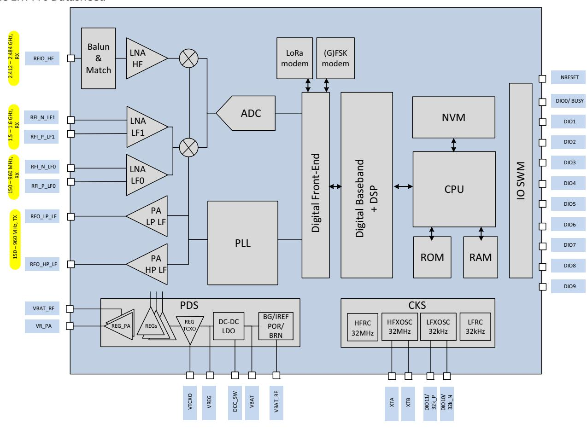

Figure 1-1: LR1110 Block Diagram

# 1.2 Overview

LR1110 is a long range, ultra-low power transceiver aimed to enhance LoRa®-based geolocation applications. It supports LoRa® and (G)FSK modulations for LPWAN use cases. The device is highly configurable over the 150MHz-960MHz ISM bands to meet different application requirements utilizing the global LoRaWAN® standard or proprietary protocols.

Besides the world-wide sub-GHz transceiver capabilities, the device feature a very low power multi-band front-end that can acquire several signals of opportunity for geolocation purposes (802.11b/g/n Wi-Fi AP MAC addresses, GNSS (GPS, BeiDou) satellites signals). The acquired information is transmitted using a LPWAN network to a geolocation server, which computes the position of the object.

LR1110 is optimized for low power and long battery life applications requiring indoor and outdoor geolocation. Its efficient Wi-Fi and GNSS geolocation capabilities, coupled with highly optimized detection algorithms, allow achieving a geolocation at a fraction of the power needed by existing solutions on the market.

# **2. System Modes**

# **2.1 Modes Description**

The different LR1110 operating modes are shown in [Figure 2-1: LR1110 Modes and Transitions](#page-13-3) hereafter:

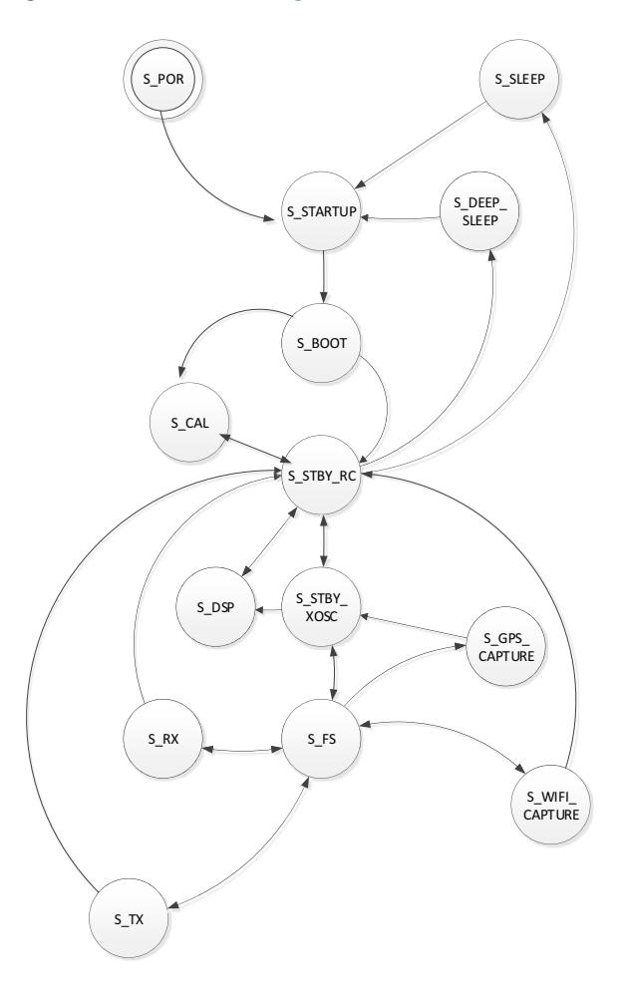

**Figure 2-1: LR1110 Modes and Transitions**

# **2.1.1 Standby**

This mode is the default mode of the LR1110: it is the return state from all the other modes (expect for specific fallback options), and the mode from which the transitions to the other modes are possible. All the commands to configure the device should be issued in this mode.

Two clocks are available for the system: either the internal 32MHz RC oscillator (Standby RC mode), or an external 32MHz crystal/TCXO (Standby Xosc mode). The RC clock is used by default for all the automatic mode transitions. The crystal/TCXO clock allows faster transitions to other modes at the expense of a higher power consumption.

The command SetStandby( ) sets the device in standby mode with the chosen 32MHz oscillator.

**Table 2-1: SetStandby Command**

| Byte           | 0     | 1     | 2                |  |
|----------------|-------|-------|------------------|--|
| Data from Host | 0x01  | 0x1C  | StdbyConfig      |  |
| Data to Host   | Stat1 | Stat2 | IrqStatus(31:24) |  |

- **•** StdbyConfig = 0x00 selects the internal RC oscillator (Standby RC mode).
- **•** StdbyConfig = 0x01 selects the external Xtal/TCXO oscillator (Standby Xosc mode).

# **2.1.2 Power Down**

This is the lowest power consumption mode of the device. In this mode, all clocks are stopped, and therefore no RTC is available. Moreover, there is no data retention which means that a device reconfiguration is necessary when leaving the power down mode. The BUSY signal is set to high in this mode, indicating to the host that the device is not ready to accept a command.

The device is put in power down mode with the SetSleep( ) command (refer to sleep mode description).

The device can exit this mode based on the detection of an event on a DIOs, or NSS pin. Exiting this mode, the device will perform a firmware restart. When the BUSY pin is set to low, it indicates that the startup phase has been performed successfully, and that the device is ready to accept a command.

# **2.1.3 Sleep**

The Sleep mode allows configuring the LR1110 into a low power consumption mode between radio or geolocation operations, while retaining the configuration register values and storing the firmware data in RAM.

An optional 32 kHz source is running either on the internal RC oscillator, or on the internal 32.768 kHz oscillator driving an external crystal. The 32.768kHz crystal oscillator allows a faster transition to standby mode, at the expense of higher power consumption. In both cases, the RTC uses the 32kHz clock source to allow an automatic wake-up from the Sleep mode.

The command SetSleep( ) allows putting the device in Powerdown and Sleep mode, and configuring the timeout for automatic wake-up.

**Table 2-2: SetSleep Command**

| Byte           | 0     | 1     | 2                    | 3                    | 4                    | 5                   | 6                  |
|----------------|-------|-------|----------------------|----------------------|----------------------|---------------------|--------------------|
| Data from Host | 0x01  | 0x1B  | SleepConfig          | SleepTime (31:24) | SleepTime (23:16) | SleepTime (15:8) | SleepTime (7:0) |
| Data to Host   | Stat1 | Stat2 | IrqStatus (31:24) | IrqStatus (23:16) | IrqStatus (15:8)  | IrqStatus (7:0)  | 0x00               |

**Table 2-3: SleepConfig Parameter**

| SleepConfig bit | bit 7 | bit 6 | bit 5 | bit 4 | bit 3 | bit 2 | bit 1  | bit 0     |
|-----------------|-------|-------|-------|-------|-------|-------|--------|-----------|
| Definition      | RFU   | RFU   | RFU   | RFU   | RFU   | RFU   | Wakeup | Retention |

- **•** The SleepConfig bits define in which sleep mode the device is put, and if it wakes up after a given time on the RTC event:
  - Retention bit (bit 0) defines if the device configuration and the firmware data are retained.
    - Retention=1: 8 kB of memory used for device state and firmware data retention.
    - Retention=0: no data retention.
  - Wakeup bit (bit 1) determines if the device wakes up after a given time on the RTC event.
    - Wakeup=1: automatic wake-up enabled. The device will automatically go in Standby mode with RC oscillator, at the end of the SleepTime timer. The 32 kHz clock source is configured using the command ConfigLFclock ( ) for modem applications.
    - Wakeup=0: automatic wake-up disabled.
  - Other bits are RFU and should be set to 0.
- **•** SleepTime: sleep time in number of 32.768 kHz clock cycles, prior to automatic wake-up. Therefore, the sleep time can vary from 0 ms to 36.4 hours in steps of 30.52us.

BUSY is set to 1 in sleep mode.

The device can exit this mode based on the detection a falling edge on the NSS pin. Exiting this mode, the device will perform a firmware restart. When the BUSY pin is set to low, it indicates that the startup phase has been performed successfully, and that the device is ready to accept a command.

The following table summarizes the different sleep modes according to the Retention and Wakeup bits configuration, with their current consumption and Standby transitions times (indicative values, for comparison only).

**Table 2-4: Sleep Mode Summary**

| Retention | Wakeup | Datasheet              | Indicative Consumption (uA) RC /XTAL | Indicative Transition to Stby (ms) |
|-----------|--------|------------------------|-----------------------------------------|---------------------------------------|
| 0         | 0      | Powerdown              | IDDPDN                                  | 30                                    |
| 0         | 1      | Sleep                  | IDDSL1 / IDDSL2                         | 30                                    |
| 1         | 0      | -                      | -                                       | -                                     |
| 1         | 1      | Sleep w/ 8kB retention | IDDSL3A / IDDSL4A                       | <1                                    |

The mode Retention=1 and Wakeup=0 is a valid usage mode, but does not correspond to any datasheet description.

# **2.1.4 RX Mode**

The RX mode allows the reception of incoming RF packets on the RFI\_N\_LF0/RFI\_P\_LF0 pins in the sub-GHz band (150-960MHz), using one the modems (LoRa® and (G)FSK). The device enters the RX mode using the command SetRx( ). At packet reception, an RX\_DONE interrupt is generated, and the received data is stored in the device data buffer. The RX operation can be automatically terminated after a packet reception, duty-cycled, or infinite based on the application requirements.

While in RX mode, the LR1110 can operate in different sub-modes:

- **•** In continuous mode, the device remains in RX mode and looks for incoming packets until the host requests a different mode.
- **•** In single mode, the device returns automatically to a configured mode (to Standby RC by default) after a packet reception only.
- **•** In single with timeout mode, the device returns automatically to a configured mode (to Standby RC by default) after a packet reception or after the given timeout time. If a sync word (G)FSK or a LoRa® header is detected, the timeout is stopped.
- **•** In RX Duty Cycle mode, the device goes periodically into RX mode to receive a packet before going back to Sleep mode, until a packet was received. The used clock source for the RTC has to be configured with a command before entering the Duty Cycle mode.
- **•** In AutoTx mode (auto transmit one packet after a given time on packet reception), the device goes into an intermediary mode for the requested time after a packet reception, before entering TX mode for the transmission of the packet.

# **2.1.5 TX Mode**

The TX mode allows the transmission of RF packets using the selected sub-GHz PA on the RFO\_LP\_LF or RFO\_HP\_LF pins in the sub-GHz band (150-960MHz), using the modems (LoRa® and (G)FSK).

After ramping-up the PA, the LR1110 transmits the data buffer at the given frequency, PA, output power and packet and modulation configurations. When the last bit of the packet has been sent, a TX\_DONE interrupt is generated, the PA regulator is ramped down, the selected PA is switched OFF and the device goes back to Standby RC or Xosc modes, depending on the FallBackMode configuration.

In TX mode, BUSY will go low as soon as the PA has ramped-up and transmission of the preamble starts.

While in TX mode, the LR1110 can operate in different sub-modes:

- **•** In single mode, the device returns automatically to a configured mode (to Standby RC by default) after a packet transmission.
- **•** In single mode with timeout, the device returns automatically to a configured mode (to Standby RC by default)) after the transmission of the packet or after the given timeout.
- **•** In AutoRX mode, the device goes into an intermediary mode for the requested time after a packet transmission, before entering RX mode for reception of one packet or until the configured timeout.
- **•** In Continuous Wave mode (CW mode), the device indefinitely transmits the carrier frequency until another command is issued to change the mode.
- **•** In Infinite preamble mode: the device indefinitely transmits an infinite preamble of the configured modulation.

# **2.1.6 FS Mode**

The Frequency Synthesis (FS) mode is an intermediate mode between the standby mode and the RX or TX modes, where the PLL and the associated regulators are switched on. BUSY goes low as soon as the PLL is locked.

# **2.1.7 GNSS Scanning Mode**

The GNSS scanning mode allows to detect GPS and BeiDou signals on the RFI\_N\_LF1 and RFI\_P\_LF1 pins for outdoor geolocation. The satellite data is then extracted and processed by the integrated DSP. At the end of the satellite data processing, the BUSY signal returns to low, indicating that the GNSS scanning data is available to the host controller. The processing result can then be transmitted to a geolocation server using a LPWAN network to compute the device position.

Different GNSS scanning sub-modes are available, depending on the availability of almanac data and assistance information. Refer to the section [11. GNSS Scanning](#page-93-2) for more details.

# **2.1.8 Wi-Fi Passive Scanning Mode**

The Wi-Fi Passive Scanning mode allows the detection of Wi-Fi signals (802.11b, g, or n) from access points in the proximity of the device on the RFIO\_HF pin. The Wi-Fi signal is processed by the integrated DSP, and the available MAC Addresses are extracted. At the end of the Wi-Fi signal processing, the BUSY signal returns to low, indicating that the MAC addresses are available to the host controller and ready to be sent to a geolocation server using a LPWAN network to compute the device position.

# **2.1.9 DSP Mode**

LR1110 geolocation functions require processing of the Wi-Fi or GNSS environment captures. In this mode, only the DSP and the associated regulators are kept active in order to minimize the power consumption.

# **2.2 Startup Sequence**

At power-up or after a reset, the device initiates its startup phase. The BUSY pin is set to high, indicating that the device is busy and cannot accept a command. When the power management unit and the RC oscillator become available, the embedded CPU starts and executes the internal firmware. At the end of the startup sequence, the device is set in Standby RC mode, the BUSY signal goes down and the device is ready to accept commands.

# **2.3 Reset**

Three reset sources are available to trigger a LR1110 restart, executing the startup sequence: Power-On-Reset / Brown-Out Reset (POR/BRN), NRESET, and Reboot( ) command.

The BUSY signal is kept high during each one of the reset procedures, and returns to low when the restart procedure is finished, and when the device is ready to accept commands. At the end of the restart procedure, the device goes into Standby mode with RC oscillator on. The whole device context is lost during this operation, and the device shall be re-configured. The calibrations shall also be re-launched.

POR/BRN and NRESET also trigger an authentication of the internal firmware. The transition time to STBY\_RC is then approximately 180 ms.

**LR1110 User Manual Rev.1.0 UM.LR1110.W.APP March 2020 18 of [130](#page-129-0) Semtech** [www.semtech.com](http://www.semtech.com/)

# **2.3.1 Power-On-Reset and Brown-Out Reset**

If the battery voltage rises above the Power-On-Reset (POR) level, the LR1110 performs a restart. The LR1110 also features a Brown-Out Reset (BRN), triggering a restart sequence if the battery voltage temporarily drops below the BRN level.

Both POR and BRN trigger a full restart of the internal firmware. The Status field of the Stat2 status variable indicates if a POR or BRN occurred.

Please refer to [5.4 Power-On-Reset and Brown-Out-Reset](#page-35-3) for addition information on the POR and BRN.

# **2.3.2 NRESET**

Putting the pin NRESET to low for at least 100 μs restarts the LR1110. The restart is equivalent to a Power-On Reset, and the device will follow the same restart sequence.

# **2.3.3 Reboot Command**

The command Reboot( ) triggers a restart of the LR1110 firmware.

**Table 2-5: Reboot Command**

| Byte           | 0     | 1     | 2                 |
|----------------|-------|-------|-------------------|
| Data from Host | 0x01  | 0x18  | StayInBootLoader  |
| Data to Host   | Stat1 | Stat2 | IrqStatus (31:24) |

- **•** StayInBootLoader = 0 performs a firmware restart.
- **•** StayInBootLoader = 3: the boot-loader will not execute the FW in flash, but will allow FW upgrades.
- **•** Other values are RFU.

The configuration of the 32kHz clock will be kept on a Reboot. To modify the 32kHz clock configuration, the command ConfigLFClock( ) shall be used.

# **2.4 Calibrations**

During the startup sequence, the device firmware automatically launches the calibration of the low frequency and high frequency RC oscillators, the PLL, the ADC, and the image rejection filter at 915MHz. At the end of the calibration procedure the device is set in Standby RC mode.

In case of operation at another frequency, the image calibration procedure has to be restarted using the command CalibImage( ).

In case of change of the device temperature, the RC oscillators calibrations has to be re-executed using the command Calibrate( ).

# **2.4.1 CalibImage**

The CalibImage( ) command launches an image calibration for the given range of frequencies Freq1 and Freq2.

**Table 2-6: CalibImage Command**

| Byte           | 0     | 1     | 2                    | 3                    |
|----------------|-------|-------|----------------------|----------------------|
| Data from Host | 0x01  | 0x11  | Freq1                | Freq2                |
| Data to Host   | Stat1 | Stat2 | IrqStatus (31:24) | IrqStatus (23:16) |

By default, the image calibration is made in the band 902 - 928 MHz. Nevertheless, it is possible to request the device to perform a new image calibration at other frequencies. The frequencies are given in 4MHz step (Ex: 900MHz -> 0xE1).

Once performed, the calibration is valid for all frequencies between the two extremes used as parameters. Typically, the user can select the parameters freq1 and freq2 to cover any specific ISM band. If twice the same frequency is given as argument, only one calibration at the given frequency is performed.

**Table 2-7: ISM Band**

| Frequency Band [MHz] | Freq1          | Freq2          |
|----------------------|----------------|----------------|
| 430-440              | 0x6B           | 0x6E           |
| 470-510              | 0x75           | 0x81           |
| 779-787              | 0xC1           | 0xC5           |
| 863-870              | 0xD7           | 0xDB           |
| 902-928              | 0xE1 (default) | OxE9 (default) |

In case of POR or when the device is recovering from power down or sleep mode without retention, the image calibration is performed as part of the initial calibration process and for optimal image rejection in the band 902 - 928 MHz. However at this stage the internal state machine has no information whether an XTAL or a TCXO is fitted.

The command will operate in any mode of the device. At the end of the calibration procedure, the device returns to Standby RC.

**Note: Contact your Semtech representative for the other optimal calibration settings outside of the given frequency bands.**

# **2.4.2 Calibrate**

The Calibrate( ) command calibrates the requested blocks defined by the CalibParams parameter.

**Table 2-8: Calibrate Command**

| Byte           | 0     | 1     | 2                |
|----------------|-------|-------|------------------|
| Data from Host | 0x01  | 0x0F  | CalibParams      |
| Data to Host   | Stat1 | Stat2 | IrqStatus(31:24) |

With CalibParams defined as follows:

**Table 2-9: CalibParams Command**

| Bits | (7:6) | 5      | 4   | 3   | 2   | 1     | 0     |
|------|-------|--------|-----|-----|-----|-------|-------|
| Name | RFU   | PLL_TX | IMG | ADC | PLL | HF_RC | LF_RC |

The command will operate in any mode of the device. At the end of the calibration procedure, the device returns to Standby RC.

# **2.5 GetVersion**

The command GetVersion() returns the version of the LR1110.

**Table 2-10: GetVersion Command**

| Byte           | 0     | 1     |
|----------------|-------|-------|
| Data from Host | 0x01  | 0x01  |
| Data to Host   | Stat1 | Stat2 |

**Table 2-11: GetVersion Response**

| Byte           | 0     | 1          | 2        | 3        | 4        |
|----------------|-------|------------|----------|----------|----------|
| Data from Host | 0x00  | 0x00       | 0x00     | 0x00     | 0x00     |
| Data to Host   | Stat1 | HW Version | Use Case | FW Major | FW Minor |

- **•** HW Version is the version of the LR1110 hardware
- **•** Use Case describes the main device features:
  - 0x01 = Transceiver
  - 0x02 = Modem
- **•** FW Major + FW Minor is the version of the LR1110 internal firmware stored in flash memory.

# **2.6 Modes Transitions & Timings**

[Table 2-12: Mode Transitions](#page-21-1) lists the main modes transitions of the LR1110. Please refer to [Figure 2-1: LR1110 Modes and](#page-13-3)  [Transitions](#page-13-3) for a representation of the LR1110 modes and modes transitions:

**Table 2-12: Mode Transitions** 

| Transition                             | TSWMode Typical value (s) |
|----------------------------------------|----------------------------|
| POR to STBY_RC                         | 180e3                      |
| SLEEP to STBY_RC (no data retention)   | 30e3                       |
| SLEEP to STBY_RC (with data retention) | <1000                      |
| STBY_RC to STBY_XOSC                   | 43                         |
| STBY_XOSC to FS                        | 50                         |
| STBY_XOSC to TX                        | 105                        |
| FS to RX (LoRa, (G)FSK)                | 39                         |
| FS to TX                               | 102                        |
| RX to FS                               | 11                         |
| RX to TX                               | 107                        |

# **3. Host-Controller Interface**

The LR1110 exposes an API which allows the Host controller to communicate with the LR1110 through a set of SPI commands / responses. The pin BUSY is used as handshake to indicate if the LR1110 is ready to accept a command. Therefore, it is necessary to check the status of BUSY prior to sending a command.

# **3.1 Write Commands**

During write commands, the LR1110 returns to the host the status registers and the interrupt registers on the MOSI pin, depending on the length of the command opcode and arguments.

The host sends a 16 bits opcode followed by the required arguments. The BUSY pin is automatically asserted on the falling edge of the NSS. Once the LR1110 finishes processing the command, the BUSY line is de-asserted to indicate that the device is ready to accept another command.

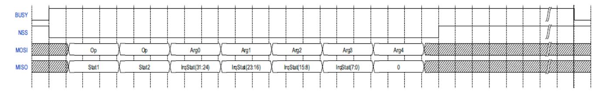

**Figure 3-1: Write Command Timing Diagram**

# **3.2 Read Commands**

Specific Read commands allow to retrieve data from LR1110, such as internal status or geolocation results.

The host sends a 16 bits opcode, followed by the required arguments. The BUSY pin is automatically asserted on the falling edge of the NSS. Once the LR1110 finished preparing the requested data, the BUSY pin is de-asserted. The host can then read back the data by sending NOPs (0x00 Bytes) to shift out the data on the SPI.

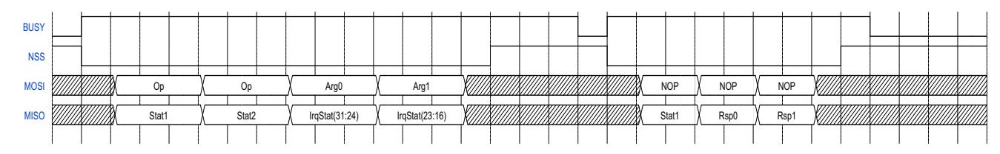

**Figure 3-2: Read Command Timing Diagram**

# **3.3 Status Registers**

The LR1110 features 2 status variables Stat1 and Stat2, which allow to determine the status of the LR1110 (the last command sent, of the device interrupts, of the device operating mode, and of the bootloader) without the need for the host to send a specific command.

Stat1 and Stat2 are always sent when the host issues a command. Only Stat1 is sent back when retrieving data from the LR1110.

The command GetStatus( ) allows returning the status registers.

# **3.3.1 Stat1**

### **Table 3-1: Stat1**

| Bits | (7:4) | (3:1)          | (0)              |
|------|-------|----------------|------------------|
| Name | RFU   | Command Status | Interrupt Status |

- **•** Command Status determines the status of the last command sent by the host:
  - 0 = CMD\_FAIL: the last command could not be executed
  - 1 = CMD\_PERR: the last command could not be processed (wrong opcode, arguments). It is possible to generate an interrupt on DIO if a command error occurred.
  - 2 = CMD\_OK: the last command was processed successfully.
  - 3 = CMD\_DAT: the last command was a successfully processed, and data is currently transmitted instead of IRQ status.
- **•** Interrupt Status indicates if a LR1110 system interrupt was raised.
  - 0: No interrupt active
  - 1: At least 1 interrupt active

# **3.3.2 Stat2**

### **Table 3-2: Stat2**

| Bits | (7:4)        | (3:1)     | (0)        |
|------|--------------|-----------|------------|
| Name | Reset Status | Chip Mode | Bootloader |

- **•** Reset Status allows the host to determine the origin of a LR1110 reset:
  - 0 = Cleared (no active reset)
  - 1 = Analog reset (Power On Reset, Brown-Out Reset)
  - 2= External reset (NRESET pin)
  - 3= System reset
  - 4= Watchdog
  - 5= IOCD restart
  - 6= RTC restart
- **•** Chip Mode allows the host to determine the current mode of the LR1110:
  - 0 = Sleep.
  - 1 = Standby with RC Oscillator.
  - 2 = Standby with Xtal Oscillator.

- 3= FS
- 4 = RX
- 5 = TX
- 6 = Wi-Fi or GNSS geolocation
- **•** Bootloader:
  - 0: currently executes from boot-loader
  - 1: currently executes from flash

The ResetStatus field is cleared on the first GetStatus() command after a reset. And that it is not cleared by any other read/write command

# **3.4 BUSY**

DIO0 is used as Busy signalling: the BUSY pin is set high when the current command is being processed, and when the device is not ready to accept a new command.

Therefore, the timing diagram of the BUSY signal is as follows:

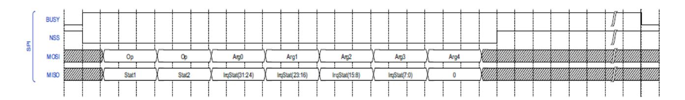

**Figure 3-3: BUSY Timing Diagram**

The amount of time the BUSY line will stay high after the end of rising edge of NSS (TSW Mode) depends on the nature of the command. The most common switching times TSW Mode are indicated in Section [2.6 "Modes Transitions & Timings" on page](#page-21-2)  [22](#page-21-2) .

# **3.5 Errors**

# **3.5.1 GetErrors**

The command GetErrors( ) returns the current pending errors that occurred since the last ClearErrors( ) command, or the startup of the circuit.

It is possible to generate an interrupt on DIO9 or DIO11 when an error occurs. There is no masking of error possible.

**Table 3-3: GetErrors Command**

| Byte           | 0     | 1     |
|----------------|-------|-------|
| Data from Host | 0x01  | 0x0D  |
| Data to Host   | Stat1 | Stat2 |

**Table 3-4: GetErrors Response**

| Byte           | 0     | 1               | 2              |  |
|----------------|-------|-----------------|----------------|--|
| Data from Host | 0x00  | 0x00            | 0x00           |  |
| Data to Host   | Stat1 | ErrorStat(15:8) | ErrorStat(7:0) |  |

ErrorStat contains all the possible error flags that could occur during different chip operations:

- **•** bit 0: LF\_RC\_CALIB\_ERR. Calibration of the low frequency RC has not been done. To fix it try redoing a calibration.
- **•** bit 1: HF\_RC\_CALIB\_ERR. Calibration of the high frequency RC has not been done. To fix it try redoing a calibration.
- **•** bit 2: ADC\_CALIB\_ERR. Calibration of the ADC has not been done. To fix it try redoing a calibration.
- **•** bit 3: PLL\_CALIB\_ERR. Calibration of the maximum and minimum frequencies was not done. To fix it redo the PLL calibration.
- **•** bit 4: IMG\_CALIB\_ERR. Calibration of the image rejection was not done. To fix it redo the image calibration.
- **•** bit 5: HF\_XOSC\_START\_ERR. High frequency XOSC did not start correctly. To fix it redo a reset, or send SetTcxoCmd() if a TCXO is connected and re do calibrations
- **•** bit 6: LF\_XOSC\_START\_ERR. Low frequency XOSC did not start correctly. To fix it redo a reset.
- **•** bit 7: PLL\_LOCK\_ERR. The PLL did not lock. This can come from too high or too low frequency configuration, or if the PLL was not calibrated. To fix it redo a PLL calibration, or use other frequencies.
- **•** bit 8: RX\_ADC\_OFFSET\_ERR. Calibration of the ADC offset could not been done. To fix it redo a calibration.
- **•** bit 9-15: RFU.

# **3.5.2 ClearErrors**

The command ClearErrors( ) clears all errors flags pending in the device. The error flags cannot be cleared individually.

**Table 3-5: ClearErrors Command**

| Byte           | 0     | 1     |
|----------------|-------|-------|
| Data from Host | 0x01  | 0x0E  |
| Data to Host   | Stat1 | Stat2 |

# 3.6 Memory Access

### 3.6.1 WriteRegMem32

The command *WriteRegMem32()* allows writing a block of 32bit words in register/memory space starting at a specific address. The address is auto incremented after each data byte so that data is stored in contiguous register/memory locations. The value of N is maximum 64.

Table 3-6: WriteRegMem32 Command

| Byte              | 0     | 1     | 2                    | 3                    | 4                   | 5                  | 6                | 7                |
|-------------------|-------|-------|----------------------|----------------------|---------------------|--------------------|------------------|------------------|
| Data from Host | 0x01  | 0x05  | Addr (31:24)      | Addr (23:16)      | Addr (15:8)      | Addr (7:0)      | Data1 (31:24) | Data1 (23:16) |
| Data to Host   | Stat1 | Stat2 | IrqStatus (31:24) | IrqStatus (23:16) | IrqStatus (15:8) | IrqStatus (7:0) | 0x00             | 0x00             |

Table 3-7: WriteRegMem32 Command (Cont.)

| Byte           | 8               | 9              | 10               | ••• | 4*N +5         |
|----------------|-----------------|----------------|------------------|-----|----------------|
| Data from Host | Data1 (15:8) | Data1 (7:0) | Data2 (31:24) |     | DataN (7:0) |
| Data to Host   | 0x00            | 0x00           | 0x00             |     | 0x00           |

# 3.6.2 ReadRegMem32

The command *ReadRegMem32()* allows reading a block of 32bit words in register/memory space starting at a specific address. The address is auto incremented after each data byte so that data is read from contiguous register locations. *Len* is the number of words to read, and is maximum 64.

Table 3-8: ReadRegMem32 Command

| Byte              | 0     | 1     | 2                    | 3                    | 4                   | 5                  | 6    |
|-------------------|-------|-------|----------------------|----------------------|---------------------|--------------------|------|
| Data from Host | 0x01  | 0x06  | Addr (31:24)      | Addr (23:16)      | Addr (15:8)      | Addr (7:0)      | Len  |
| Data to Host      | Stat1 | Stat2 | IrqStatus (31:24) | IrqStatus (23:16) | IrqStatus (15:8) | IrqStatus (7:0) | 0x00 |

Table 3-9: ReadRegMem32 Response

| Byte              | 0     | 1                | 2                | 3               | 4              | 5                | •••  | 4*N            |
|-------------------|-------|------------------|------------------|-----------------|----------------|------------------|------|----------------|
| Data from Host | 0x00  | 0x00             | 0x00             | 0x00            | 0x00           | 0x00             | 0x00 | 0x00           |
| Data to Host   | Stat1 | Data1 (31:24) | Data1 (23:16) | Data1 (15:8) | Data1 (7:0) | Data2 (31:24) |      | DataN (7:0) |

# 3.6.3 WriteRegMemMask32

The command WriteRegMemMask32() allows a read/modify/write of the masked bits (Mask bits = 1) of a single 32bit word in register/memory space at the specified address.

Table 3-10: WriteRegMemMask32 Command

| Byte              | 0     | 1     | 2                    | 3                    | 4                   | 5                  | 6               | 7               |
|-------------------|-------|-------|----------------------|----------------------|---------------------|--------------------|-----------------|-----------------|
| Data from Host | 0x01  | 0x0C  | Addr (31:24)      | Addr (23:16)      | Addr (15:8)      | Addr (7:0)      | Mask (31:24) | Mask (23:16) |
| Data to Host   | Stat1 | Stat2 | IrqStatus (31:24) | IrqStatus (23:16) | IrqStatus (15:8) | IrqStatus (7:0) | 0x00            | 0x00            |

Table 3-11: WriteRegMemMask32 Command(Cont.)

| Byte           | 8              | 9             | 10              | 11              | 12             | 13            |
|----------------|----------------|---------------|-----------------|-----------------|----------------|---------------|
| Data from Host | Mask (15:8) | Mask (7:0) | Data (31:24) | Data (23:16) | Data (15:8) | Data (7:0) |
| Data to Host   | 0x00           | 0x00          | 0x00            | 0x00            | 0x00           | 0x00          |

### 3.6.4 WriteBuffer8

The command WriteBuffer8() allows writing a block of bytes into the radio TX buffer. The value of N is maximum 255...

Table 3-12: WriteBuffer8 Command

| Byte              | 0     | 1     | 2                    | 3                    | 4                   | 5                  | 6     | ••• | N+5   |
|-------------------|-------|-------|----------------------|----------------------|---------------------|--------------------|-------|-----|-------|
| Data from Host | 0x01  | 0x09  | Data1                | Data2                | Data3               | Data4              | Data5 |     | DataN |
| Data to Host   | Stat1 | Stat2 | IrqStatus (31:24) | IrqStatus (23:16) | IrqStatus (15:8) | IrqStatus (7:0) | 0x00  |     | 0x00  |

# **3.6.5 ReadBuffer8**

The command ReadBuffer8( ) allows reading a block of Len Bytes in the radio RX buffer starting at a specific offset. RX buffer has to be implemented as a ring buffer.

**Table 3-13: ReadBuffer8 Command**

| Byte           | 0     | 1     | 2                 | 3                 |
|----------------|-------|-------|-------------------|-------------------|
| Data from Host | 0x01  | 0x0A  | Offset (7:0)      | Len (7:0)         |
| Data to Host   | Stat1 | Stat2 | IrqStatus (31:24) | IrqStatus (23:16) |

# **Table 3-14: ReadBuffer8 Response**

| Byte           | 0     | 1     | 2     | 3     |  N     |
|----------------|-------|-------|-------|-------|-----------|
| Data from Host | 0x00  | 0x00  | 0x00  | 0x00  |  0x00  |
| Data to Host   | Stat1 | Data1 | Data2 | Data3 |  DataN |

# **3.6.6 ClearRxBuffer**

The command ClearRxBuffer( ) allows clearing all data in the radio RX buffer. It will write '0' on the whole Rx buffer. It is mainly used for debug purpose to ensure the data in the Rx buffer is not from the previous packet..

**Table 3-15: ClearRxBuffer Command**

| Byte           | 0     | 1     |
|----------------|-------|-------|
| Data from Host | 0x01  | 0x0B  |
| Data to Host   | Stat1 | Stat2 |

# **4. GPIOs**

The LR1110 features 12 digital IOs:

- **•** DIO1 to DIO4 are dedicated to the SPI interface signals NSS, SCK, MOSI and MISO respectively.
- **•** DIO0 is used as BUSY signalling, and is mandatory to properly handle the host controller interface.
- **•** DIO9 is dedicated to the LR1110 interrupts. It is recommended to connect DIO9 to the host controller for the lowest-power applications. DIO11 can be used as another interrupt pin if no 32.768 kHz crystal oscillator is used.
- **•** NRESET allows to cancel on-going functions of the LR1110, and reset all HW and FW. Although a device restart is also possible through host controller commands, it is recommended to allow the host controller to control this signal.
- **•** DIO5, DIO6, DIO7, DIO8 and DIO10 can be used to control external RF switches or LNAs on the Wi-Fi, GNSS, and sub-GHz RF paths.
- **•** DIO8 can also be used as 32.768 kHz source to the host controller if a 32.768 kHz crystal oscillator is connected to DIO10 and DIO11.
- **•** DIO10 and DIO11 can be used as connection pins for an external 32.768 kHz crystal oscillator as RTC source. DIO11 can also be used as input pin in case the 32.768 kHz signal is fed by the host controller. In that case DIO10 shall be left unconnected.

# **4.1 Interrupts**

The LR1110 features numerous interrupt sources, allowing the host to react to a large variety of events in the LR1110 system without the need to poll registers, and therefore allowing power-optimized applications.

# **4.1.1 Description**

The LR1110 interruptions are multiplexed on DIO9 and/or DIO11 pin. When the application receives an interrupt, it can determine the source by using the command GetStatus( ). The interrupt can then be cleared using the ClearIrq( ) command.

The command SetDioIrqParams( ) configures which interrupt signal should be activated on the DIO9 and/or DIO11 interrupt pins.

The interrupts mapping table IrqToEnable is as follows:

**Table 4-1: IrqToEnable Interruption Mapping**

| Bit | Interrupt                   | Description                             |
|-----|-----------------------------|-----------------------------------------|
| 0   | RFU                         | RFU                                     |
| 1   | RFU                         | RFU                                     |
| 2   | TxDone                      | Packet transmission completed           |
| 3   | RxDone                      | Packet received                         |
| 4   | PreambleDetected            | Preamble detected                       |
| 5   | SyncWordValid / HeaderValid | Valid sync word / LoRa® header detected |
| 6   | HeaderErr                   | LoRa® header CRC error                  |

**Table 4-1: IrqToEnable Interruption Mapping**

| Bit   | Interrupt    | Description                                                  |  |  |  |
|-------|--------------|--------------------------------------------------------------|--|--|--|
|       |              | Packet received with error.                                  |  |  |  |
| 7     | Err          | LoRa®: Wrong CRC received                                    |  |  |  |
|       |              | (G)FSK: CRC error                                            |  |  |  |
| 8     | CadDone      | LoRa® Channel activity detection finished                    |  |  |  |
| 9     | CadDetected  | LoRa® Channel activity detected                              |  |  |  |
| 10    | Timeout      | RX or TX timeout                                             |  |  |  |
| 11-18 | RFU          | RFU                                                          |  |  |  |
| 19    | GNSSDone     | GNSS Scan finished                                           |  |  |  |
| 20    | WifiDone     | Wi-Fi Scan finished                                          |  |  |  |
| 21    | LBD          | Low Battery Detection                                        |  |  |  |
| 22    | CmdError     | Host command error                                           |  |  |  |
| 23    | Error        | An error other than a command error occurred (see GetErrors) |  |  |  |
|       |              | IRQ raised if the packet was received with a length          |  |  |  |
| 24    | FskLenError  | error                                                        |  |  |  |
|       |              | IRQ raised if the packet was received with an address        |  |  |  |
| 25    | FskAddrError | error                                                        |  |  |  |

# **4.1.2 Commands**

### **4.1.2.1 GetStatus**

The command GetStatus( ) returns the status of the LR1110 interrupts.

**Table 4-2: GetStatus Command**

| Byte           | 0     | 1     | 2                    | 3                    | 4                   | 5                  |
|----------------|-------|-------|----------------------|----------------------|---------------------|--------------------|
| Data from Host | 0x01  | 0x00  | 0x00                 | 0x00                 | 0x00                | 0x00               |
| Data to Host   | Stat1 | Stat2 | IrqStatus (31:24) | IrqStatus (23:16) | IrqStatus (15:8) | IrqStatus (7:0) |

### **4.1.2.2 SetDioIrqParams**

The command SetDioIrqParams( ) configures which interrupt signal should be activated on the DIO9 and/or DIO11 interrupt pin (referred to as IRQ pin 1 and/or 2).

**Table 4-3: SetDioIrqParams Command**

| Byte           | 0     | 1     | 2                       | 3                       | 4                      | 5                     |
|----------------|-------|-------|-------------------------|-------------------------|------------------------|-----------------------|
| Data from Host | 0x01  | 0x13  | Irq1ToEnable (31:24) | Irq1ToEnable (23:16) | Irq1ToEnable (15:8) | Irq1ToEnable (7:0) |
| Data to Host   | Stat1 | Stat2 | IrqStatus               | IrqStatus               | IrqStatus              | IrqStatus             |
|                |       |       | (31:24)                 | (23:16)                 | (15:8)                 | (7:0)                 |

| Byte           | 6                       | 7                       | 8                      | 9                     |
|----------------|-------------------------|-------------------------|------------------------|-----------------------|
| Data from Host | Irq2ToEnable (31:24) | Irq2ToEnable (23:16) | Irq2ToEnable (15:8) | Irq2ToEnable (7:0) |
| Data to Host   | 0x00                    | 0x00                    | 0x00                   | 0x00                  |

### **4.1.2.3 ClearIrq**

The ClearIrq( ) command clears the selected interrupt signals by writing a 1 in the respective bit.

**Table 4-4: ClearIrq Command**

| Byte           | 0     | 1     | 2                     | 3                     | 4                    | 5                   |
|----------------|-------|-------|-----------------------|-----------------------|----------------------|---------------------|
| Data from Host | 0x01  | 0x14  | IrqToClear (31:24) | IrqToClear (23:16) | IrqToClear (15:8) | IrqToClear (7:0) |
| Data to Host   | Stat1 | Stat2 | IrqStatus (31:24)  | IrqStatus (23:16)  | IrqStatus (15:8)  | IrqStatus (7:0)  |

The IrqToClear is identical to IrqToEnable assignment.

# **4.2 RF Switch Control**

### 4.2.1 SetDioAsRfSwitch

DIO5, DIO6, DIO7, DIO8 and DIO10 can be used to control external RF switches or LNAs on the Sub-GHz, GNSS, and Wi-Fi RF paths using the *SetDioAsRfSwitch()* command:

Table 4-5: SetDioAsRfSwitch Command

| Byte           | 0     | 1     | 2                    | 3                    | 4                   | 5                  | 6               | 7    | 8               | 9               |
|----------------|-------|-------|----------------------|----------------------|---------------------|--------------------|-----------------|------|-----------------|-----------------|
| Data from Host | 0x01  | 0x12  | RfSw Enable       | RfSw StbyCfg      | RfSw RxCfg       | RfSw TxCfg      | RfSw TxHPCfg | RFU  | RfSw GnssCfg | RfSw WifiCfg |
| Data to Host   | Stat1 | Stat2 | IrqStatus (31:24) | IrqStatus (23:16) | IrqStatus (15:8) | IrqStatus (7:0) | 0x00            | 0x00 | 0x00            | 0x00            |

- RfswEnable value indicates which switch is used (1) and which is not (0). Only the lowest 5 bits of all the configurations as well as the enable are taken into account. Each Cfg bit corresponds to the state of the RFSW output for that particular mode:
  - Bit 0 RFSW0 Enabled (DIO5 pin)
  - Bit 1 RFSW1 Enabled (DIO6 pin)
  - Bit 2 RFSW2 Enabled (DIO7 pin)
  - Bit 3 RFSW3 Enabled (DIO8 pin)
  - Bit 4 RFSW4 Enabled (DIO10 pin)
- RfSwStbyCfg value indicates the RFSW DIO states when in standby mode.
- RfSwRxCfg value tells the RFSW DIO states when in RX mode.
- RfSwTxCfg value indicates the RFSW DIO states when in low power TX mode.
- RfSwTxHPCfg value indicates the RFSW DIO states when in high power TX mode.
- RfSwGnssCfg value indicates the RFSW DIO states when in GNSS scanning mode.
- RfSwWifiCfg value indicates the RFSW DIO states when in Wi-Fi scanning mode.
- Byte 7 is RFU

By default, no DIO is used as RF switch: all RFSW outputs are in High-Z state.

This command will only work with the chip in Standby RC mode, otherwise it will return a CMD\_FAIL on the next *GetStatus* command.

# **4.3 Temperature Sensor**

A built-in temperature sensor, giving an indication of the internal device temperature, is implemented in the LR1110. The temperature measurement can be triggered using the command GetTemp():

**Table 4-6: GetTemp Command** 

| Byte           | 0     | 1     |
|----------------|-------|-------|
| Data from Host | 0x01  | 0x1A  |
| Data to Host   | Stat1 | Stat2 |

**Table 4-7: GetTemp Response** 

| Byte           | 0     | 1          | 2         |  |
|----------------|-------|------------|-----------|--|
| Data from Host | 0x00  | 0x00       | 0x00      |  |
| Data to Host   | Stat1 | Temp(15:8) | Temp(7:0) |  |

The Temperature value is a function of an internal reference voltage (typ. 1.35V), and a typical temperature characteristic (typ -1.7mV/°C), and can be approximated using the following formula:

$$\textbf{Temperature(degC)} \sim 25 + \frac{1000}{-1.7 mV/^{\circ}C} \times (Temp(10:0)/2047*1.35 - 0.7295)$$

# **5. Power Distribution**

# **5.1 Power Modes**

Two power modes are available: DC-DC converter for low power applications, and LDO for low-cost or small size applications.

The command SetRegMode( ) defines which regulator should be used.

**Table 5-1: SetRegMode Command**

| Byte           | 0     | 1     | 2                 |
|----------------|-------|-------|-------------------|
| Data from Host | 0x01  | 0x10  | RegMode           |
| Data to Host   | Stat1 | Stat2 | IrqStatus (31:24) |

- **•** The RegMode parameter defines if the DC-DC converter has to be switched ON :
  - RegMode = 0: do not switch on the DC-DC converter in any mode (Default)
  - RegMode = 1: automatically switch on the DC-DC converter, depending on the mode as per [Table](#page-34-5) 5-2

This command will only work with the device in Standby RC mode, otherwise it will return CMD\_FAIL on the next GetStatus command.

The following table illustrates the power regulation options for different modes and user settings.

**Table 5-2: Power Regulation Options**

| Circuit Mode       | Sleep | STDBY_RC | STDBY_XOSC  | FS          | RX          | TX          |
|--------------------|-------|----------|-------------|-------------|-------------|-------------|
| Regulator Type = 0 | -     | LDO      | LDO         | LDO         | LDO         | LDO         |
| Regulator Type = 1 | -     | LDO      | DC-DC + LDO | DC-DC + LDO | DC-DC + LDO | DC-DC + LDO |

# **5.2 Over Current Protection**

An Over Current Protection (OCP) block is built-in the LR1110. It prevents surge currents when the device is used at its highest power levels, thus protecting the battery that may power the application. The current clamping values are trimmable by register access. By default, the OCP values are 60mA for the low power PA, and 150mA for the high power PA.

# **5.3 VBAT Measurement**

The battery supply voltage can be monitored using the GetVbat( ) command. This command returns the Vbat voltage as a function of a reference voltage:

**Table 5-3: GetVbat Command**

| Byte           | 0     | 1     |
|----------------|-------|-------|
| Data from Host | 0x01  | 0x19  |
| Data to Host   | Stat1 | Stat2 |

### **Table 5-4: GetVbat Response**

| Byte           | 0     | 1         |
|----------------|-------|-----------|
| Data from Host | 0x00  | 0x00      |
| Data to Host   | Stat1 | Vbat(7:0) |

$$\mathbf{VBAT}(\mathbf{V}) = \left( \left( \frac{5 \times VBat(7:0)}{255} \right) - 1 \right) 1.35$$

# **5.4 Power-On-Reset and Brown-Out-Reset**

The LR1110 features both POR and BRN features.

The POR/BRN ensure a proper startup of the circuit maintaining the internal blocks reset until a safe level of the battery voltage is reached, for example at battery insertion. The BRN triggers a device reset in case the battery voltage goes below the safe operation threshold of 1.7V (typically). The POR/BRN detector has a 50 mV hysteresis.

Refer to [Figure 5-1: LR1110 POR and BRN Functions](#page-36-1) for an illustration of the POR and BRN functions.

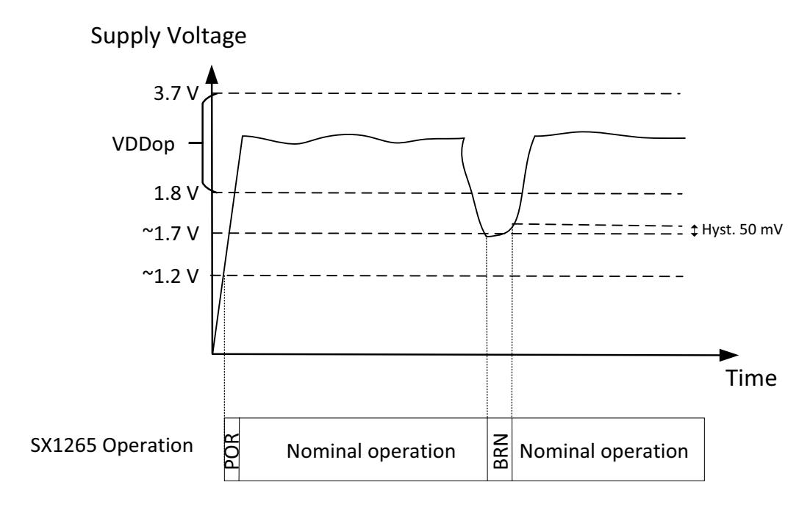

**Figure 5-1: LR1110 POR and BRN Functions**

# **5.5 Low Battery Detector**

The Low Battery Detector (LBD) detects when the supply voltage VBAT drops below 1.88 V (typ). The LBD indication is given through an interrupt signal, hence minimizing the host activity in critical supply voltage conditions. The LBD IRQ shall be activated though the command SetDioIrqParams().

# **6. Clock Sources**

The LR1110 uses both low frequency (32 kHz) and high frequency (32 MHz) clock sources. For each frequency, the clock signal can be obtained by either a RC oscillator, or a Crystal oscillator. RC oscillators allow optimized power consumption and faster switching times. Crystal oscillators provide a more precise frequency, in cases when frequency accuracy is needed.

RF operations require 32 MHz high precision clock reference, which can be provided by either an external crystal oscillator or by a TCXO.

# **6.1 RC Oscillators Clock References**

Two RC oscillators are available: 32 kHz and 32 MHz RC oscillators:

- **•** The 32 kHz RC oscillator is optionally used by the circuit in Sleep mode to wake-up the device when performing periodic or duty cycled operations. Several commands make use of this 32 kHz RC oscillator (RTC) to generate time-based events.
- **•** The 32 MHz RC oscillator is enabled for all SPI communication to permit configuration of the device without the need to start the 32MHz crystal oscillator.

# **6.2 High-Precision Clock References**

# **6.2.1 32.768 kHz Crystal**

A 32.768 kHz crystal oscillator can be used instead of the 32.768 kHz RC oscillator as low frequency clock source. The configuration of the 32 kHz source is done through the command ConfigLfClock( ) . By default, the 32.768 kHz RC oscillator is used.

**Table 6-1: ConfigLfClock Command**

| Byte           | 0     | 1     | 2                 |
|----------------|-------|-------|-------------------|
| Data from Host | 0x01  | 0x16  | LfClkConfig       |
| Data to Host   | Stat1 | Stat2 | IrqStatus (31:24) |

### LfClkConfig parameter:

- **•** bit 0-1: LF clock selection
  - 0: use 32.768 kHz RC oscillator
  - 1: use 32.768 kHz Crystal oscillator
  - 2: use externally provided 32.768kHz signal on DIO11 pin
  - 3: RFU
- **•** bit 2: Wait for Xtal 32k ready. If 1 will wait for the Xtal 32k to be ready before releasing the busy.

**•** bits 3-7: RFU

# **6.2.2 32 MHz Crystal**

A 32MHz crystal oscillator is the cheapest and lowest power consuming approach to provide the 32MHz clock reference to the LR1110. The crystal loading capacitance are integrated, minimizing the overall BOM cost and optimizing the PCB space.

Please refer to the LR1110 datasheet for the Crystal choice criteria.

In case of crystal operation, the VTCXO pin should be left unconnected.

# **6.2.3 32 MHz TCXO**

In environments with extreme temperature variation, it may be required to use a TCXO (Temperature Compensated Crystal Oscillator) to achieve better frequency accuracy. It is required to use a TCXO to use the LR1110 GNSS features in order to minimize the power consumption required to perform an outdoor geolocation.

### **6.2.3.1 Description**

When a TCXO is used, it should be connected to pin XTA, through a 220 Ω resistor and a10 pF DC-cut capacitor. Pin XTB should be left open. The TCXO is supplied by the internal regulator on the VTCXO pin.

The regulated VTCXO is programmable from 1.6 to 3.3 V using the command SetTcxoMode ( ). VBAT should always be 200 mV higher than the programmed voltage to ensure proper operation.

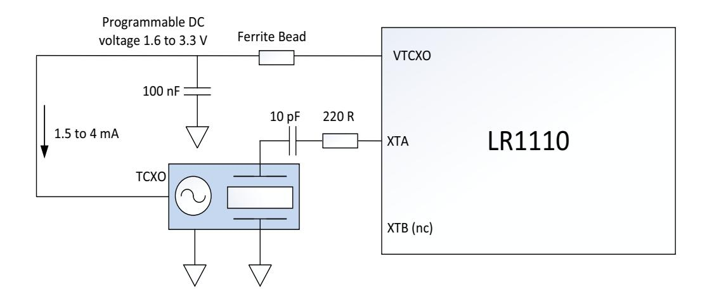

**Figure 6-1: TCXO**

The nominal current drain is 1.5 mA, but the regulator can support up to 4 mA of load. Clipped-sine output TCXO are required, with the output amplitude not exceeding 1.2 V peak-to-peak.

Please refer to the LR1110 datasheet for the TCXO choice criteria.

**Note: A complete Reset of the chip is required to get back to normal XOSC operation, after the device has been set to TCXO mode with the command SetTcxoMode.**

### **6.2.3.2 SetTcxoMode**

The SetTcxoMode( ) command configures the chip for a connected TCXO.

**Table 6-2: SetTcxoMode Command**

| Byte           | 0     | 1     | 2                    | 3                    | 4                   | 5                  |
|----------------|-------|-------|----------------------|----------------------|---------------------|--------------------|
| Data from Host | 0x01  | 0x17  | RegTcxoTune          | Delay (23:16)     | Delay (15:8)     | Delay (7:0)     |
| Data to Host   | Stat1 | Stat2 | IrqStatus (31:24) | IrqStatus (23:16) | IrqStatus (15:8) | IrqStatus (7:0) |

**•** RegTcxoTune allows to tune the output voltage on the TCXO supply pin VTCXO, according to [Table 6-3: TCXO Supply](#page-39-1)  [Voltage programming values](#page-39-1)

**Table 6-3: TCXO Supply Voltage programming values**

| RegTcxoTune | TCXO Supply Voltage (typ) |
|-------------|---------------------------|
| 0x00        | 1.6                       |
| 0x01        | 1.8                       |
| 0x02        | 1.8 V                     |
| 0x03        | 2.2 V                     |
| 0x04        | 2.4 V                     |
| 0x05        | 2.7 V                     |
| 0x06        | 3.0 V                     |
| 0x07        | 3.3 V                     |

- **•** Delay represents the maximum duration for the 32MHz oscillator to start and stabilize (in 30.52us steps). If the 32 MHz oscillator from the TCXO is not detected internally at the end the delay period, the device internal firmware triggers a HF\_XOSC\_START\_ERR error.
  - Delay set to 0 (default value) disables the TCXO mode.

The command will operate only in Standby RC mode, otherwise it will return CMD\_FAIL on the next GetStatus command.

# 7. Sub GHz Radio

# 7.1 Description

The LR1110 is a half-duplex RF transceiver capable of handling constant envelope modulation schemes such as LoRa®, and (G)FSK. It is fully compatible with the SX1261/62/68 family.

The sub-GHz radio system is shown in figure Figure 7-1: Sub-GHz Radio here below. It is composed of the frequency synthesizer (also referred as PLL), two TX paths (High Power and Low Power), and a RX path, followed by a high-bandwidth ADC. Both the ADC and the PLL are tied to the digital subsystem and to the LoRa® and (G)FSK modems.

The High Power and the Low Power PA are described in a dedicated section, as well as the LoRa® and (G)FSK modems.

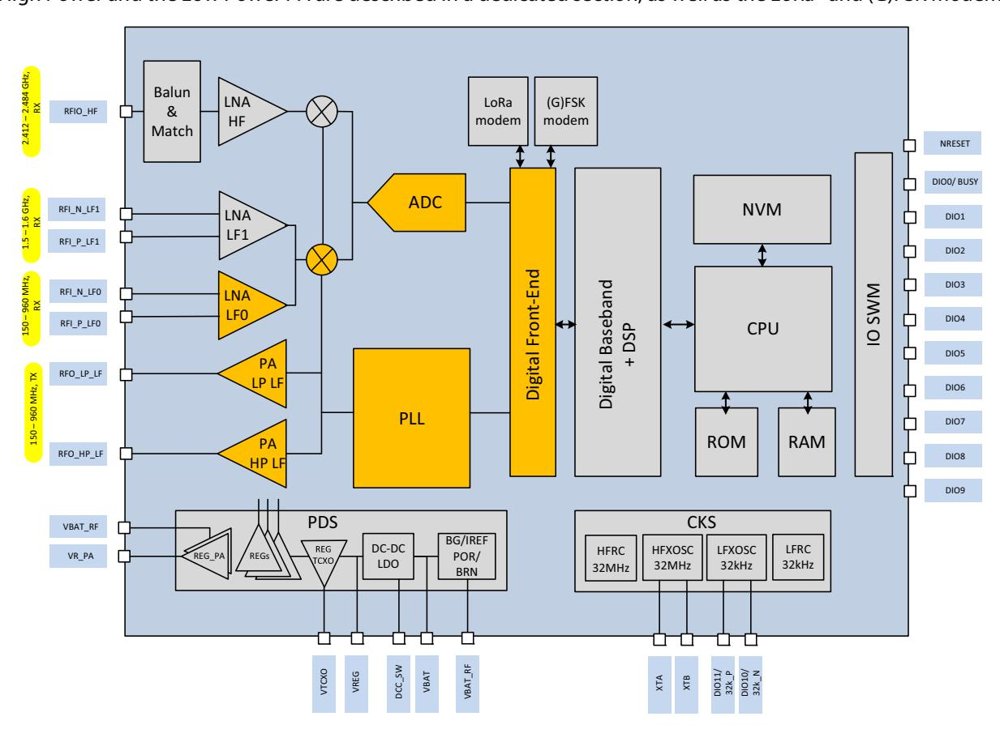

Figure 7-1: Sub-GHz Radio

The LR1110 frequency synthesizer allows a continuous operation in the 150 MHz-2700 MHz frequency range. It is shared between the sub-GHz radio, the GNSS and the Wi-Fi scanning engines, therefore no simultaneous sub-GHz radio operation, GNSS scanning, or Wi-Fi scanning is possible.

The LR1110 frequency synthesizer is clocked by a 32 MHz reference, provided by either a crystal oscillator, or a TCXO. Refer to Section 6. "Clock Sources" on page 38 for details.

# **7.2 Commands**

# **7.2.1 SetRfFrequency**

The command SetRfFrequency( ) sets the RF frequency of the sub-GHz radio. In RX mode, the frequency is internally down-converted to IF Frequency.

**Table 7-1: SetRfFrequency Command**

| Byte           | 0     | 1     | 2                    | 3                    | 4                   | 5                  |
|----------------|-------|-------|----------------------|----------------------|---------------------|--------------------|
| Data from Host | 0x02  | 0x0B  | RfFreq (31:24)    | RfFreq (23:16)    | RfFreq (15:8)    | RfFreq (7:0)    |
| Data to Host   | Stat1 | Stat2 | IrqStatus (31:24) | IrqStatus (23:16) | IrqStatus (15:8) | IrqStatus (7:0) |

The RF Frequency of the sub-GHz radio is given in Hz. All the frequency dependent parameters are automatically recomputed by the LR1110 firmware when processing this command.

# **7.2.2 SetRx**

The command SetRx( ) sets the sub-GHz radio in RX mode. If no packet is received after the defined RxTimeout, the device will go back to Standby RC mode.

**Table 7-2: SetRx Command**

| Byte           | 0     | 1     | 2                 | 3                 | 4                |
|----------------|-------|-------|-------------------|-------------------|------------------|
| Data from Host | 0x02  | 0x09  | RxTimeout (23:16) | RxTimeout (15:8)  | RxTimeout (7:0)  |
| Data to Host   | Stat1 | Stat2 | IrqStatus (31:24) | IrqStatus (23:16) | IrqStatus (15:8) |

- **•** RxTimeout is expressed in periods of the 32.768 kHz RTC. The maximum timeout value corresponds to 512s. Values 0x000000 and 0xFFFFFF disable the timeout function.
  - 0x000000 sets the device in RX mode until a reception occurs. After packet reception, the device returns in Standby mode.
  - 0xFFFFFF sets the device in RX mode until the host sends a command to change the mode. The device can receive several packets. Each time a packet is received, a packet done indication is given to the host and the device will automatically search for a new packet.

If the timer is active, the radio will stop the reception at the end of the timeout period unless a preamble and Syncword (in (G)FSK) or Header (in LoRa®) has been detected, depending on StopTimeoutOnPreamble configuration.

If no packet type was configured, or the packet type does not allow RX operations, the command will fail.

The busy pin will go to low after the device is set into RX mode.

# **7.2.3 SetTx**

The command SetTx( ) sets the sub-GHz radio in TX mode, triggering the RF packet transmission, and starting the RTC with the given TxTimeout value.

If the RTC event fires before the end of transmission, it will trigger a TIMEOUT IRQ, and stop the device transmission. Otherwise, at the end of the packet transmission, a TX\_DONE interrupt is generated.

By default, the device goes back to STBY\_RC mode after a TIMEOUT IRQ or a TX\_DONE IRQ, or to STBY\_XOSC or FS depending on the FallBackMode configuration.

**Table 7-3: SetTx Command**

| Byte           | 0     | 1     | 2                 | 3                | 4               |
|----------------|-------|-------|-------------------|------------------|-----------------|
| Data from Host | 0x02  | 0x0A  | TxTimeout (23:16) | TxTimeout (15:8) | TxTimeout (7:0) |
| Data to Host   | Stat1 | Stat2 | IrqStatus(31:24)  | IrqStatus(23:16) | IrqStatus(15:8) |

**•** TxTimeout is expressed in periods of the 32.768 kHz RTC. The maximum TxTimeout value corresponds to 512s. 0x000000 disables the timeout function.

If no packet type was configured, or the packet type does not allow Tx operations, the command will fail.

The busy pin will go to '0' after the device is set into TX mode.

# **7.2.4 AutoTxRx**

The command AutoTxRx( ) automatically performs the transition to RX mode after a packet transmission, or to TX mode after a packet reception. After the second mode, the device goes back to Standby RC mode.

**Table 7-4: AutoTxRx Command**

| Byte           | 0     | 1     | 2                    | 3                    | 4                   | 5                    | 6                  | 7                 | 8                |
|----------------|-------|-------|----------------------|----------------------|---------------------|----------------------|--------------------|-------------------|------------------|
| Data from Host | 0x02  | 0x0C  | Delay (23:16)     | Delay (15:8)      | Delay (7:0)      | Intermediary Mode | Timeout (23:16) | Timeout (15:8) | Timeout (7:0) |
| Data to Host   | Stat1 | Stat2 | IrqStatus (31:24) | IrqStatus (23:16) | IrqStatus (15:8) | IrqStatus (7:0)   | 0x00               | 0x00              | 0x00             |

- **•** Delay defines the transition time between the TX and RX mode, expressed in periods of the 32.768kHz RTC. The maximum Delay value corresponds to 512 s.
  - 0x000000 performs a direct TX to RX or RX to TX transition, without going through the IntermediairyMode.
  - 0xFFFFFF disables the AutoTxRx function. The AutoTxRx function is disabled by default.
- **•** IntermediaryMode: device mode in between the TX and RX modes.
  - 0x00: Sleep mode
  - 0x01: Standby RC mode
  - 0x02: Standby Xosc mode
  - 0x03 FS mode

- **•** Timeout defines the timeout of the second mode, after the automatic transition. It is expressed in periods of the 32.768kHz RTC. The maximum timeout value coresponds to 512 s.
  - 0x000000 disables the timeout function.

If the AutoTxRx mode is enabled, and a SetTx( ) command is sent to the device, the device will go to RX mode after TX\_DONE and the given delay. Timeout is used as the RxTimeout of the auto RX.

If the AutoTxRx mode is enabled, and a SetRx( ) command is sent to the chip, the chip will go to Tx mode after RX\_DONE and the given delay. Timeout is used as the TxTimeout of the auto Tx.

If a RxDutyCycleMode is started, this mode is not used.

# **7.2.5 SetRxTxFallbackMode**

The command SetRxTxFallbackMode( ) defines in which mode the device goes after a packet transmission or a packet reception.

**Table 7-5: SetRxTxFallbackMode Command**

| Byte           | 0     | 1     | 2                 |
|----------------|-------|-------|-------------------|
| Data from Host | 0x02  | 0x13  | FallbackMode      |
| Data to Host   | Stat1 | Stat2 | IrqStatus (31:24) |

- **•** FallbackMode values:
  - 0x01: Standby RC mode (default value).
  - 0x02: Standby Xosc mode
  - 0x03: FS mode

If a RxDutyCycle is started or an AutoRxTx is configured, this mode is not used.

The fallback mode is also used for RxDutyCycleMode after the RX\_DONE interrupt, or for an AutoRxTx after the RX to TX, or TX to RX sequence is completed.

# **7.2.6 SetRxDutyCycle**

The command SetRxDutyCycle( ) periodically opens RX windows. Between RX windows, the device goes in Sleep mode (with retention).

**Table 7-6: SetRxDutyCycle Command**

| Byte              | 0     | 1     | 2                    | 3                    | 4                   | 5                          | 6                         | 7                        | 8    |
|-------------------|-------|-------|----------------------|----------------------|---------------------|----------------------------|---------------------------|--------------------------|------|
| Data from Host | 0x02  | 0x14  | RxPeriod (23:16)  | RxPeriod (15:8)   | RxPeriod (7:0)   | Sleep Period (23:16) | Sleep Period (15:8) | Sleep Period (7:0) | Mode |
| Data to Host   | Stat1 | Stat2 | IrqStatus (31:24) | IrqStatus (23:16) | IrqStatus (15:8) | IrqStatus (7:0)         | 0x00                      | 0x00                     | 0x00 |

- **•** RxPeriod defines the maximum RX window duration, expressed in periods of the 32.768kHz RTC. The maximum Delay value corresponds to 512 s.
- **•** SleepPeriod defines the duration of the Sleep period between the RX windows. It is expressed in periods of the 32.768kHz RTC. The maximum Delay value corresponds to 512 s.
- **•** Mode selects the device mode during the RX windows:

**UM.LR1110.W.APP March 2020**

- Mode=0 configures the device in RX mode during the RX windows. This mode is available for (G)FSK and LoRa® packet types.
- Mode =1 configures the device in CAD mode during the RX windows. This mode is available only for LoRa® packet types. It will return a CMD\_FAIL for (G)FSK packet types.

The Mode parameter is optional, and will be set to mode = 0 if not sent.

When this command is sent in Standby mode, the context (device configuration) is saved and the device enters in a loop defined by the following steps, and depicted in [Figure 7-2: LR1110 Current Profile During RX Duty Cycle Operation.](#page-44-0)

- **•** The device enters RX and listens for an incoming RF packet for a period of time defined by RxPeriod
- **•** Upon preamble detection, the timeout is stopped and restarted with the value 2 \* RxPeriod + SleepPeriod, as shown in [Figure 7-3: RX Duty Cycle Upon Preamble Detection](#page-45-1).
- **•** If no packet is received during the RX window, the device goes into Sleep mode with context saved for a period of time defined by sleepPeriod
- **•** At the end of the Sleep window, the device automatically restarts the process of restoring context and enters the RX mode, and so on. At any time, the host can stop the procedure.

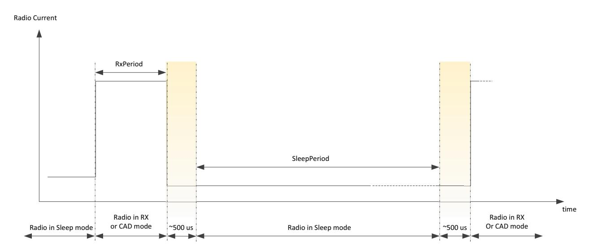

**Figure 7-2: LR1110 Current Profile During RX Duty Cycle Operation**

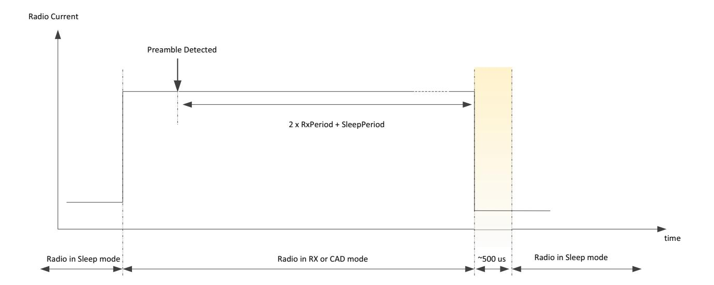

**Figure 7-3: RX Duty Cycle Upon Preamble Detection**

The loop is terminated if either:

- **•** A packet is detected during the RX window, at which moment the chip interrupts the host via the RX\_DONE flag and returns to the configured Fallback mode (refer to Section [7.2.5 "SetRxTxFallbackMode " on page 44](#page-43-0) ).
- **•** The host issues a SetStandby( ) command during the RX window.
- **•** The device is woken up from Sleep mode with a falling edge of NSS. In that case, the user should send the SetStandby( ) command to avoid race conditions in case the NSS falling edge was issued during the boot phase of the device.

If a RxDutyCycle( ) is started, AutoRxTx or SetRxTxFallback modes are not used.

StopTimeoutOnPreamble( ) has no effect on this mode.

**Note: the RxDutyCycle**( ) **command will return CMD\_FAIL in the status of the next command, if the packet type has not been set.**

# **7.2.7 StopTimeoutOnPreamble**

The command StopTimeoutOnPreamble( ) defines if the RX timeout should be stopped on Syncword / Header detection or on PreambleDetection.

**Table 7-7: StopTimeoutOnPreamble Command**

| Byte           | 0     | 1     | 2                 |
|----------------|-------|-------|-------------------|
| Data from Host | 0x02  | 0x17  | StopOnPreamble    |
| Data to Host   | Stat1 | Stat2 | IrqStatus (31:24) |

- **•** StopOnPreamble values:
  - 0x00: stop on Syncword/Header detection (default value).

0x01: stop on Preamble detection

# **7.2.8 GetRssiInst**

The command GetRssiInst( ) returns the instantaneous RSSI value at the precise time when the command is sent. Therefore if no RF packet is present, the RSSI value returned by the command GetRssiInst( ) will correspond to the RF noise.

**Table 7-8: GetRssiInst Command**

| Byte           | 0     | 1     |
|----------------|-------|-------|
| Data from Host | 0x02  | 0x05  |
| Data to Host   | Stat1 | Stat2 |

**Table 7-9: GetRssiInst Response**

| Byte           | 0     | 1    |
|----------------|-------|------|
| Data from Host | 0x00  | 0x00 |
| Data to Host   | Stat1 | Rssi |

The RSSI in dBm is calculated using the following formula:

RSSI (dBm)= -Rssi/2

# **7.2.9 GetStats**

The command GetStats( ) returns the internal statistics of the received RF packets:

**Table 7-10: GetStats Command**

| Byte           | 0     | 1     |
|----------------|-------|-------|
| Data from Host | 0x02  | 0x01  |
| Data to Host   | Stat1 | Stat2 |

**Table 7-11: GetStats Response**

| Byte           | 0     | 1                           | 2                          | 3                           | 4                          | 5               | 6              | 7               | 8              |
|----------------|-------|-----------------------------|----------------------------|-----------------------------|----------------------------|-----------------|----------------|-----------------|----------------|
| Data from Host | 0x00  | 0x00                        | 0x00                       | 0x00                        | 0x00                       | 0x00            | 0x00           | 0x00            | 0x00           |
| Data to Host   | Stat1 | NbPkt Received (15:8) | NbPkt Received (7:0) | NbPkt CrcError (15:8) | NbPkt CrcError (7:0) | Data1 (15:8) | Data1 (7:0) | Data2 (15:8) | Data2 (7:0) |

- **•** NbPktReceived is the total number of received packets.
- **•** NbPkCrcError is the total number of received packets with a CRC error.
- **•** Data1 is PacketType dependant:
  - (G)FSK mode: Data1= NbPacketLengthError(15:0): number of packet with a length error
  - LoRa® mode: Data1=NbPktHeaderErr(15:0): number of packets with a Header error
- **•** Data2 is PacketType dependant:
  - (G)FSK mode: Data2=0x00
  - LoRa® mode: Data2=NbPktFalseSync(15:0): number of false synchronizations.

Statistics are reset on a Power On Reset, power down, or by the command ResetStats( ).

# **7.2.10 ResetStats**

The command ResetStats( ) resets the internal statistics of the received RF packets:

# **Table 7-12: ResetStats Command**

| Byte           | 0     | 1     |
|----------------|-------|-------|
| Data from Host | 0x02  | 0x00  |
| Data to Host   | Stat1 | Stat2 |

# **7.2.11 GetRxBufferStatus**

The command GetRxBufferStatus( ) returns the length of the last RF packet received and the offset in the RX buffer of the first byte received:

**Table 7-13: GetRxBufferStatus Command**

| Byte           | 0     | 1     |
|----------------|-------|-------|
| Data from Host | 0x02  | 0x03  |
| Data to Host   | Stat1 | Stat2 |

# **Table 7-14: GetRxBufferStatus Response**

| Byte           | 0     | 1               | 2                    |
|----------------|-------|-----------------|----------------------|
| Data from Host | 0x00  | 0x00            | 0x00                 |
| Data to Host   | Stat1 | PayloadLengthRX | RxStartBufferPointer |

**•** PayloadLengthRX is the Palyoad length of the last RF packet received.

RxStartBufferPointer is the offset in the RX buffer of the first byte received.

# **7.2.12 SetRxBoosted**

The command SetRxBoosted( ) sets the device in RX Boosted mode, allowing a ~2 dB increased sensitivity, at the expense of a ~2 mA higher current consumption in RX mode.

**Table 7-15: SetRxBoosted Command**

| Byte           | 0     | 1     | 2                 |
|----------------|-------|-------|-------------------|
| Data from Host | 0x02  | 0x27  | RxBoosted         |
| Data to Host   | Stat1 | Stat2 | IrqStatus (31:24) |

**•** RxBoosted: Activates the Rx Boosted mode.

RxBoosted=0: RX Boosted mode deactivated

RxBoosted=1: RX Boosted mode activated

Other values are RFU

# **8. Modems**

# **8.1 Modem Configuration**

The LR1110 contains different modems capable of handling different constant envelope modulations. The user shall then specify the modem to be used by using the command SetPacketType( ) .

In a second step, SetModulationParam( ) configures the modem parameters (SF, BW, CR and LDRO), and SetPacketParam( ) defines the RF packet parameters (Payload length, Implicit/explicit mode, …). Then the settings of the PA used for the RF packet transmission shall be configured with the command SetPaConfig( ) (which PA, supply mode…), followed at last by the PA parameters (output power, ramp time) using the command SetTxParams( ) .

The suitable command order is the following:

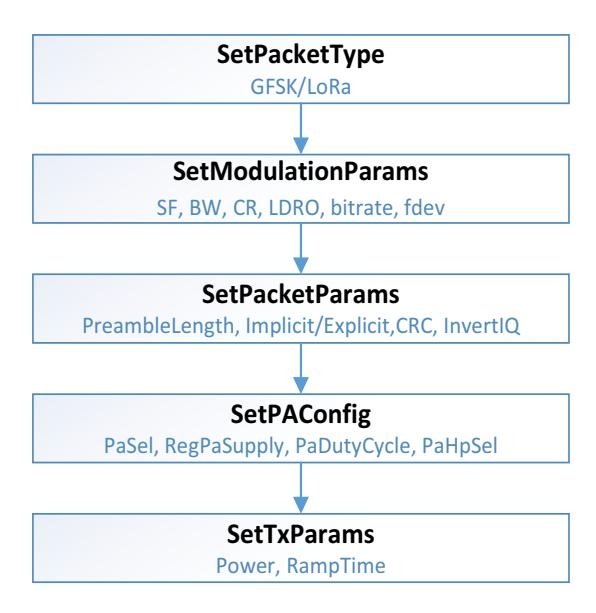

**Figure 8-1: LoRa® /(G)FSK Command Order**

# **8.1.1 SetPacketType**

The SetPacketType( ) command defines which modem is to be used.

**Table 8-1: SetPacketType Command**

| Byte           | 0     | 1     | 2                 |
|----------------|-------|-------|-------------------|
| Data from Host | 0x02  | 0x0E  | PacketType        |
| Data to Host   | Stat1 | Stat2 | IrqStatus (31:24) |

- **•** PacketType defines the modem to be used for the next RF transactions.
  - 0x00:None
  - 0x01: (G)FSK

- 0x02: LoRa®
- Other values are RFU

This command is the first one to be called before going to RX or TX and before defining modulation and packet parameters. No protocol is defined by default.

This command will only work with the device in Standby RC, Standby Xosc or Fs mode, otherwise it will return CMD\_FAIL in the status of the next command.

# **8.1.2 GetPacketType**

The command GetPacketType( ) returns the current protocol of the radio.

**Table 8-2: GetPacketType Command**

| Byte           | 0     | 1     |
|----------------|-------|-------|
| Data from Host | 0x02  | 0x02  |
| Data to Host   | Stat1 | Stat2 |

**Table 8-3: GetPacketType Response**

| Byte           | 0     | 1          |
|----------------|-------|------------|
| Data from Host | 0x00  | 0x00       |
| Data to Host   | Stat1 | PacketType |

- **•** PacketType corresponds to the modem used for the following RF transactions.
  - 0:None
  - 1: (G)FSK
  - 2: LoRa®
  - Other values are RFU

# **8.2 LoRa® Modem Description**

# **8.2.1 LoRa® Modulation Principle**

The LoRa® modem uses a proprietary spread spectrum modulation, which permits an increase in link budget and increased immunity to in-band interference compared to legacy modulation techniques. It has the capability to receive signals with negative SNR that increases the sensitivity as well as link budget and range of the LoRa® receiver.

### **8.2.1.1 Spreading Factor (SF)**

The spread spectrum LoRa® modulation is performed by representing each bit of payload information by multiple chips of information. The rate at which the spread information is sent is referred to as the symbol rate (Rs). The ratio between the

nominal symbol rate and chip rate is the spreading factor and it represents the number of symbols sent per bit of information.

Note that the spreading factor must be known in advance on both transmit and receive sides of the link as different spreading factors are orthogonal to each other.

### **8.2.1.2 LoRa® Bandwidth (BWL)**

The LoRa® modem operates at a programmable bandwidth (BWL) around a programmable central frequency fRF. The LoRa® modem bandwidth always refers to the double side band (DSB), as shown in [LoRa® Signal Bandwidth on page](#page-51-0) 52.

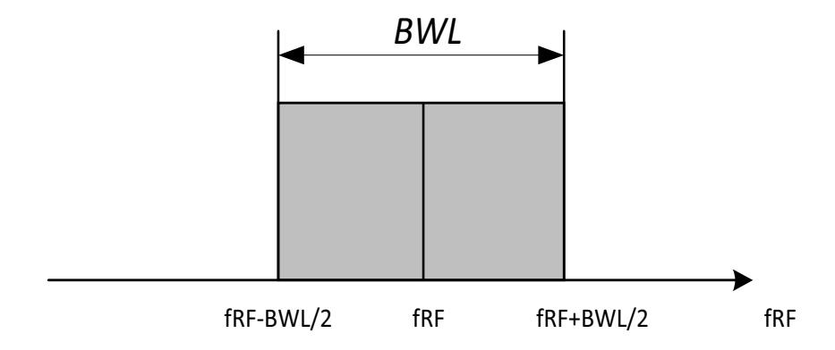

**Figure 8-2: LoRa® Signal Bandwidth**

An increase in signal bandwidth permits the use of a higher effective data rate, thus reducing transmission time at the expense of reduced sensitivity.

**Note: There are regulatory constraints in most countries on the permissible occupied bandwidth, therefore allowing usage of only a subset of BWL.** 

### **8.2.1.3 Coding Rate (CR)**

To further improve the robustness of the link, the LoRa® modem employs cyclic error coding to perform forward error detection and correction. Such error coding incurs a transmission overhead.

### **8.2.1.4 Low Datarate Optimization (LDRO)**

It increases the robustness of the LoRa® link at low effective data rates, improving the sensitivity level and increasing the robustness towards frequency drift and Doppler events. Its use is mandated with spreading factors of 11 and 12 at 125 kHz bandwidth, and SF12 at 250 kHz BW.

### **8.2.1.5 LoRa® Symbol Rate**

With a knowledge of the key parameters that can be controlled by the user we define the LoRa® symbol rate as:

$$Rs = \frac{BWL}{2^{SF}}$$

where BWL is the programmed bandwidth and SF is the spreading factor. The transmitted signal is a constant envelope signal. Equivalently, one chip is sent per second per Hz of bandwidth.

# **8.2.2 LoRa® Packet Format**

The LoRa® modem employs two types of packet formats: explicit and implicit. The explicit packet includes a short header that contains information about the number of bytes, coding rate and whether a CRC is used in the packet.

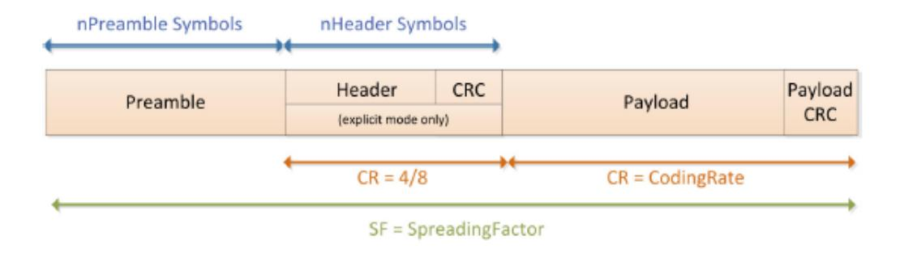

**Figure 8-3: LoRa® Packet Format**

### **8.2.2.1 Preamble**

The LoRa® packet starts with a preamble sequence, used to synchronize the receiver with the incoming signal. The transmitted preamble length may vary from 1 to 65535 symbols. This permits the transmission of near arbitrarily long preamble sequences. In order to optimize the packet reception, it is advised to use a minimum preamble length of 12 with SF5 and SF6, and of 8 for other SF.

The receiver undertakes a preamble detection process that periodically restarts. For this reason the preamble length should be configured as identical to the transmitter preamble length. Where the preamble length is not known, or can vary, the maximum preamble length should be programmed on the receiver side.

### **8.2.2.2 Header**

The header provides information on the payload:

**•** The payload length in bytes

**UM.LR1110.W.APP March 2020**

- **•** The forward error correction coding rate
- **•** The presence of an optional 16-bit CRC for the payload

The header is transmitted with maximum error correction code (4/8). It also has its own CRC to allow the receiver to discard invalid headers.

In certain scenarios, where the payload, coding rate and CRC presence are fixed or known in advance, it may be advantageous to reduce transmission time by invoking implicit header mode. In this mode the header is removed from the packet. In this case the payload length, error coding rate and presence of the payload CRC must be manually configured identically on both sides of the radio link.

### 8.2.2.3 Payload

The packet payload is a variable-length field that contains the actual data coded at the error rate either as specified in the header in explicit mode or in the register settings in implicit mode. An optional CRC may be appended.

### 8.2.2.4 LoRa® Packet Time On Air

The Time On Air of the LoRa® packet is given by:

$$ToA = \frac{2^{SF}}{BW\overline{L}} \times N_{symbol}$$

with:

- SF: Spreading Factor (5 to 12)
- BWL: Bandwidth (in kHz)
- ToA: the Time on Air in ms
- Nsymbol: number of symbols

The computation of the number of symbols differs depending on the parameters of the modulation:

For SF5 and SF6:

$$\textbf{N}_{\textbf{symbol}} = \textbf{N}_{\textbf{symbol}_{\textbf{preamble}}} + 6.25 + 8 + \textbf{ceil} \bigg( \frac{\textbf{max}(8 \times \textbf{N}_{\textbf{byte}_{\textbf{payload}}} + \textbf{N}_{\textbf{bit}_{\textbf{CRC}}} - 4 \times \textbf{SF} + 8 + \textbf{N}_{\textbf{symbol}_{\textbf{header}}}, 0)}{4 \times \textbf{SF}} \bigg) \times (\textbf{CR} + 4)$$

For all other SF:

$$\mathbf{N_{symbol}} = \mathbf{N_{symbol\_preamble}} + 4.25 + 8 + \mathbf{ceil} \left( \frac{\mathbf{max}(8 \times \mathbf{N_{byte\ payload}} + \mathbf{N_{bit\ CRC}} - 4 \times \mathbf{SF} + 8 + \mathbf{N_{symbol\ header}}, 0)}{4 \times \mathbf{SF}} \right) \times (\mathbf{CR} + 4)$$

• For all other SF with Low Data Rate Optimization activated:

$$\mathbf{N_{symbol}} = \mathbf{N_{symbol\_preamble}} + 4.25 + 8 + \mathbf{ceil} \left( \frac{\mathbf{max}(8 \times \mathbf{N_{byte\_payload}} + \mathbf{N_{bit\_CRC}} - 4 \times \mathbf{SF} + 8 + \mathbf{N_{symbol\_header}}, 0)}{4 \times (\mathbf{SF} - 2)} \right) \times (\mathbf{CR} + 4)$$

With:

- N\_bit\_CRC = 16 if CRC activated, 0 if not
- N\_symbol\_header = 20 with explicit header, 0 with implicit header
- CR is 1, 2, 3 or 4 for respective coding rates 4/5, 4/6, 4/7 or 4/8

The ceil function indicates that the portion of the equation in square brackets should be rounded up to the next integer value.

# **8.2.3 Channel Activity Detection**

Used only in LoRa® packet type, the Channel Activity Detection (CAD) is a LoRa® specific mode of operation where the device searches for the presence of a LoRa® preamble signal. After the search has completed, the device returns in STDBY\_RC mode. The length of the search is configured via the command *SetCadParams()*. At the end of the search period, the device triggers the IRQ CADdone. If a valid signal has been detected it also generates the IRQ CadDetected. A minimum of 2 symbols is recommended to perform CAD.

# **8.3 LoRa® Commands**

# **8.3.1 SetModulationParam**

The command SetModulationParam( ) configures the modulation parameters for the selected modem. Since the parameters are modem dependent, the description hereafter is valid only for the LoRa® modem.

**Table 8-4: SetModulationParam Command**

| Byte           | 0     | 1     | 2                    | 3                    | 4                   | 5                   |
|----------------|-------|-------|----------------------|----------------------|---------------------|---------------------|
| Data from Host | 0x02  | 0x0F  | SF                   | BWL                  | CR                  | LowDataRateOptimize |
| Data to Host   | Stat1 | Stat2 | IrqStatus (31:24) | IrqStatus (23:16) | IrqStatus (15:8) | IrqStatus (7:0)  |

**•** SF defines the spreading factor:

**Table 8-5: Spreading Factor**

| Description |
|-------------|
| SF5         |
| SF6         |
| SF7         |
| SF8         |
| SF9         |
| SF10        |
| SF11        |
| SF12        |
|             |

The SF5 and SF6 are compatible with the SX126x device family, but SF6 is not compatible with the SF6 used in the SX127x family.

**•** BWL defines the LoRa® modulation bandwidth

**Table 8-6: LoRa® Modulation Bandwidth**

| BWL  | Description | Value                    |
|------|-------------|--------------------------|
| 0x03 | LoRa_BW_62  | LoRa® Bandwidth 62.5 kHz |
| 0x04 | LoRa_BW_125 | LoRa® Bandwidth 125 kHz  |
| 0x05 | LoRa_BW_250 | LoRa® Bandwidth 250 kHz  |
| 0x06 | LoRa_BW_500 | LoRa® Bandwidth 500 kHz  |

**•** CR configures the Coding Rate

**Table 8-7: Coding Rate**

| CR   | Description               | Overhead Ratio |
|------|---------------------------|----------------|
| 0x01 | Short Interleaver CR= 4/5 | 1.25           |
| 0x02 | Short Interleaver CR= 4/6 | 1.5            |
| 0x03 | Short Interleaver CR= 4/7 | 1.75           |
| 0x04 | Short Interleaver CR= 4/8 | 2              |
| 0x05 | Long Interleaver CR= 4/5  | 1.25           |
| 0x06 | Long Interleaver CR= 4/6  | 1.5            |
| 0x07 | Long Interleaver CR= 4/8  | 2              |

**•** LowDataRateOptimize reduces the number of bits per symbol:

**Table 8-8: LowDataRateOptimize**

| LowDataRateOptimize | Description             |
|---------------------|-------------------------|
| 0x00                | LowDataRateOptimize off |
| 0x01                | LowDataRateOptimize on  |

# **8.3.2 SetPacketParam**

The command SetPacketParam( ) configures the parameters of the RF packet for the selected modem. Since the parameters are modem dependent, the description hereafter is valid only for the LoRa® modem.

**Table 8-9: SetPacketParam Command**

| Byte           | 0     | 1     | 2                    | 3                    | 4                   | 5                  | 6    | 7        |
|----------------|-------|-------|----------------------|----------------------|---------------------|--------------------|------|----------|
| Data from Host | 0x02  | 0x10  | PbLengthTX (15:8) | PbLengthTX (7:0)  | HeaderType          | PayloadLen         | CRC  | InvertIQ |
| Data to Host   | Stat1 | Stat2 | IrqStatus (31:24) | IrqStatus (23:16) | IrqStatus (15:8) | IrqStatus (7:0) | 0x00 | 0x00     |

- **•** PbLengthTX defines the length of the LoRa® packet preamble.
  - Coded on 2 Bytes, from 0x0001 (1) to 0xFFFF (65535). Minimum of 12 with SF5 and SF6, and of 8 for other SF advised.
- **•** HeaderType defines if the header is explicit or implicit:
  - 0x00= explicit header (default)
  - 0x01= implicit header
- **•** PayloadLen defines the size of the payload (in Bytes) to transmit or the maximum size of the payload that the receiver can accept.

In explicit header mode:

- PayloadLen=0: reception of any payload length between 0 and 255 Bytes allowed.
- PayloadLen= N: reception of any payload length between 1 and N Bytes accepted. Payload lengths of 0 or > N are rejected and result in a HeaderErr IRQ.

In implicit header mode, PayloadLen configures the exact length of the payload to be transmitted or received.

- CRC defines if the CRC is OFF or ON:
  - 0x00= CRC OFF
  - 0x01= CRC ON
- InvertIQ defines if the I and Q signals are inverted.
  - 0x00= non inverted IQ
  - ◆ 0x01= inverted IQ

This command will fail if no packet type has been set.

### 8.3.3 SetCad

The command SetCad() activates the CAD feature.

Table 8-10: SetCad Command

| Byte           | 0     | 1     |
|----------------|-------|-------|
| Data from Host | 0x02  | 0x18  |
| Data to Host   | Stat1 | Stat2 |

### 8.3.4 SetCadParams

The command SetCadParams() defines the LoRa® CAD parameters.

Table 8-11: SetCadParams Command

| Byte              | 0     | 1     | 2                    | 3                    | 4                   | 5                  | 6                  | 7                 | 8                |
|-------------------|-------|-------|----------------------|----------------------|---------------------|--------------------|--------------------|-------------------|------------------|
| Data from Host | 0x02  | 0x0D  | Symbol Num        | DetPeak              | DetMin              | CadExit Mode    | Timeout (23:16) | Timeout (15:8) | Timeout (7:0) |
| Data to Host   | Stat1 | Stat2 | IrqStatus (31:24) | IrqStatus (23:16) | IrqStatus (15:8) | IrqStatus (7:0) | 0x00               | 0x00              | 0x00             |

- SymbolNum defines the number of symbols used for the CAD detection
- DetPeak and DetMin define the sensitivity of the LoRa® modem when trying to correlate to actual LoRa® preamble symbols. These two settings depend on the LoRa® spreading factor and Bandwidth, but also depend on the number of symbol used to validate or not the detection. Choosing the right value must be carefully tested to ensure a good detection at sensitivity level, and also to limit the number of false detections.

Application note AN1200.48 provides guidance for the selection of the CAD parameters.

**•** CadExitMode defines the action to be done after a CAD operation.

**Table 8-12: CadExitMode Parameter Definition**

| Value | CadExitMode | Operation                                                                                                                                                                        |  |  |
|-------|-------------|----------------------------------------------------------------------------------------------------------------------------------------------------------------------------------|--|--|
| 0x00  | CAD_ONLY    | The chip performs the CAD operation in LoRa®. Once don and whatever the activity on the channel, the device goes back to STBY_RC mode.                                        |  |  |
| 0x01  | CAD_RX      | The device performs a CAD operation and if an activity is detected, it stays in RX until a packet is detected or the timer reaches the timeout defined by CadTimeout *31.25us |  |  |
| 0x10  | CAD_LBT     | The device performs a CAD operation and if no activity is detected, it goes to Tx mode with the defined CadTimeout as timeout parameter.                                      |  |  |

**•** Timeout is only used when the CAD is performed with cadExitMode = CAD\_RX. Here, Timeout indicates the time the device will stay in Rx mode following a successful CAD.

# **8.3.5 LoRaSynchTimeout**

The command LoRaSynchTimeout( ) configures the LoRa® modem to issue an RX timeout after exactly SymbolNum symbols in case no packet was detected by then.

**Table 8-13: LoRaSynchTimeout Command**

| Byte           | 0     | 1     | 2                 |
|----------------|-------|-------|-------------------|
| Data from Host | 0x02  | 0x1B  | SymbolNum         |
| Data to Host   | Stat1 | Stat2 | IrqStatus (31:24) |

**•** SymbolNum: 0x00 means no timeout. Default value is 0x00

# **8.3.6 SetLoRaPublicNetwork**

The command SetLoRaPublicNetwork( ) sets the LoRa® modem syncword to public or private.

**Table 8-14: SetLoRaPublicNetwork**

| Byte           | 0     | 1     | 2                 |
|----------------|-------|-------|-------------------|
| Data from Host | 0x02  | 0x08  | PublicNetwork     |
| Data to Host   | Stat1 | Stat2 | IrqStatus (31:24) |

- **•** PublicNetwork:
  - 0x00= Private network (default)
  - 0x01 =Public network

# **8.3.7 GetPacketStatus**

The command GetPacketStatus( ) gets the status of the last received packet. Since the returned values are modem dependent, the description hereafter is valid only for the LoRa® modem.

**Table 8-15: GetPacketStatus Command**

| Byte           | 0     | 1     |
|----------------|-------|-------|
| Data from Host | 0x02  | 0x04  |
| Data to Host   | Stat1 | Stat2 |

### **Table 8-16: GetPacketStatus Response**

| Byte           | 0     | 1       | 2      | 3             |
|----------------|-------|---------|--------|---------------|
| Data from Host | 0x00  | 0x00    | 0x00   | 0x00          |
| Data to Host   | Stat1 | RssiPkt | SnrPkt | SignalRssiPkt |

- **•** RssiPkt defines the average RSSI over the last packet received. RSSI value in dBm is –RssiPkt/2.
- **•** SnrPkt is an estimation of SNR on last packet received. Expressed in two's complement format multiplied by 4. Actual SNR in dB is SnrPkt/4
- **•** SignalRssiPkt provides an estimation of RSSI of the LoRa® signal (after despreading) on last packet received. In two's complement format [negated, dBm, fixdt(0,8,1)]. Actual Rssi in dB is -SignalRssiPkt/2

Additional information on the RSSI can be found in section Section [8.7 "RSSI Functionality" on page 69.](#page-68-1)

# **8.4 (G)FSK Modem Description**

# **8.4.1 (G)FSK Modulation Principle**

The (G)FSK modem is able to perform transmission and reception of 2-FSK modulated packets over a range of data rates ranging from 0.6 kbps to 300 kbps.

Both the bit rate (Bitrate) and frequency deviation (Fdev) are directly configured using the command SetModulationParams().

Additionally, in transmission mode, several shaping filters can be applied to the signal in packet mode or in continuous mode. In reception mode, the user needs to select the best reception bandwidth depending on its conditions. To ensure correct demodulation, the following limit must be respected for the selection of the bandwidth:

$$(2 \times Fdev + BR) < BWF$$

Where the bandwidth BWF ranges from 4.8kHz to 467kHz.

The bandwidth must be chosen so that:

Bandwidth[DSB] **BR** + 2 frequency deviation + frequency error

where the frequency error is two times the frequency error of the crystal oscillator used.

# **8.4.2 (G)FSK Packet Engine**

The LR1110 is designed for packet-based transmission. The packet controller block is responsible for assembly of received data bit-stream into packets and their storage into the data buffer. It also performs the bit-stream decoding operations such as de-whitening & CRC-checks on the received bit-stream.

On the transmit side, the packet handler can construct a packet and send it bit by bit to the modulator for transmission. It can whiten the payload and append the CRC-checksum to the end of the packet. The packet controller only works in half-duplex mode i.e. either in transmit or receive at a time.

The packet controller is configured using the command SetPacketParams( ) . This function can be called only after defining the protocol.

### **Preamble Detection in Receiver Mode**

The LR1110 is able to gate the reception of a packet if an insufficient number of alternating preamble symbols (usually referred to 0x55 or 0xAA in hexadecimal form) has been detected. This can be selected by the user by using the parameter PreambleDetectorLength used in the command SetPacketParams( ) . The user can select a value ranging from "Preamble detector length off" - where the radio will not perform any gating and will try to lock directly on the following Syncword -to "Preamble detector length 32 bits" where the radio will be expecting to receive 32 bits of preamble before the following Syncword. In this case, if the 32 bits of preamble are not detected, the radio will either drop the reception in RxSingle mode, or restart its tracking loop in RxContinuous mode.

To achieve best performance of the device, it is recommended to set PreambleDetectorLength to "Preamble detector length 8 bits" or "Preamble detector length 16 bits" depending of the complete size of preamble which is sent by the transmitter.

Note: In all cases, PreambleDetectorLength must be smaller than the size of the following Syncword to achieve proper detection of the packets. If the preamble length is greater than the following Syncword length (typically when no Syncword is used) the user should fill some of the Syncword bytes with 0x55.

# **8.4.3 (G)FSK Packet Format**

The (G)FSK packet format provides a conventional packet format for application in proprietary NRZ coded, low energy communication links. The packet format has built in facilities for CRC checking of the payload, dynamic payload size and packet acknowledgement. Optionally whitening based upon pseudo random number generation can be enabled. Two principle packet formats are available in the (G)FSK protocol: fixed length and variable length packets.

### **8.4.3.1 Fixed-Length Packet**

If the packet length is fixed and known on both sides of the link then knowledge of the packet length does not need to be transmitted over the air. Instead the packet length can be written to the parameter packetLength which determines the packet length in bytes (0 to 255).

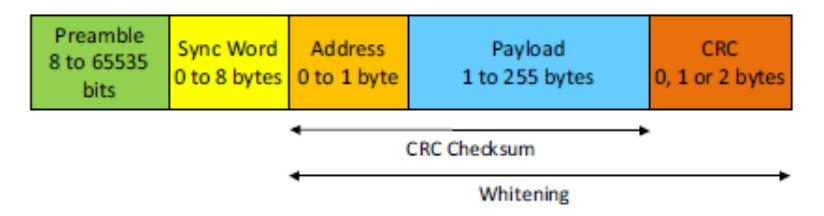

**Figure 8-4: Fixed-Length Packet**

The preamble length is set from 8 to 65535 bits using the parameter PreambleLen. It is usually recommended to use a minimum of 16 bits for the preamble to guarantee a valid reception of the packet on the receiver side. The CRC operation, packet length and preamble length are defined using the command SetPacketParams( ).

### **8.4.3.2 Variable-Length Packet**

Where the packet is of uncertain or variable size, then information about the packet length must be transmitted within the packet. The format of the variable-length packet is shown below.

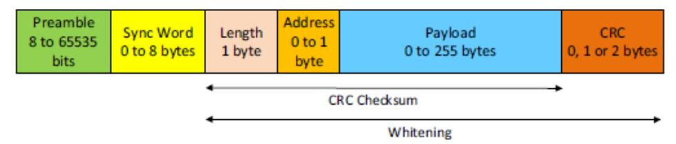

**Figure 8-5: Variable-Length Packet**

# **8.4.3.3 Setting The Packet Length Or Node Address**

The packet length and Node or Broadcast address are not considered part of the payload and they are added automatically in hardware.

The packet length is added automatically in the packet when the PacketType field is set to variable size in the command SetPacketParam( ) .

The node or broadcast address can be enabled by using the AddrComp field is in the command SetPacketParam( ) . This field allow the user to enable and select an additional packet filtering at the payload level.

### **8.4.3.4 Whitening**

The whitening process is built around a 9-bit LFSR which is used to generate a random sequence and the payload (including the payload length, the Node or Broadcase address and CRC checksum when needed) is then XORed with this random sequence to generate the whitened payload. The data is de-whitened on the receiver side by XORing with the same random sequence. This setup limits the number of consecutive 1's or 0's to 9. Note that the data whitening is only required when the user data has high correlation with long strings of 0's and 1's. If the data is already random then the whitening is not required.

# LFSR Polynomial = X9 + X5 + 1 X8

Figure 8-6: (G)FSK Whitening

The whitening is based around the 9-bit LFSR polynomial  $x^9+x^5+1$ . With this structure, the LSB at the output of the LFSR is XORed with the MSB of the data.

At the initial stage, the command SetGfskWhitParams() allows setting the whitening Seed.

### 8.4.3.5 CRC

The LR1110 offers full flexibility to select the CRC polynomial and initial value of the selected polynomial. In addition, the user can also select a complete inversion of the computed CRC to comply with some international standards.

The CRC can be enabled and configured by using the *CrcType* field in the command *SetPacketParam()*. This field allows the user to enable and select the length and configuration of the CRC.

The command SetGfskCrcParams() allows configuring the CRC polynomial and initial value.

# 8.5 (G)FSK Commands

### 8.5.1 SetModulationParam

The command *SetModulationParam()* allows to configure the modulation parameters for the selected modem. Since the parameters are modem dependent, the description hereafter is valid only for the (G)FSK modem.

**Table 8-17: SetModulationParam Command** 

| Byte           | 0     | 1     | 2                        | 3                        | 4                       | 5                      | 6              | 7    | 8               | 9               | 10             | 11            |
|----------------|-------|-------|--------------------------|--------------------------|-------------------------|------------------------|----------------|------|-----------------|-----------------|----------------|---------------|
| Data from Host | 0x02  | 0x0F  | Bitrate (31:24)       | Bitrate (23:16)       | Bitrate (15:8)       | Bitrate (7:0)       | Pulse Shape | BWF  | Fdev (31:24) | Fdev (23:16) | Fdev (15:8) | Fdev (7:0) |
| Data to Host   | Stat1 | Stat2 | Irq Status (31:24) | Irq Status (23:16) | Irq Status (15:8) | Irq Status (7:0) | 0x00           | 0x00 | 0x00            | 0x00            | 0x00           | 0x00          |

- **•** BitRate defines the (G)FSK bit rate in bits per second. It ranges from 600 b/s up to 300 kb/s with a default value at 4.8 kb/s.
- **•** PulseShape defines the filtering applied to the (G)FSK packet.

### **Table 8-18: PulseShape Parameter**

| PulseShape | Description       |  |  |  |  |  |
|------------|-------------------|--|--|--|--|--|
| 0x00       | No Filter applied |  |  |  |  |  |
| 0x08       | Gaussian BT 0.3   |  |  |  |  |  |
| 0x09       | Gaussian BT 0.5   |  |  |  |  |  |
| 0x0A       | Gaussian BT 0.7   |  |  |  |  |  |
| 0x0B       | Gaussian BT 1     |  |  |  |  |  |

### **•** BWF defines the bandwidth

### **Table 8-19: Bandwidth Parameter**

| BWF  | Description                  |  |  |  |  |  |
|------|------------------------------|--|--|--|--|--|
| 0x1F | RX_BW_4800 (4.8 kHz DSB)     |  |  |  |  |  |
| 0x17 | RX_BW_5800 (5.8 kHz DSB)     |  |  |  |  |  |
| 0x0F | RX_BW_7300 (7.3 kHz DSB)     |  |  |  |  |  |
| 0x1E | RX_BW_9700 (9.7 kHz DSB)     |  |  |  |  |  |
| 0x16 | RX_BW_11700 (11.7 kHz DSB)   |  |  |  |  |  |
| 0x0E | RX_BW_14600 (14.6 kHz DSB)   |  |  |  |  |  |
| 0x1D | RX_BW_19500 (19.5 kHz DSB)   |  |  |  |  |  |
| 0x15 | RX_BW_23400 (23.4 kHz DSB)   |  |  |  |  |  |
| 0x0D | RX_BW_29300 (29.3 kHz DSB)   |  |  |  |  |  |
| 0x1C | RX_BW_39000 (39 kHz DSB)     |  |  |  |  |  |
| 0x14 | RX_BW_46900 (46.9 kHz DSB)   |  |  |  |  |  |
| 0x0C | RX_BW_58600 (58.6 kHz DSB)   |  |  |  |  |  |
| 0x1B | RX_BW_78200 (78.2 kHz DSB)   |  |  |  |  |  |
| 0x13 | RX_BW_93800 (93.8 kHz DSB)   |  |  |  |  |  |
| 0x0B | RX_BW_117300 (117.3 kHz DSB) |  |  |  |  |  |
| 0x1A | RX_BW_156200 (156.2 kHz DSB) |  |  |  |  |  |
| 0x12 | RX_BW_187200 (187.2 kHz DSB) |  |  |  |  |  |
| 0x0A | RX_BW_234300 (232.3 kHz DSB) |  |  |  |  |  |
| 0x19 | RX_BW_312000 (312 kHz DSB)   |  |  |  |  |  |

**Table 8-19: Bandwidth Parameter**

| BWF  | Description                  |  |  |  |  |
|------|------------------------------|--|--|--|--|
| 0x11 | RX_BW_373600 (373.6 kHz DSB) |  |  |  |  |
| 0x09 | RX_BW_467000 (467 kHz DSB)   |  |  |  |  |

**•** Fdev defines the deviation frequency (in Hz).

# **8.5.2 SetPacketParam**

The command SetPacketParam( ) allows to configure the parameters of the RF packet for the selected modem. Since the parameters are modem dependent, the description hereafter is valid only for the (G)FSK modem.

**Table 8-20: SetPacketParam Command**

| Byte           | 0     | 1     | 2                        | 3                        | 4                       | 5                      | 6            | 7              | 8              | 9           | 10     |
|----------------|-------|-------|--------------------------|--------------------------|-------------------------|------------------------|--------------|----------------|----------------|-------------|--------|
| Data from Host | 0x02  | 0x10  | PbLength TX(15:8)     | PbLength TX(7:0)      | Pbl Detect           | Sync WordLen        | Addr Comp | Packet Type | Payload Len | Crc Type | DcFree |
| Data to Host   | Stat1 | Stat2 | Irq Status (31:24) | Irq Status (23:16) | Irq Status (15:8) | Irq Status (7:0) | 0x00         | 0x00           | 0x00           | 0x00        | 0x00   |

- **•** PbLengthTX defines the length of the (G)FSK packet preamble in bits. Coded on 2 Bytes, from 0x0008 (8 bits) to 0xFFFF (65535 bits).
- **•** PblDetect defines the preamble detector length. The preamble detector acts as a gate to the packet controller, when different from 0x00 (preamble detector length off), the packet controller will only become active if a certain number of preamble bits have been successfully detected by the radio.

**Table 8-21: PblDetect: Preamble Detector Length**

| Description                      |
|----------------------------------|
| Preamble detector length off     |
| Preamble detector length 8 bits  |
| Preamble detector length 16 bits |
| Preamble detector length 24 bits |
| Preamble detector length 32 bits |
|                                  |

**•** SyncWordLen defines the length of the Syncword in bits. The Syncword is directly programmed into the device through the command SetGfskSyncWord( ).

**•** AddrComp allows conditioning the packet reception to a predefined peer device address. Node address and broadcast address can be set with the SetPacketAdrs( )command. If the address comparison fails then the packet reception is aborted and the adrsErr flag is set.

### **Table 8-22: AddrComp**

| AddrComp | Description                                                 |
|----------|-------------------------------------------------------------|
| 0x00     | Address Filtering Disable                                   |
| 0x01     | Address Filtering activated on Node address                 |
| 0x02     | Address Filtering activated on Node and broadcast addresses |

**•** PacketType defines the length of the incoming packet.

### **Table 8-23: PacketType**

| PacketType | Description                                                                                  |  |  |  |
|------------|----------------------------------------------------------------------------------------------|--|--|--|
| 0x00       | The packet length is known on both sides, the size of the payload is not added to the packet |  |  |  |
| 0x01       | The packet is of variable size, the first byte of the payload will be the size of the packet |  |  |  |

- **•** PayloadLen defines the length of the payload in Bytes,
- **•** CrcType defines the packet CRC:

### **Table 8-24: CrcType**

| CrcType | Description                                         |
|---------|-----------------------------------------------------|
| 0x01    | CRC_OFF (No CRC)                                    |
| 0x00    | CRC_1_BYTE (CRC computed on 1 byte)                 |
| 0x02    | CRC_2_BYTE(CRC computed on 2 byte)                  |
| 0x04    | CRC_1_BYTE_INV(CRC computed on 1 byte and inverted) |
| 0x06    | CRC_2_BYTE_INV(CRC computed on 2 byte and inverted) |

The CRC can be fully configured and the polynomial used, as well as the initial values can be entered directly through the command SetGfskCrcParams( ) .

**•** Whitening allows to enable the whitening on the RF packet

### **Table 8-25: Whitening**

| Whitening | Description      |  |  |  |
|-----------|------------------|--|--|--|
| 0x00      | No encoding      |  |  |  |
| 0x01      | Whitening enable |  |  |  |

# **8.5.3 SetGfskSyncWord**

The command SetGfskSyncWord( ) allows to configure the Syncword of the (G)FSK packet.

**Table 8-26: SetGfskSyncWord Command**

| Byte                 | 0     | 1     | 2                    | 3                    | 4                   | 5                   | 6                   | 7                   | 8                  | 9                 |
|----------------------|-------|-------|----------------------|----------------------|---------------------|---------------------|---------------------|---------------------|--------------------|-------------------|
| Data from Host | 0x02  | 0x06  | Syncword (63:56)  | Syncword (55:48)  | Syncword (47:40) | Syncword (39:32) | Syncword (31:24) | Syncword (23:16) | Syncword (15:8) | Syncword (7:0) |
| Data to Host   | Stat1 | Stat2 | IrqStatus (31:24) | IrqStatus (23:16) | IrqStatus (15:8) | IrqStatus (7:0)  | 0x00                | 0x00                | 0x00               | 0x00              |

By default, the Syncword is set to 0x9723522556536564.

# **8.5.4 SetPacketAdrs**

The command SetPacketAdrs( ) allows to set the Node address and Broadcast address used for (G)FSK packet reception/transmission when filtering is enabled (AddrComp 0x01, or 0x02).

**Table 8-27: SetPacketAdrs Command**

| Byte           | 0     | 1     | 2                 | 3                 |  |
|----------------|-------|-------|-------------------|-------------------|--|
| Data from Host | 0x02  | 0x12  | NodeAddr          | BroadcastAddr     |  |
| Data to Host   | Stat1 | Stat2 | IrqStatus (31:24) | IrqStatus (23:16) |  |

If the address comparison fails then the packet reception is aborted and the addrsErr flag is set.

# **8.5.5 SetGfskCrcParams**

The command SetGfskCrcParams( ) allows configuring the CRC polynomial and initial value.

**Table 8-28: SetGfskCrcParams Command**

| Byte                 | 0     | 1     | 2                    | 3                    | 4                   | 5                  | 6               | 7               | 8              | 9             |
|----------------------|-------|-------|----------------------|----------------------|---------------------|--------------------|-----------------|-----------------|----------------|---------------|
| Data from Host | 0x02  | 0x24  | InitValue (31:24) | InitValue (23:16) | InitValue (15:8) | InitValue (7:0) | Poly (31:24) | Poly (23:16) | Poly (15:8) | Poly (7:0) |
| Data to Host      | Stat1 | Stat2 | IrqStatus (31:24) | IrqStatus (23:16) | IrqStatus (15:8) | IrqStatus (7:0) | 0x00            | 0x00            | 0x00           | 0x00          |

- **•** InitValue: initial value of the configured CRC polynomial
- **•** Poly: CRC polynomial

This flexibility permits the user to select any standard CRC or to use his own CRC allowing a specific detection of a given packet. Examples:

### **To use the IBM CRC configuration, the user must select:**

- **•** 0x8005 for the CRC polynomial
- **•** 0xFFFF for the initial value
- **•** CRC\_2\_BYTE for the field CrcType in the command SetPacketParam( )

### **For the CCITT CRC configuration the user must select:**

- **•** 0x1021 for the CRC polynomial
- **•** 0x1D0F for the initial value
- **•** CRC\_2\_BYTE\_INV for the field CrcType in the command SetPacketParam( )

# **8.5.6 SetGfskWhitParams**

The command SetGfskWhitParams( ) allows setting the whitening Seed:

**Table 8-29: SetGfskWhitParams Command**

| Byte           | 0     | 1     | 2                 | 3                 |
|----------------|-------|-------|-------------------|-------------------|
| Data from Host | 0x02  | 0x025 | Seed(15:8)        | Seed(7:0)         |
| Data to Host   | Stat1 | Stat2 | IrqStatus (31:24) | IrqStatus (23:16) |

# **8.6 Data Buffer**

The LR1110 is equipped with two 255 Bytes RAM data buffers which are accessible in all modes except sleep mode. One buffer stores the received payloads data, while the other is intended to contain the payload data to be transmitted.

The LR1110 automatically control the data pointers, which means that no Base Address handling by the user is necessary.

# **8.6.1 Data Buffer in Receive Mode**

The received payload data are stored in the RX Buffer, and can be read back using the command ReadBuffer8( ). The pointer to the first byte of the last packet received and the packet length can be read with the command GetRxbufferStatus( ). ClearRxBuffer( ) clears all the data in the LR1110 RX buffer

### **8.6.1.1 GetRxBufferStatus**

The command GetRxBufferStatus( ) gets the length of the last received packet and the offset in the RX buffer of the first byte

received.

**Table 8-30: GetRxBufferStatus Command**

| Byte           | 0     | 1     |
|----------------|-------|-------|
| Data from Host | 0x02  | 0x03  |
| Data to Host   | Stat1 | Stat2 |

### **Table 8-31: GetRxBufferStatus Response**

| Byte           | 0     | 1               | 2                    |
|----------------|-------|-----------------|----------------------|
| Data from Host | 0x00  | 0x00            | 0x00                 |
| Data to Host   | Stat1 | PayloadLengthRX | RxStartBufferPointer |

- **•** PayloadLengthRX: length of the last received packet in Bytes.
- **•** RxStartBufferPointer: offset in the RX buffer of the first byte received

### **8.6.1.2 ReadBuffer8**

The command ReadBuffer8( ) allows reading a block of bytes in the radio RX buffer starting at a specific offset.

**Table 8-32: ReadBuffer8 Command**

| Byte           | 0     | 1     | 2                 | 3                 |
|----------------|-------|-------|-------------------|-------------------|
| Data from Host | 0x01  | 0x0A  | Offset (7:0)      | Len (7:0)         |
| Data to Host   | Stat1 | Stat2 | IrqStatus (31:24) | IrqStatus (23:16) |

### **Table 8-33: ReadBuffer8 Response**

| Byte           | 0     | 1     | 2     | 3     |  N     |
|----------------|-------|-------|-------|-------|-----------|
| Data from Host | 0x00  | 0x00  | 0x00  | 0x00  |  0x00  |
| Data to Host   | Stat1 | data1 | data2 | data3 |  dataN |

### 8.6.1.3 ClearRxBuffer

The command ClearRxBuffer() clears all the data in the LR1110 RX buffer. It will write '0' on the whole RX buffer. It is used to ensure the data in the RX buffer is not from the last packet, mostly a debug feature.

**Table 8-34: ClearRxBufferStatus Command** 

| Byte           | 0     | 1     |  |
|----------------|-------|-------|--|
| Data from Host | 0x01  | 0x0B  |  |
| Data to Host   | Stat1 | Stat2 |  |

### 8.6.2 Data Buffer in Transmit Mode

The payload data to be transmitted shall be written the Tx Buffer using the command WriteBuffer8().

### 8.6.2.1 WriteBuffer8

The command WriteBuffer8() allows writing a block of bytes (up to 255 Bytes) in the radio TX buffer.

Table 8-35: WriteBuffer8 Command

| Byte              | 0     | 1     | 2                    | 3                    | 4                   | 5                  | 6     |  N+1   |
|-------------------|-------|-------|----------------------|----------------------|---------------------|--------------------|-------|-----------|
| Data from Host | 0x01  | 0x09  | data1                | data2                | data3               | data4              | data5 |  dataN |
| Data to Host   | Stat1 | Stat2 | IrqStatus (31:24) | IrqStatus (23:16) | IrqStatus (15:8) | IrqStatus (7:0) | 0     |  0     |

# 8.7 RSSI Functionality

The RSSI information of the LR1110 is available through different means: either in the sub-GHz chain, or at the modem stage.

A summary of the different RSSI informations and their meaning is summarized in the table Table 8-36: RSSI Information Origin and Meaning below:

**Table 8-36: RSSI Information Origin and Meaning** 

| Command       | Modem | Name     |                    | Description |  |
|---------------|-------|----------|--------------------|-------------|--|
| GetRssiInst() | All   | Rssilnst | Instantaneous RSSI |             |  |

**Table 8-36: RSSI Information Origin and Meaning**

| Command            | Modem  | Name          | Description                                                                                                                   |  |  |
|--------------------|--------|---------------|-------------------------------------------------------------------------------------------------------------------------------|--|--|
|                    | (G)FSK | RSSISync      | Instantaneous RSSI value latched in the (G)FSK demodulator, upon the detection of sync address                             |  |  |
|                    |        | RssiAvg       | Average RSSI value over the whole payload of the received packet, determined in the (G)FSK demodulator.                    |  |  |
| GetPacketStatus( ) | LoRa®  | RssiPkt       | Measurement of the mean energy at the input of the modem over the last packet received.                                    |  |  |
|                    |        | SignalRssiPkt | Estimation of the mean energy of the LoRa® signal over the last packet received. Equivalent to RssiPkt - environment noise |  |  |

Refer to each command description for implementation details on the various RSSI fields.

# 9. Power Amplifiers

The LR1110 features 2 Power Amplifiers for sub-GHz operation: a High Power PA, optimized for +22dBm operation, and a Low Power PA, optimized for +14dBm operation, capable of +15 dBm output power.

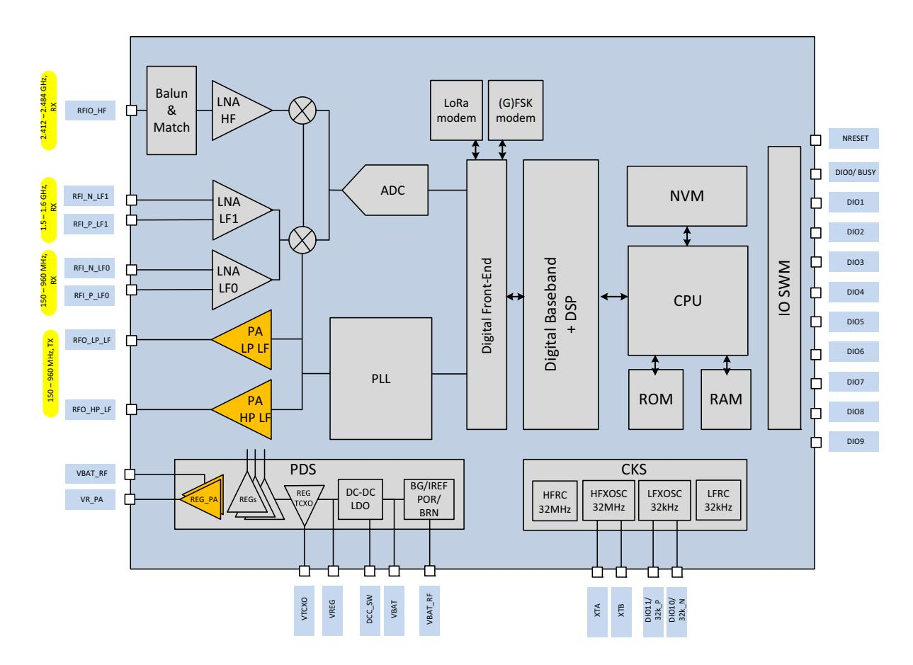

Figure 9-1: LR1110 Power Amplifiers

The PA is configured using two commands: SetPaConfig() and SetTxParams().

The SetPaConfig() is used to:

- Select the PA to be used (High power or low power)
- Select the supply of the PA (VBAT or VREG)
- Select the duty cycle of either PA
- Select the size of the PA (only applicable to the high power PA).

The SetTxParams() command is used to:

- Control the supply voltage of the PA (VR\_PA) and output power
- Choose the ramp time at the start / stop of TX

# **9.1 PA Supply Scheme**

The PA supply scheme is depicted in [Figure 9-2: PA Block Diagram](#page-71-1).

The PA regulator (Reg\_PA) is used to supply of both the Low Power PA and the High Power PAs through the VR\_PA pin. Each amplifier require a high-Q choke inductor connected externally between their respective output and VR\_PA in order to provide the bias and control the output power.

The PA regulator is internally connected to the DC-DC /LDO output for the Low Power PA, allowing a +15dBm operation in both DCDC or LDO configurations. It is also connected to the VBAT\_RF pin for the High Power PA, therefore to the main supply voltage. This means that the maximum output power generated by the High Power PA will depend on the VBAT voltage.

The TX main supply can switched between the battery VBAT and the internal regulator VREG, according to the PA use case. When operating with VR\_PA above 1.35 V (e.g. in the case of High Power), the battery supply VBAT must be chosen. When operating with VR\_PA below 1.35 V (e.g. in the case of low power PA), either supply can be chosen. However, it is better to choose the internal regulator VREG whenever the required VR\_PA is 1.35 V or below, in order to benefit from the Buck converter.

The LR1110 incorporates a precise duty cycle trimmer shared between the two power amplifiers. This duty cycle trimmer can be used to trade-off the output power, efficiency, and harmonic emission to address the different regional standard requirements.

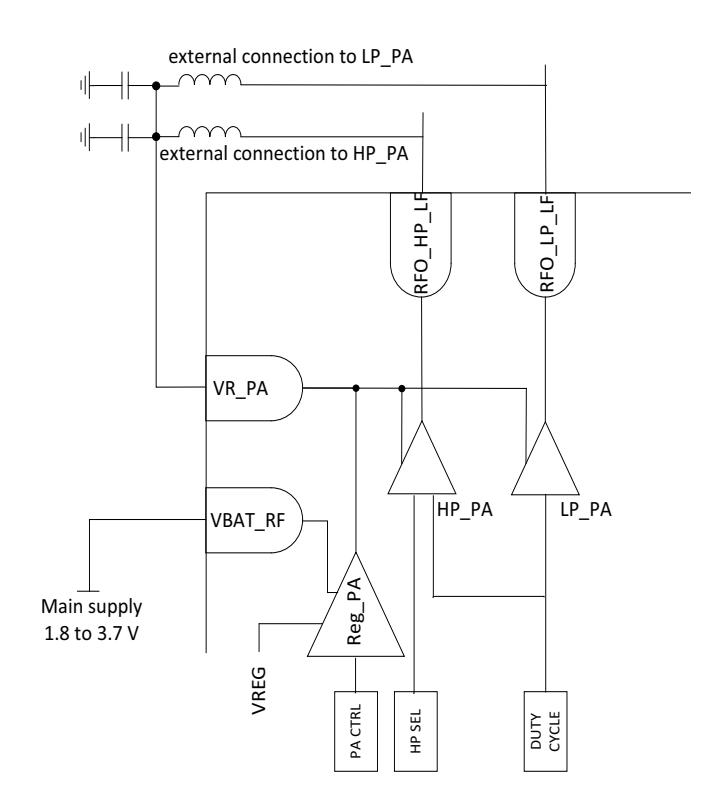

**Figure 9-2: PA Block Diagram**

# **9.1.1 Low Power PA**

For maximum efficiency, the low power PA should be operated with a maximum VR\_PA near 1.35V. To get VR\_PA = 1.35 V the user should set TxPower = 14. At this setting, the PA can deliver up to 15 dBm output power, constant over the specified battery supply range. The actual maximum output power can be set according to the duty cycle setting (PaDutyCycle). If needed, the output power can be decremented in steps of 1 dB from maximum by using TxPower < 14.

The VR\_PA variation over the programmed power TxPower for different supply voltages and PaDutyCycle conditions is depicted in [Figure 9-3: Low Power PA VR\\_PA Voltage vs. TxPower](#page-72-2) here below (valid for VBAT and VREG supplies, in both LDO or DCDC configurations).

**Note: All figures in this chapter are indicative and typical, and are not a specification. These figures only highlight the behavior of the PA over the various parameters and conditions.**

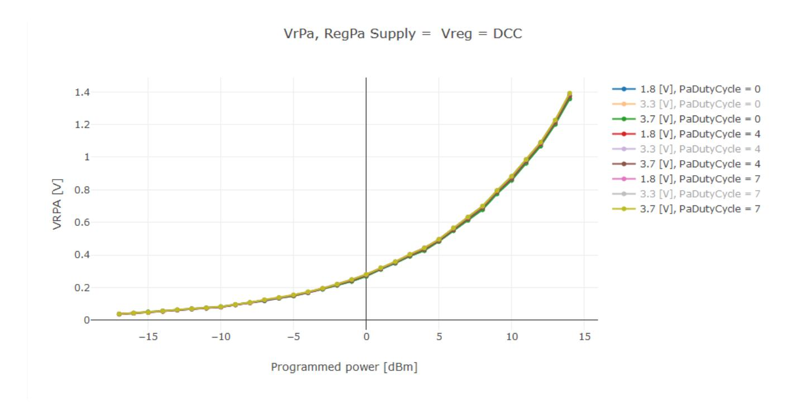

**Figure 9-3: Low Power PA VR\_PA Voltage vs. TxPower**

# **9.1.2 High Power PA**

**UM.LR1110.W.APP March 2020**

For maximum efficiency, the high power PA should be operated with a maximum VR\_PA near 3.1 V. To get VR\_PA = 3.1 V the user should set TxPower =22. At this setting, the PA can deliver up to 22 dBm output power. The output power in this case will inevitably vary when the battery voltage drops below 3.3 V. The actual maximum output power can be set according to the PaDutyCycle and PaHpSel. If needed, the output power can be decremented in steps of 1 dB from maximum by using TxPower < 22.

The VR\_PA variation over the programmed power TxPower for different supply voltages and duty cycle (PaDutyCycle) conditions is depicted in [Figure 9-4: High Power PA VR\\_PA Voltage vs. TxPower](#page-73-2) here below.

The internal regulator for VR\_PA has 200 mV of drop-out, which means VBAT must be 200 mV higher than the VR\_PA voltage in order to attain the corresponding output power.

For example:

**LR1110 User Manual Rev.1.0 73 of [130](#page-129-0) Semtech** [www.semtech.com](http://www.semtech.com/)

For Pout = +20 dBm, VR\_PA = 2.5 V is required (brown curve), which means that the High Power PA will be able to maintain Pout = +20 dBm on the 2.7 V < VBAT < 3.7 V voltage range (2.5 V +200 mV = 2.7V). Below 2.7 V, the output power will degrade as VBAT reduces.

At 1.8 V of supply voltage, the maximum VR\_PA value is 1.6 V (1.8 V - 200 mV), allowing therefore a +17dBm output power.

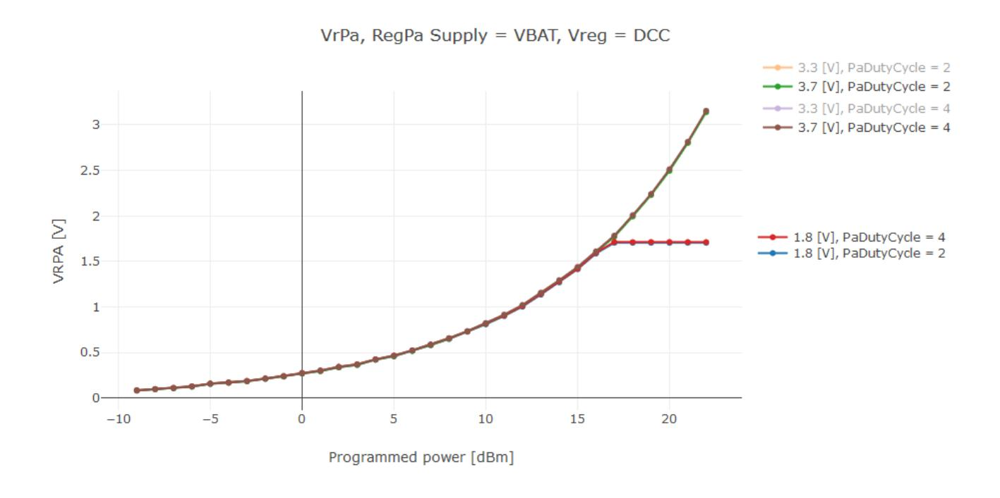

**Figure 9-4: High Power PA VR\_PA Voltage vs. TxPower**

# **9.2 PA Output Power**

As stated previously, two parameters do have an impact on the TX output power generated by both the Low Power and the High Power PA: the programmed power TxPower and the duty cycle PaDutyCycle. A third parameter, PaHPSel, controls the size of the High Power PA, and therefore has a direct impact on the High Power PA output power. In order to reach +22dBm output power, PaHPSel has to be set to 7. PaHPSel has no impact on the Low Power PA.

# **9.2.1 Low Power PA**

[Figure 9-5: Low Power PA Output Power vs. TxPower](#page-74-1) shows the output power of the Low Power PA with TxPower for different PaDutyCycle settings and over the supply voltage. The supply voltage has no impact on the output power, since the Low Power PA is internally regulated. Only the PaDutyCycle has an influence on the Output Power. Therefore the plots for 1.8V, 3.3V and 3.7 V are superimposed, and only the plots for 3.7V are visible.

### For example:

- **•** TxPower=14 and PaDutyCycle=0 gives +10 dBm whatever the supply voltage (1.8V, 3.3V and 3.7 V)
- **•** TxPower=14 and PaDutyCycle=4 gives +14 dBm whatever the supply voltage (1.8V, 3.3V and 3.7 V)
- **•** TxPower=14 and PaDutyCycle=7 gives +15dBm whatever the supply voltage (1.8V, 3.3V and 3.7 V)

**User Manual Rev.1.0 74 of [130](#page-129-0) Semtech** [www.semtech.com](http://www.semtech.com/)

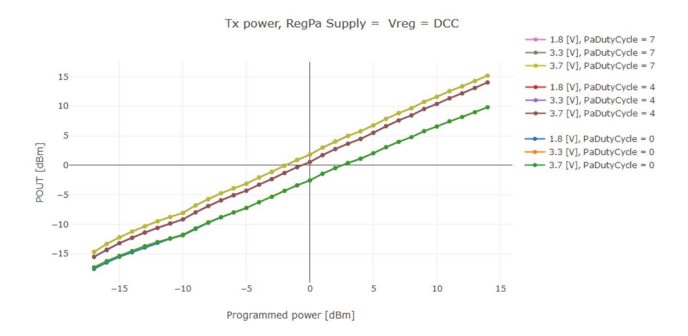

**Figure 9-5: Low Power PA Output Power vs. TxPower**

# **9.2.2 High Power PA**

[Figure 9-6: HP PA Output Power vs. TxPower](#page-75-2) shows the output power of the High Power PA with TxPower for different PaDutyCycle settings and over the supply voltage.

For a given PaDutyCycle, the output power of the High Power PA is maintained on a certain voltage range, and then decreases with VBAT. For example:

- **•** For the +22dBm power setting, a VR\_PA of ~3.1 V is required (refer to [Figure](#page-73-2) 9-4). Therefore, given the 200 mV drop-out of the PA regulator, the +22 dBm output power can only be obtained from a 3.3 V to 3.7 V supply voltage range.
- **•** For +17dBm, VR\_PA around 2 V is required. Therefore the LR1110 output power will drop to +17 dBm for the minimum supply voltage 1.8 V.

Therefore, the plots for 3.3V and 3.7V are then superimposed for a given PaDutyCycle, and only the plots for 3.7V are visible.

For a given supply voltage, increasing the PaDutyCycle increases the output power.

### For example:

- **•** For the +22dBm power setting at 3.3V, PaDutyCycle=4 allows the High Power PA to deliver +22dBm
- **•** For the +22dBm power setting at 3.3V, PaDutyCycle=2 allows the High Power PA to deliver +20dBm

**User Manual Rev.1.0 75 of [130](#page-129-0) Semtech** [www.semtech.com](http://www.semtech.com/)

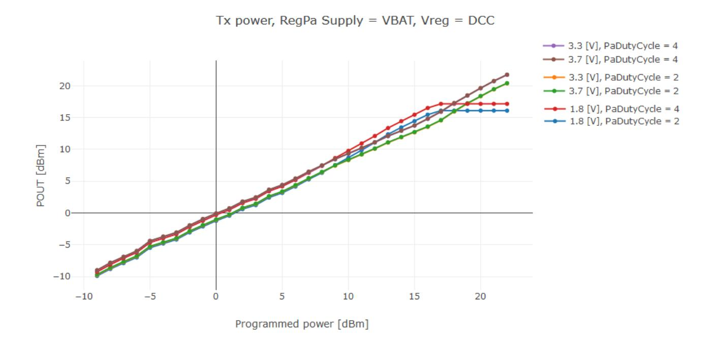

**Figure 9-6: HP PA Output Power vs. TxPower**

# **9.3 PA Current Consumption**

# **9.3.1 Low Power PA**

**UM.LR1110.W.APP March 2020**

[Figure 9-7: IDDTX vs TxPower, Low Power PA, DC-DC Configuration](#page-76-0) shows the impact of the supply voltage for three PaDutyCycle settings (0, 4 and 7) in DC-DC configuration.

At a given supply voltage, a higher PaDutyCycle setting increases the device current consumption. At a given PaDutyCycle setting, the current consumption is optimum for a supply voltage equal or greater to 3.3V, therefore the plots for 3.3 V and 3.7 V are superimposed. A power supply of 1.8V will be not be as power efficient than 3.3V or above, resulting in a higher current consumption.

### For example:

- **•** For 3.7 V, PaDutyCycle=0 the current consumption is approx. 28 mA, for PaDutyCycle=4 approx. 47 mA and for PaDutyCycle=0 approx. 62mA.
- **•** For PaDutyCycle=4, the current consumption is approx. 47 mA for 3.3 V and 3.7 V, and approx. 49 mA for 1.8 V.

**LR1110 User Manual Rev.1.0 76 of [130](#page-129-0) Semtech** [www.semtech.com](http://www.semtech.com/)

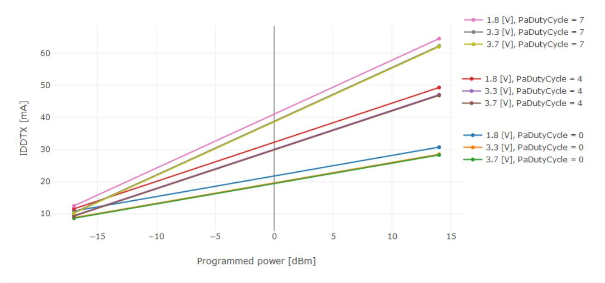

**Figure 9-7: IDDTX vs TxPower, Low Power PA, DC-DC Configuration**

[Figure 9-8: IDDTX vs TxPower, Low Power PA, LDO Configuration](#page-77-1) show the impact of the supply voltage for three PaDutyCycle settings (0, 4 and 7) in LDO configuration.

Similarly to the DC-DC configuration, we can notice that at a given supply voltage, a higher PaDutyCycle setting increases the device current consumption. However, the supply voltage has no influence on the current consumption at a given PaDutyCycle setting, which means that the plots for 1.8 V, 3.3 V, and 3.7 V are superimposed.

[Figure](#page-76-0) 9-7 and [Figure](#page-77-1) 9-8 show that the power efficiency of the Low Power PA is maximized when the internal DC-DC regulator is used at or above 3.3V.

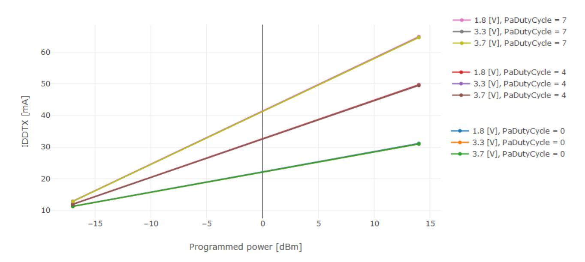

**Figure 9-8: IDDTX vs TxPower, Low Power PA, LDO Configuration**

# **9.3.2 High Power PA**

[Figure 9-9: IDDTX vs TxPower, High Power PA, DC-DC Configuration](#page-78-0) and [Figure 9-10: IDDTX vs TxPower, High Power PA,](#page-78-1)  [LDO Configuration](#page-78-1) show the impact of the supply voltage for two PaDutyCycle settings (2 and 4) in both DC-DC and LDO configurations.

Similarly to the Low Power PA, at a given supply voltage a higher PaDutyCycle setting increases the device current consumption. However, at a given PaDutyCycle setting, the current consumption is stable with respect to the supply voltage, providing this latter is high enough to allow the generation of the VR\_PA voltage required for the programmed power value TxPower.

### For example:

- **•** For 3.3 V, the current consumption is approx. 98mA for PaDutyCycle=2, and approx. 118 mA for PaDutyCycle=4.
- **•** For 1.8 V, the current consumption is approx. 69mA for PaDutyCycle=2, and approx. 81 mA for PaDutyCycle=4. This is due to the fact that at 1.8 V of supply voltage, the maximum VR\_PA voltage is 1.6 V, therefore a maximum output power of +17dBm.

During the High Power PA operation, the DC-DC supplies the analog and digital core of the devices, whereas the PA itself -the largest power consumption contributor- is supplied directly from VBAT. Therefore, there is no significant current consumption difference between the DC-DC or the LDO modes during the High Power PA operation.

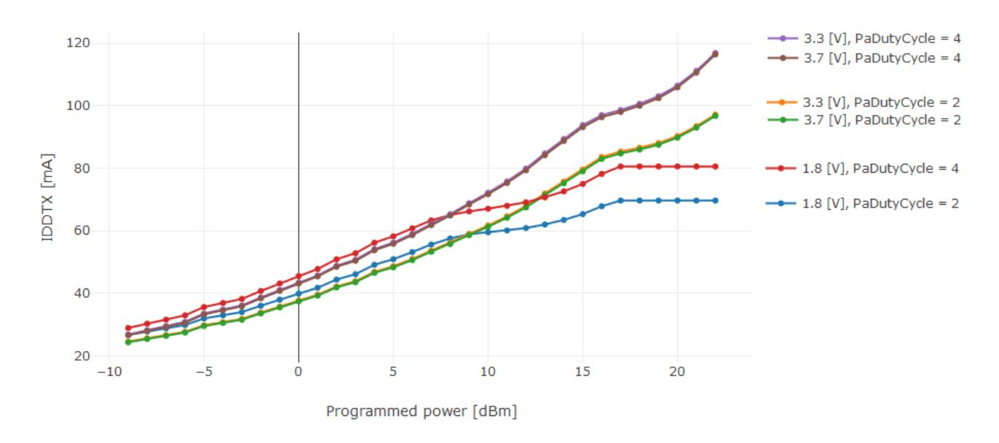

**Figure 9-9: IDDTX vs TxPower, High Power PA, DC-DC Configuration**

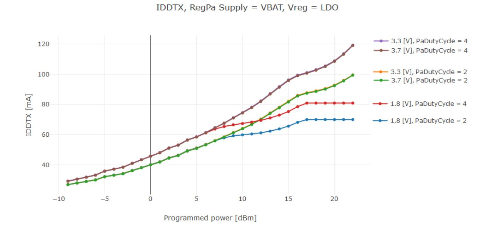

**Figure 9-10: IDDTX vs TxPower, High Power PA, LDO Configuration**

# **9.4 Impedance Matching Networks**

The High Power PA and Low Power PAs are available on the RFO\_HP\_LF and RFO\_LP\_LF pins respectively. They are connected to the antenna through a dedicated impedance matching network, which aims at presenting the optimized load at the output pins when loaded with 50 Ohms at the antenna level.

# **9.4.1 Multi-Band Operation**

It is also possible to implement a multi-band configuration using a single impedance matching network, allowing the same set of SMD components to cover multiple sub-GHz ISM bands. [Table 9-1: Optimized Settings for LP PA with the Same](#page-79-3)  [Matching Network](#page-79-3) and [Table 9-2: Optimized Settings for HP PA with the Same Matching Network](#page-79-4) show the optimal settings for the PA when using the Semtech matching network. The user can fine tune the PaDutyCycle and PaHpSel according to their requirements of matching network, efficiency, output power, and harmonic emission.

The matching network implementation proposed by Semtech is optimized for +22dBm and +15dBm for the higher ISM bands, i.e. a 868-928 MHz operation.

**Table 9-1: Optimized Settings for LP PA with the Same Matching Network**

| Target Power | TxPower | PaSel | RegPASupply | PaDutyCycle | PaHPSel |
|--------------|---------|-------|-------------|-------------|---------|
| +15 dBm      | 14      | 0     | 0           | 7           | -       |
| +14 dBm      | 14      | 0     | 0           | 4           | -       |
| +10 dBm      | 14      | 0     | 0           | 0           | -       |

**Table 9-2: Optimized Settings for HP PA with the Same Matching Network**

| Target Power | TxPower | PaSel | RegPASupply | PaDutyCycle | PaHPSel |
|--------------|---------|-------|-------------|-------------|---------|
| +22 dBm      | 22      | 1     | 1           | 4           | 7       |
| +20 dBm      | 22      | 1     | 1           | 2           | 7       |
| +17dBm       |         | 1     | 1           | 4           | 3       |
|              | 22      | 1     | 1           | 1           | 5       |
| +14 dBm      | 22      | 1     | 1           | 2           | 2       |

# **9.4.2 RF Switch Implementation**

The implementation examples hereafter show a combined High Power PA and High Efficiency PA operation, with the use of a 3 ports RF switch SP3T. A single-band operation is also possible, the unused PA pin being left unconnected. In that case a 2 ports RF switch SPDT would be necessary.

The RF switch implementation allows optimizing the impedance presented to the PA and the impedance presented to the LNA separately. Therefore one can optimize the TX efficiency without compromising the RX sensitivity.

The RF switch can be controlled either by the host controller, or by the LR1110 itself (pins DIO5, DIO6, DIO7, DIO8 and DIO10), using the SetDioAsRfSwitch( ) command.

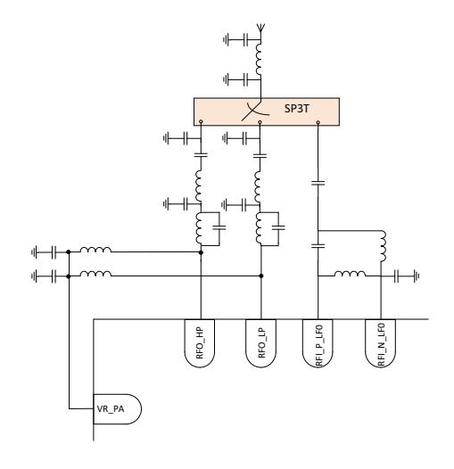

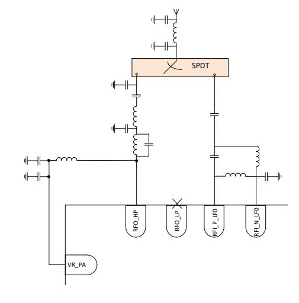

**Figure 9-11: RF Switch, Double PA Operation Figure 9-12: RF Switch, Single PA Operation (High Power PA Example)**

# **9.4.3 Direct-Tie Implementation**

In case of cost-sensitive application, it is possible to get rid of the RF switch, and implement a so-called direct-tie implementation.

In such a configuration, the PA and the RX differential stages are connected as depicted in the figure hereafter. Please note that series capacitances are required between the PA and the RX stage in order to avoid damaging the LR1110 due to current flowing in the RX stage.

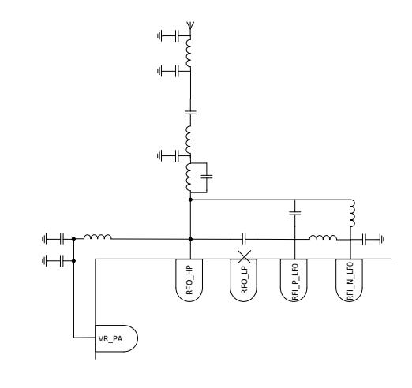

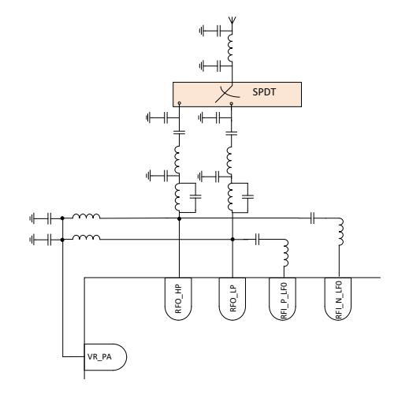

**Figure 9-13: Single Tie implementation: Only one PA Used (High Power PA Example)**

**Figure 9-14: Single Tie implementation: Both PAs Used (High Power PA Example)**

Compared to the switched implementation, the direct-tie suffers a trade-off between TX efficiency and RX sensitivity. This is unavoidable because the transmitter and receiver require different optimal impedances, which may not be simultaneously feasible. In the case of a direct-tie, the user should expect a degradation of 2 ~ 3 dB in RX sensitivity.

# **9.5 Commands**

# **9.5.1 SetPaConfig**

The command SetPaConfig( ) selects which PA to use and configures the supply of this PA.

**Table 9-3: SetPaConfig Command**

| Byte           | 0     | 1     | 2                    | 3                    | 4                   | 5                  |
|----------------|-------|-------|----------------------|----------------------|---------------------|--------------------|
| Data from Host | 0x02  | 0x15  | PaSel                | RegPaSupply          | PaDutyCycle         | PaHPSel            |
| Data to Host   | Stat1 | Stat2 | IrqStatus (31:24) | IrqStatus (23:16) | IrqStatus (15:8) | IrqStatus (7:0) |

- **•** PaSel= 0x00 selects the Low Power PA. PaSel= 0x01 selects the High Power PA.
- **•** RegPaSupply= 0x00 powers the PA from the internal regulator. RegPaSupply= 0x01 powers the PA from VBAT. The user must use RegPaSupply = 0x01 whenever TxPower > 14.
- **•** PaDutyCycle controls the duty cycle of the High Power PA and Low Power PA.

**Table 9-4: DutyCycle Parameter**

|               | Low Power PA                                                                                   | High Power PA                               |
|---------------|------------------------------------------------------------------------------------------------|---------------------------------------------|
| Control       |                                                                                                | DutyCycle = 20% + 4%*PaDutyCycle            |
|               | 20% <dutycycle<48%< td=""><td>20%<dutycycle<36%< td=""></dutycycle<36%<></td></dutycycle<48%<> | 20% <dutycycle<36%< td=""></dutycycle<36%<> |
| Allowed Range | 0 <padutycycle<7< td=""><td>0<padutycycle<6< td=""></padutycycle<6<></td></padutycycle<7<>     | 0 <padutycycle<6< td=""></padutycycle<6<>   |
|               |                                                                                                | DutyCycle=36%                               |
| Default value |                                                                                                | PaDutyCycle=4                               |

**•** PaHPSel controls the size of the High Power PA.

# **9.5.2 SetTxParams**

The command SetTxParams( ) allows setting the Tx Power and the Ramp Time of the selected PA. SetPaConfig( ) must be sent prior to this command.

**Table 9-5: SetTxParams Command**

| Byte           | 0     | 1     | 2                | 3                |
|----------------|-------|-------|------------------|------------------|
| Data from Host | 0x02  | 0x11  | TxPower          | RampTime         |
| Data to Host   | Stat1 | Stat2 | IrqStatus(31:24) | IrqStatus(23:16) |

- **•** TxPower defines the output power in dBm in a range of
  - 17 dBm (0xEF) to +14 dBm (0x0E) by step of 1 dB if the High Efficiency PA is selected

- 9 dBm (0xF7) to +22 dBm(0x16) by step of 1 dB if the High Power PA is selected

For TxPower > +15 dBm, the user must select the VBAT supply for the PA using the SetPaConfig command.

**•** RampTime defines the PA power ramping time. The Ramp Time can be set from 10 us to 3400 us according to the following table:

**Table 9-6: RampTime**

| RampTime       | Value | Ramp Time in us |
|----------------|-------|-----------------|
| SET_RAMP_10U   | 0x00  | 10              |
| SET_RAMP_20U   | 0x01  | 20              |
| SET_RAMP_40U   | 0x02  | 40              |
| SET_RAMP_80U   | 0x03  | 80              |
| SET_RAMP_200U  | 0x04  | 200             |
| SET_RAMP_800U  | 0x05  | 800             |
| SET_RAMP_1700U | 0x06  | 1700            |
| SET_RAMP_3400U | 0x07  | 3400            |

A value of Ramp Time value of 40 us allows the best trade-off between a fast RF power establishment and the minimum RF spurious, therefore a compliance to the radio standards.

# 10. Wi-Fi Passive Scanning

LR1110 gives the possibility to provide a device geolocation through an energy efficient scanning and processing of 802.11b/g/n Wi-Fi signals of opportunity.

# **10.1 Principle Of Operation**

The command *WifiScan()* allows capturing the Wi-Fi signals on the RFIO\_HF pin on a given channel, for a defined 802.11 signal (802.11b/g/n). The MAC addresses of the Wi-Fi access points in range on the scanned channel are then extracted with their corresponding RSSI, and can be read out using the command *WifiReadResults()*. The scanned MAC addresses on the various Wi-Fi channels can then be sent via a LPWAN network to the geolocation server, which calculates the device position.

The number of Wi-Fi passive scanning results has to be determined prior to reading out the passive scanning results. This can be done through the command WifiGetNbResults().

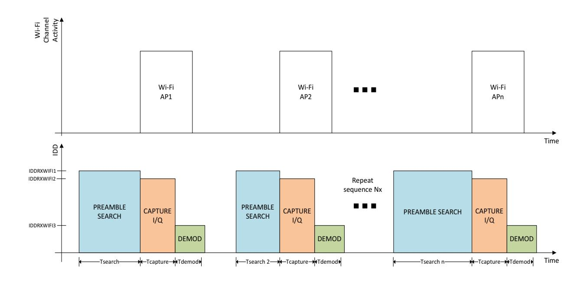

Figure 10-1: Wi-Fi Passive Scanning Sequence

Figure 10-1shows the sequence of a Wi-Fi passive scanning on a Wi-Fi channel. Upon a WifiScan() command, the LR1110 opens a receive window (Preamble Search window) on the given channel, until a Wi-Fi packet is detected (Tsearch). The Wi-Fi packet is then captured and demodulated, until the Access Point MAC address is extracted. During the demodulation phase, the RF front-end is turned off, resulting in a lower current consumption. If another MAC address is to be extracted, another Preamble Search window is opened on the same channel, until a second Wi-Fi packet is detected, captured and the Access Point MAC address is extracted. This sequence is repeated until NbSearchAttempt (number of Wi-Fi captures in the given channel) or NbMaxRes (total number of MAC addresses over all the configured Wi-Fi channels) is reached.

Statistically, the time spent in preamble search mode can vary between 0us (Wi-Fi packet detected immediately after the WifiScan() command is executed) to the Access Point beacon interval. The LR1110 timeout parameter allows limiting the

 LR1110
 www.semtech.com
 84 of 130

 User Manual
 Rev.1.0
 Semtech

 UM.LR1110.W.APP
 March 2020

time the LR1110 spends in Preamble Search mode in case no Wi-Fi activity is detected in a given channel. The capture of a WiFi packet can only be done if a WiFi preamble is detected during the Preamble Search window.

The scanned results are accumulated into the LR1110 memory over the successive Wi-Fi passive scannings on the various Wi-Fi channels and Wi-Fi types. Up to 32 different MAC addresses total are stored in the retention RAM memory, therefore they can be read at any time before the LR1110 goes to Sleep mode without retention or Powerdown. Above 32 MAC addresses, no additional results are retrieved. Please note that sending a new WifiScan ( ) command automatically clears the previous results.

Although at least 1 MAC address is necessary to determine an approximate geolocation, it is a good approach to gather 3 MAC addresses or more to ensure a successful device geolocation and increase its precision. Therefore, performing Wi-Fi passive scanning on various channels might be necessary, depending on the Wi-Fi traffic in the environment.

# **10.2 WifiScan**

The command WifiScan( ) allows capturing the Wi-Fi packets on the RFIO\_HF pin:

**Table 10-1: WifiScan Command**

| Byte                 | 0     | 1     | 2                    | 3                      | 4                     | 5                  | 6                | 7                         | 8                     | 9                    | 10                         |
|----------------------|-------|-------|----------------------|------------------------|-----------------------|--------------------|------------------|---------------------------|-----------------------|----------------------|----------------------------|
| Data from Host | 0x03  | 0x00  | Wi-Fi Type        | Chan Mask (15:8) | Chan Mask (7:0) | Acq Mode        | Nb Max Res | Nb Scan Per Chan | Time out (15:8) | Time out (7:0) | Abort On Time out |
| Data to Host   | Stat1 | Stat2 | IrqStatus (31:24) | IrqStatus (23:16)   | IrqStatus (15:8)   | IrqStatus (7:0) | 0                | 0                         | 0                     | 0                    | 0                          |

- **•** Wi-Fi Type defines the type of the 801.11 signal to be scanned:
  - 0x01: Wi-Fi 802.11b type
  - 0x02: Wi-Fi 802.11g type
  - 0x03: Wi-Fi 802.11n type
  - 0x04: All signals: Wi-Fi b, then Wi-Fi g/n on the same channel
- **•** ChanMask defines which Wi-Fi channels to be scanned:
  - [0 0 Ch14 Ch13 Ch12 Ch11 Ch10 Ch9 Ch8 Ch7 Ch6 Ch5 Ch4 Ch3 Ch2 Ch1]
  - channel bit at 1 indicates that this channel must be scanned
- **•** AcqMode indicates the WifiScan acquisition mode:
  - 0x01: Beacon search mode. Use only the Wi-Fi beacons to extract the MAC addresses.
  - 0x02: Beacon and Packet search mode. Use both the Wi-Fi beacons and WI-Fi data packets to extract the MAC addresses.
  - Other values are RFU
- **•** NbMaxRes: maximum total number of different MAC addresses wanted as a result for all scans on the various channels and Wi-Fi types (must be inferior or equal to 32). If this number is reached the passive scanning is stopped. If a MAC address already present in the result structure is detected a second time with a different RSSI value, then the new result is ignored.

- **•** NbScanPerChan: number of Wi-Fi passive scans to be executed per channel (range: 1 to 255).
- **•** Timeout: 16 bit timeout of the Preamble Search mode. Unit of Timeout is in ms. For example, for a beacon period of 102.4 ms, a 105 ms timeout value can be set to ensure the WifiScan covers the whole beacon period.
- **•** AbortOnTimeout: if set to 1, when a timeout preamble detect occurs, the passive scanning on this channel is aborted and the device jumps to the other channel to scan

### For example: the configuration

- **•** Scan Wi-Fi b
- **•** Channels 1, 6, 11
- **•** Beacon and Packet search mode
- **•** 10 Maximum Results
- **•** 6 scans per channel
- **•** 70 ms timeout for Preamble Search mode
- **•** No abort on timeout

### Will be coded as:

| Opcode | Wi-Fi Type | ChanMask | AcqMode | NbMaxRes | NbScanPer Chan | Timeout | AbortOn Timeout |
|--------|------------|----------|---------|----------|-------------------|---------|--------------------|
| 0x0300 | 0x01       | 0x0421   | 0x02    | 0x0A     | 0x06              | 0x0046  | 0x00               |

During the Wi-Fi passive scanning, the BUSY signal is set High, indicating that LR1110 is not ready to accept a command from the host. This can take a few hundreds of milliseconds, depending on the Wi-Fi passive scanning parameters. BUSY returns to Low when the Wi-Fi passive scanning procedure is complete.

If the WifiScanDone interrupt has been enabled, the IRQ pin goes high at the end of the Wi-Fi passive scanning process on the given channel mask for the given Wi-Fi type.

# **10.3 Wi-Fi Passive Scanning Results**

# **10.3.1 Wi-Fi Passive Scanning Result Formats**

Two different types of Wi-Fi Passive Scanning Results are implemented, allowing the user to retrieve either only the minimum set of information for the geolocation in order to optimize the application power consumption (basic results format), or the maximum amount of information available for the WifiScan ( ) operation (full results format).

# **10.3.2 Basic Result Format**

The Basic Result structure is organized as continuous series of MAC Addresses Basic Results, each MAC Address Basic Result being coded on 9 Bytes, defined in [Table 10-2: Basic Results Format per MAC Address](#page-86-2) here below. The maximum number of MAC Addresses reported is 32.

**Table 10-2: Basic Results Format per MAC Address**

| Byte    | 0          | 1               | 2    | 3    | 4    | 5    | 6    | 7    | 8    |
|---------|------------|-----------------|------|------|------|------|------|------|------|
| Content | Wi-Fi type | Channel info | RSSI | MAC6 | MAC5 | MAC4 | MAC3 | MAC2 | MAC1 |

- **•** Wi-Fi Type: coded on 8 bits:
  - bits 0-1: Wi-Fi signal type:
    - 1: Wi-Fi b
    - 2: Wi-Fi g
    - 3: Wi-Fi n
  - bits 2-7: DatarateID, coded as indicated i[nTable 10-4: Wi-Fi DatarateID Field.](#page-87-1)
- **•** Channel info: coded on 8 bits:
  - bits 0-3: ChannelID, coded as indicated in [Table 10-5: Wi-Fi Channel ID Field.](#page-88-0) ChannelID indicates the Wi-Fi channels configured for the scan.
  - bits 4-7: MacValidation, coded as indicated i[nTable 10-6: Wi-Fi MacValidation Field.](#page-88-1)

MacValidation indicates if the MAC address belongs to a gateway, to a phone or if it is undetermined because MAC address is extracted from a packet.

- **•** RSSI: RSSI value of the signal captured, coded on 8 bits
- **•** MAC: MAC address of the Access Point, coded on 6 bytes:
  - MAC6:MAC5:MAC4:MAC3:MAC2:MAC1, from MSB to LSB

# **10.3.3 Full Result Format**

**•** The Full Result structure is organized as continuous series of MAC Addresses Full Results, each MAC Address Full Result being coded on 22 Bytes, defined in [Table 10-3: Full Results Format per MAC Address](#page-87-0) here below. The maximum number of MAC Addresses reported is 32.

**Table 10-3: Full Results Format per MAC Address**

| Byte    | 0          | 1               | 2                   | 3                   | 4                    | 5                    | 6                    | 7                    |
|---------|------------|-----------------|---------------------|---------------------|----------------------|----------------------|----------------------|----------------------|
| Content | Wi-Fi type | Channel info | RSSI                | FrameCtrl           | MAC6                 | MAC5                 | MAC4                 | MAC3                 |
|         |            |                 |                     |                     |                      |                      |                      |                      |
| Byte    | 8          | 9               | 10                  | 11                  | 12                   | 13                   | 14                   | 15                   |
| Content | MAC2       | MAC1            | PhiOffset (15:8) | PhiOffset (7:0)) | Timestamp (63:56) | Timestamp (55:48) | Timestamp (47:40) | Timestamp (39:32) |

| Byte    | 16        | 17        | 18        | 19        | 20     | 21     |
|---------|-----------|-----------|-----------|-----------|--------|--------|
| Content | Timestamp | Timestamp | Timestamp | Timestamp | Period | Period |
|         | (31:24)   | (23:16)   | (15:8)    | (7:0)     | Beacon | Beacon |

- **•** Wi-Fi Type: coded on 8 bits:
  - bits 0-1: Wi-Fi signal type:
    - 1: Wi-Fi b
    - 2: Wi-Fi g
    - 3:Wi-Fi n
  - bits 2-7: DatarateID, coded as indicated i[nTable 10-4: Wi-Fi DatarateID Field.](#page-87-1)
- **•** Channel info: coded on 8 bits:
  - bits 0-3: ChannelID, coded as indicated in [Table 10-5: Wi-Fi Channel ID Field](#page-88-0).
  - bits 4-7: MacValidation, coded as indicated i[nTable 10-6: Wi-Fi MacValidation Field.](#page-88-1)
- **•** RSSI: RSSI value of the signal captured, coded on 8 bits.
- **•** FrameCtrl: 16 bit Frame control, coded as indicated in [Table 10-7: Wi-Fi Frame Control Field](#page-88-2).
- **•** Timestamp: Indicates the number of microseconds the AP is active, coded on 64 bits
- **•** PhiOffset: coded on 2 Byts. Used to compute frequency offset of the signal

### **Table 10-4: Wi-Fi DatarateID Field**

| DatarateID | Signal type | Modulation | Coding rate | Datarate (Mbps) |
|------------|-------------|------------|-------------|-----------------|
| 1          |             | DBPSK      |             | 1               |
| 2          | Wi-Fi b     | DQPSK      |             | 2               |

**Table 10-4: Wi-Fi DatarateID Field** 

| DatarateID | Signal type   | Modulation  | Coding rate | Datarate (Mbps) |  |
|------------|---------------|-------------|-------------|-----------------|--|
| 3          |               | BPSK        | 1/2         | 6               |  |
| 4          |               | BPSK 3/4 |             | 9               |  |
| 5          |               | QPSK        | 1/2         | 12              |  |
| 6          | Wi-Fi g       | QPSK        | 3/4         | 18              |  |
| 7          |               | 16-QAM      | 1/2         | 24              |  |
| 8          |               | 16-QAM      | 36          |                 |  |
| 11         |               | BPSK        | 1/2         | 6.5             |  |
| 12         |               | QPSK        | 1/2         | 13              |  |
| 13         |               | QPSK        | 3/4         | 19.5            |  |
| 14         |               | 16-QAM      | 1/2         | 26              |  |
| 15         | Wi-Fi n       | 16-QAM      | 3/4         | 39              |  |
| 19         | mixed mode | BPSK        | 1/2         | 7.2             |  |
| 20         |               | QPSK        | 1/2         | 14.4            |  |
| 21         |               | QPSK        | 3/4         | 21.7            |  |
| 22         |               | 16-QAM      | 1/2         | 28.9            |  |
| 23         |               | 16-QAM      | 3/4         | 43.3            |  |

**Table 10-5: Wi-Fi Channel ID Field**

| Channel ID           | 1    | 2    | 3    | 4    | 5    | 6    | 7    | 8    | 9    | 10   | 11   | 12   | 13   | 14   |
|----------------------|------|------|------|------|------|------|------|------|------|------|------|------|------|------|
| Center Freq (MHz) | 2412 | 2417 | 2422 | 2427 | 2432 | 2437 | 2442 | 2447 | 2452 | 2457 | 2462 | 2467 | 2472 | 2484 |

### **Table 10-6: Wi-Fi MacValidation Field**

| MacValidation Value | Meaning                    |  |  |
|---------------------|----------------------------|--|--|
| 1                   | MAC Address from a gateway |  |  |
| 2                   | MAC Address from a phone   |  |  |
| 3                   | Undetermined               |  |  |

### **Table 10-7: Wi-Fi Frame Control Field**

| Bit    | (0:1) | (2:5)   | 6    | 7      |
|--------|-------|---------|------|--------|
| Fields | Type  | SubType | ToDS | FromDS |

The Frame Control field is transmitted LSB first, and therefore represented accordingly.

- Type:
  - 00: Management Frame
  - 01: Control Frame
  - 10: Data Frame
  - 11: Reserved
- SubType: coded as indicated inTable 10-8: SubType Description
- ToDS: 1 indicates that the data frame is going from the client station (STA) to the Distribution System (DS)
- FromDS: 1 indicates that the data frame is going from the Distribution System (DS) to the client Station (STA)

**Table 10-8: SubType Description** 

| Туре | Subtype Value | SubType          | Туре | Subtype Value | SubType           | Туре | Subtype Value | SubType              |
|------|------------------|------------------|------|------------------|-------------------|------|------------------|----------------------|
|      | 0000             | Assoc req        |      | 0000             | Reserved          |      | 0000             | Data                 |
|      | 0001             | Assoc res        |      | 0001             | Reserved          | -    | 0001             | Data +CF-ACK      |
|      | 0010             | Reassoc req      |      | 0010             | Reserved          |      | 0010             | Data +CF-Poll        |
|      | 0011             | Reassoc res      |      | 0011             | Reserved          |      | 0011             | DATA+CF-AC K/Poll |
|      | 0100             | Probe Req        |      | 0100             | Reserved          |      | 0100             | Null                 |
|      | 0101             | Probe res        |      | 0101             | Reserved          | -    | 0101             | CF-ACK               |
|      | 0110             | Reserved         | . 01 | 0110             | Reserved          | 10   | 0110             | CF-Poll              |
| 00 - | 0111             | Reserved         |      | 0111             | Reserved          |      | 0111             | CF-ACK /Poll      |
|      | 1000             | Beacon           |      | 1000             | Block ACK Req  |      | 1000             | Qos Data             |
|      | 1001             | Announceme nt |      | 1001             | Block Acq         |      | 1001             | Qos + CF-ACK      |
|      | 1010             | Diassoc          |      | 1010             | PS-Poll           |      | 1010             | Qos + CF-Poll        |
|      | 1011             | Auth             |      | 1011             | RTS               |      | 1011             | Qos + CF-ACL/Poll |
|      | 1100             | Deauth           |      | 1100             | CTS               |      | 1100             | Qos Null             |
|      | 1101             | Action           |      | 1101             | ACK               |      | 1101             | Reserved             |
|      | 1110             | Reserved         |      | 1110             | CF-End            |      | 1110             | Qos + CF-Poll        |
|      | 1111             | Reserved         |      | 1111             | CF-END +CF-ACK |      | 1111             | Qos + CF-ACK      |

# **10.3.4 WifiGetNbResults**

The number of Wi-Fi Scanning results can be known with the command WifiGetNbResults( ). The number of results is returned on 8 bits and can be read at the next SPI transaction.

**Table 10-9: WifiGetNbResults Command**

| Byte           | 0     | 1     |
|----------------|-------|-------|
| Data from Host | 0x03  | 0x05  |
| Data to Host   | Stat1 | Stat2 |

### **Table 10-10: WifiGetNbResults Response**

| Byte           | 0     | 2         |
|----------------|-------|-----------|
| Data from Host | 0x00  | 0x00      |
| Data to Host   | Stat1 | NbResults |

# **10.3.5 WifiReadResults**

WifiReadResults( ) allows reading out the byte stream containing a defined number of Wi-Fi Passive Scanning results from a given index, in the requested format.

It is necessary to issue the command WifiGetNbResults( ) before this command.NOP Bytes (0x00) shall be issued to read back the results.

**Table 10-11: WifiReadResults Command**

| Byte           | 0     | 1     | 2                 | 3                 | 4                |
|----------------|-------|-------|-------------------|-------------------|------------------|
| Data from Host | 0x03  | 0x06  | Index             | NbResults         | Format           |
| Data to Host   | Stat1 | Stat2 | IrqStatus (31:24) | IrqStatus (23:16) | IrqStatus (15:8) |

### **Table 10-12: WifiReadResults Response**

| Byte           | 0     | 1            | 2            | …    | N+1          |
|----------------|-------|--------------|--------------|------|--------------|
| Data from Host | 0x00  | 0x00         | 0x00         | 0x00 | 0x00         |
| Data to Host   | Stat1 | ResultsByte0 | ResultsByte1 | …    | ResultsByteN |

- **•** Index: index of Wi-Fi Passive Scanning results to read, from 0 to 31
- **•** NbResults: number of Wi-Fi AP MAC Addresses to read, from 1 to 32
- **•** Format: Format of the Wi-Fi Passive Scanning results to read
  - 1: Full Results format
  - 4: Basic Results format
  - Other values are RFU

For example, in order to read the results of a Wi-Fi Passive Scanning that returned 6 MAC Âddresses in Basic Results format, the user shall send:

| Opcode | Wi-Fi Type | Index | NbResults | Format |
|--------|------------|-------|-----------|--------|
| 0x0306 | 0x01       | 0x00  | 0x06      | 0x04   |

The result data will be sent in a stream of 6x9=54 Bytes.

The maximum number of Bytes that be read from one WifiReadResults( ) command is 1020 Bytes. Therefore if the size to read is greater than 1020 Bytes, the read operation shall be separated into two requests.

# **10.3.6 WifiResetCumulTimings**

WifiResetCumulTimings( ) allows to reset the Wi-Fi Passive Scanning cumulative timings (refer to [10.3.7](#page-91-1)  [WifiReadCumulTimings](#page-91-1)).

This command shall be called prior to the executing the Wi-Fi Passive Scanning, in order to initialize the Wi-Fi Passive Scanning cumulative timings if those are to be read.

**Table 10-13: WifiResetCumulTimings Command**

| Byte           | 0     | 1     |
|----------------|-------|-------|
| Data from Host | 0x03  | 0x07  |
| Data to Host   | Stat1 | Stat2 |

# **10.3.7 WifiReadCumulTimings**

WifiReadCumulTimings( ) allows to read the Wi-Fi Passive Scanning cumulative timings, coded on 16Bytes, coded as in [Table](#page-91-3)  [10-14: Wi-Fi Cumulative Timings Description](#page-91-3). The Cumulative represents the total time in he various modes during a WifiScan ( ) command, therefore summed up for all Wi-Fi acquisitions, over the different WifiScan ( ) parameters (Wi-Fi Types, Wi-FI channels, ...). These timings are expressed in microseconds.

**Table 10-14: Wi-Fi Cumulative Timings Description**

| Byte    | 0:3                                      | 4:7                                             | 8:11                              | 12:15                                  |
|---------|------------------------------------------|-------------------------------------------------|-----------------------------------|----------------------------------------|
| Meaning | Total duration in RX mode with ADC on | Total duration in preamble detection mode | Total duration in capture mode | Total duration in demodulation mode |

This cumulative timing can be read regularly to compute the energy consumption of the device for Wi-Fi Passive Scanning operations. All 16 Bytes shall be read. Cumulative timing must be reset by the host.

**Table 10-15: WifiReadCumulTimings Command**

.

| Byte           | 0     | 1     |
|----------------|-------|-------|
| Data from Host | 0x03  | 0x08  |
| Data to Host   | Stat1 | Stat2 |

### **Table 10-16: WifiReadCumulTimings Response**

| Byte           | 0     | 1      | 2      | …    | 17        |
|----------------|-------|--------|--------|------|-----------|
| Data from Host | 0x00  | 0x00   | 0x00   | 0x00 | 0x00      |
| Data to Host   | Stat1 | Byte 0 | Byte 1 | …    | Last Byte |

# **11. GNSS Scanning**

# **11.1 GNSS Geolocation System Overview**

LR1110 features a GNSS receiver allowing a fast and energy efficient outdoor geolocation. LR1110's GNSS Geolocation System achieves low energy geolocation by offloading time- and compute-intensive operations to back-end system components. In particular, the following three back-end system components are needed to operate LR1110's GNSS Geolocation System:

- **•** GNSS Position Solving Component: LR1110 does not resolve the full position on-device. Instead, the measurements from GNSS signals are combined into a binary message (the NAV message) and expected to be sent via any communication channel to the GNSS Position Solver backend component for final position calculation. This component is required in all operation modes.
- **•** GNSS Almanac Update Component (required in assisted mode): LR1110 is able to reduce the GNSS scanning time by taking into account coarse orbital parameters for different GNSS constellations (the Almanac parameters). In conjunction with a coarse time and position estimate, LR1110 uses this information to optimize the search an acquisition of GNSS signals. Over time, the true satellite positions diverge from the fixed Almanac parameters, which requires them to be updated. This can be achieved by a back-end component which estimates the quality of the almanac image on device and issues updates when needed. This component is required if GNSS assisted mode is used.
- **•** GNSS Assistance Component (required in assisted mode): In order to operate GNSS Geolocation System in assisted mode, coarse estimates of time and position must be provided to LR1110. This information can be obtained in a variety of ways including application-level knowledge. In LoRaWAN® the Application Layer Clock Synchronization protocol is suited to retrieve assistance time information. The assistance position information can generally be derived from past position solutions.

LoRa Cloud™ offers these components in a single, easy to use, managed service as part of the Device and Application Services (DAS). Visit www.loracloud.com for more information.

[Figure 11-1: GNSS System Overview](#page-94-1) shows the system components for a LoRaWAN® -based integration. Once put in GNSS mode, LR1110 searches for available GNSS signals and extracts the minimum set of satellite information needed for a position calculation. The GNSS satellite signal data (also referred as NAV message) is then transmitted via the LPWAN communication stack to a GNSS solver for the geolocation position calculation. If an update to the almanac parameters is needed, the Almanac Update Component schedules appropriate downlink messages.

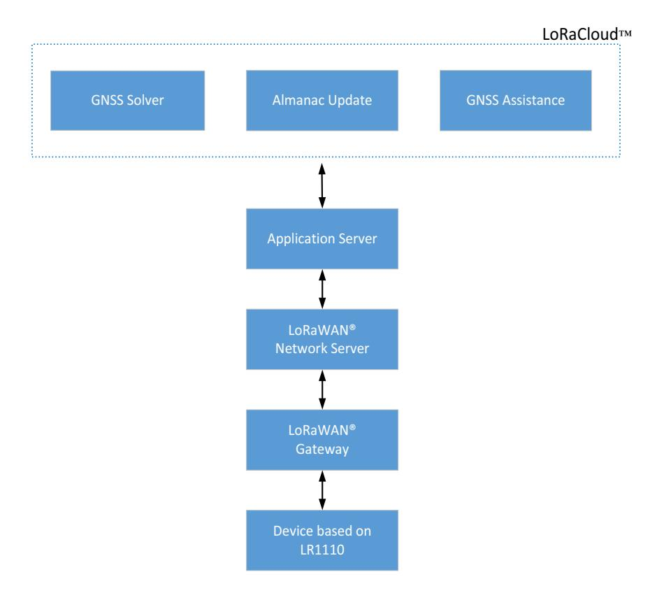

**Figure 11-1: GNSS System Overview**

# **11.2 GNSS Principle Of Operation**

Two GNSS modes are implemented:

- **•** the GNSS autonomous mode does not require any assistance location or almanac data, and aims at detecting strong satellite signals. Therefore is suitable for outdoor conditions with good sky visibility.
- **•** the GNSS assisted mode allows the most efficient GNSS geolocation. Assistance information allows building a list of satellites in view at the current time and at the current location, in order to reduce the GNSS satellites search space, and thererfore optimize the time and energy spent for the geolocation. The assistance information is tailored to a LPWAN network, limiting the data to be sent, especially the downlink size and frequency. It consists in:
  - the LR1110 approximate position (within +/-150km range)
  - the current time (within +/- 1 s)
  - up-to-date reduced size Almanac information (less than 3 months old)

The LR1110 supports both GPS L1 and BeiDou B1 signals. The LR1110 is able to perform either a single GNSS in any (or both) GPS and BeiDou constellations, or a dual GNSS BeiDou in any (or both) GPS and BeiDou constellations.

During the GNSS, the BUSY signal is set High, indicating that LR1110 is not ready to accept SPI transactions. BUSY returns to Low when the procedure is complete. If the GNSSDone interrupt has been enabled, the IRQ pin goes high at the end of the GNSS process.

A TCXO is mandatory for any GNSS operation.

# **11.3 GNSS API Functions**

# **11.3.1 SetGNSSConstellationToUse**

The command GnssSetConstellationToUse( ) allows configuring the GNSS scanning for the selected constellation (GPS and/or BeiDou).

**Table 11-1: GnssSetConstellationToUse**

| Byte           | 0     | 1     | 2                          |
|----------------|-------|-------|----------------------------|
| Data from Host | 0x04  | 0x00  | ConstellationBitMask (7:0) |
| Data to Host   | Stat1 | Stat2 | IrqStatus (31:24)          |

- **•** ConstellationBitMask: Selection between GPS, or BeiDou, or both GPS and BeiDou.
  - bit 0 = 1: GPS selected
  - bit 1 =1: BeiDou selected
  - Other values are RFU

# **11.3.2 GnssSetMode**

The command GnssSetMode( ) allows configuring the GNSS for a single or dual scanning for the selected constellation (GPS and/or BeiDou).

**Table 11-2: GnssSetMode**

| Byte           | 0     | 1     | 2                 |
|----------------|-------|-------|-------------------|
| Data from Host | 0x04  | 0x08  | GnssMode          |
| Data to Host   | Stat1 | Stat2 | IrqStatus (31:24) |

- **•** GnssMode: Selection between single or dual GNSS scanning.
  - 0x00: single scanning
  - 0x01: dual scanning

Other values are RFU

### 11.3.3 GnssAutonomous

The command *GnssAutonomous()* allows capturing the GNSS signals in autonomous mode, for example in case no assistance information is available, or for fast indoor/outdoor detection.

**Table 11-3: GnssAutonomous Command** 

| Byte              | 0     | 1     | 2                    | 3                    | 4                   | 5                  | 6              | 7              | 8       |
|-------------------|-------|-------|----------------------|----------------------|---------------------|--------------------|----------------|----------------|---------|
| Data from Host | 0x04  | 0x09  | Time (31:24)      | Time (23:16)      | Time (15:8)      | Time (7:0)      | Effort Mode | Result Mask | NbSvMax |
| Data to Host   | Stat1 | Stat2 | IrqStatus (31:24) | IrqStatus (23:16) | IrqStatus (15:8) | IrqStatus (7:0) | 0x00           | 0x00           | 0x00    |

- *Time*: GPS time (GPST), in number of seconds elapsed since 6 January 1980. Hint: When converting from UTC to GPST, the UTC-GPST corresponding leap second offset must be taken into account.
- EffortMode =0x00. Other values are RFU
- ResultMask: bit mask indicating which information is added in the output payload.
  - bit 0: timestamp presence in output
  - bit 1: doppler presence in output
  - bit 2: bit change presence in output
- NbSvMax defines the maximum number of satellites wanted as a result of the GnssAutonomous(). If more satellites are detected during the scanning than NbSvMax,, then the satellites with the highest C/N0 are returned. If NbSvMax=0, then all the detected satellites are returned.

Please note that calling this command resets the previous GNSS results, if any.

### 11.3.4 GnssAssisted

The command *GnssAssisted()* allows capturing the GNSS signals using assistance data (current time, approximate position, and Almanac information)..

Table 11-4: GnssAssisted Command

| Byte                 | 0     | 1     | 2                    | 3                    | 4                   | 5                  | 6              | 7          | 8       |
|----------------------|-------|-------|----------------------|----------------------|---------------------|--------------------|----------------|------------|---------|
| Data from Host | 0x04  | 0x0A  | Time (31:24)      | Time (23:16)      | Time (15:8)      | Time (7:0)      | Effort Mode | ResultMask | NbSvMax |
| Data to Host      | Stat1 | Stat2 | IrqStatus (31:24) | IrqStatus (23:16) | IrqStatus (15:8) | IrqStatus (7:0) | 0x00           | 0x00       | 0x00    |

- Time: GPS time (GPST), in number of seconds elapsed since 6 January 1980. Hint: When converting from UTC to GPST, the UTC-GPST corresponding leap second offset must be taken into account.
- EffortMode
  - 0x00: Low Power mod. The GNSS scanning stops the detection if no strong satellite is detected.
  - 0x01: Best Effort mode. The GNSS scanning continues the detection even if no strong satellite is detected.

- **•** ResultMask: bit mask indicating which information is added in the output payload. Set to 0x03. Other values are RFU.
- **•** NbSvMax defines the maximum number of satellites to detect. If NbSvMax=0, all the detected satellites will be returned. Otherwise, only the NbSvMax satellites with higher C/N will be returned.

Please note that calling this command resets the previous GNSS results, if any.

# **11.3.5 GnssSetAssistancePosition**

The command GnssSetAssistancePosition( ) allows configuring the approximate position for the GNSS assisted mode.

**Table 11-5: GnssSetAssistancePosition Command**

| Byte           | 0     | 1     | 2                    | 3                    | 4                   | 5                  |
|----------------|-------|-------|----------------------|----------------------|---------------------|--------------------|
| Data from Host | 0x04  | 0x10  | Latitude (15-8)   | Latitude (7-0)    | Longitude (15-8) | Longitude (7:0) |
| Data to Host   | Stat1 | Stat2 | IrqStatus (31:24) | IrqStatus (23:16) | IrqStatus (15:8) | IrqStatus (7:0) |

**•** Latitude: Latitude, coded on 12bits (resolution of 0.044°)

Latitude= latitude in degrees (decimal value)\* 2048/90.

For example for 47.006° latitude: 47.006\*2048/90=1070 (rounded)=0x042E.

**•** Longitude: Longitude, coded on 12bits (resolution of 0.088°) Longitude= longitude in degrees (decimal value)\* 2048/180.

For example, for 6.966°longitude: 6.966\*2048/180=79 (rounded)=0x004F.

# **11.4 GNSS Scanning Results Description**

GNSS scanning results are formatted in NAV messages, of variable length depending on the number of satellites detected and on the GnssMode (single or dual scanning). The NAV messages destination can be either to the host (for status information), to the Solver (for geolocation cloud calculation), or to the DMC (for almanac management).

In order to read back the GNSS scanning results, the size of results stream to read has to be determined first using the command GnssGetResultSize( ). Afterwards, the results can be read using the command GnssReadResult( ).

# **11.4.1 NAV Message Description**

The NAV message format is shown in [Figure 11-2: NAV Message Format](#page-98-1) It is composed of a DestinationID field, followed by a Payload of variable length:

**Figure 11-2: NAV Message Format**

- **•** DestinationID=0x00: NAV message to the Host.
- **•** DestinationID=0x01: NAV message to the GNSS Solver.
- **•** DestinationID=0x02: NAV message to the GNSS DMC.

Both NAV messages with DestinationID=0x01 and 0x02 shall be sent to the GNSS Solver and the GNSS DMC by the host.

### **11.4.1.1 NAV Messages to the Host**

The NAV messages to the host (DestinationID=0x00) have a single Byte Payload, coded as below:

- **•** 0x00: OK
- **•** 0x01: Command unexpected
- **•** 0x02: Command not implemented
- **•** 0x03: Command parameters invalid
- **•** 0x04: Message Sanity check error
- **•** 0x05: Scanning failed
- **•** 0x06: No time
- **•** 0x07: No satellite detected
- **•** 0x08: Almanac too old
- **•** 0x09: Almanac update fails due to CRC errors
- **•** 0x0A: Almanac update fails due to flash integrity error
- **•** 0x0B: Almanac update fails due to almanac date too old
- **•** 0x0C: Almanac update not allowed (GPS and Beidou satellite can't be updated in a same request)
- **•** 0x0D: Global Almanac CRC error
- **•** 0x0E: Almanac version not supported

Those messages shall not be transmitted to the GNSS solver.

# **11.4.2 GnssGetResultSize Command**

The command GnssGetResultSize( ) allows reading the size in Bytes of the bytes stream containing the available GNSS results.

**Table 11-6: GnssGetResultSize Command**

| Byte           | 0     | 1     |
|----------------|-------|-------|
| Data from Host | 0x04  | 0x0C  |
| Data to Host   | Stat1 | Stat2 |

**Table 11-7: GnssGetResultSize Response**

| Byte           | 0     | 1                 | 2                |
|----------------|-------|-------------------|------------------|
| Data from Host | 0x00  | 0x00              | 0x00             |
| Data to Host   | Stat1 | ResultSize (15:8) | ResultSize (7:0) |

# **11.4.3 GnssReadResults**

The command GnssReadResults( ) allows to retrieve the last GNSS results.

**Table 11-8: GnssReadResults Command**

| Byte           | 0     | 1     |
|----------------|-------|-------|
| Data from Host | 0x04  | 0x0D  |
| Data to Host   | Stat1 | Stat2 |

**Table 11-9: GnssReadResults Response**

| Byte           | 0     | 1            | 2            | 3            | …            |
|----------------|-------|--------------|--------------|--------------|--------------|
| Data from Host | 0x00  | 0x00         | 0x00         | 0x00         | 0x00         |
| Data to Host   | Stat1 | ResultsByte1 | ResultsByte2 | ResultsByte3 | ResultsByteN |

# **11.4.4 GnssGetNbSvDetected**

The command GnssGetNbSvDetected( ) allows to retrieve the number of Satellites Vehicles detected during the last GNSS Scanning.

**Table 11-10: GnssGetNbSvDetected Command**

| Byte           | 0     | 1     |
|----------------|-------|-------|
| Data from Host | 0x04  | 0x17  |
| Data to Host   | Stat1 | Stat2 |

**Table 11-11: GnssGetNbSvDetected Response**

| Byte           | 0     | 1    |
|----------------|-------|------|
| Data from Host | 0x00  | 0x00 |
| Data to Host   | Stat1 | NbSv |

# **11.4.5 GnssGetSvDetected**

The command GnssGetSvDetected( ) allows to retrieve the ID and the C/N0 of the Satellites Vehicles detected during the last GNSS Scanning.

**Table 11-12: GnssGetSvDetected Command**

| Byte           | 0     | 1     |
|----------------|-------|-------|
| Data from Host | 0x04  | 0x18  |
| Data to Host   | Stat1 | Stat2 |

**Table 11-13: GnssGetSvDetected Response**

| Byte           | 0     | 1     | 2    | 3     |  |
|----------------|-------|-------|------|-------|--|
| Data from Host | 0x00  | 0x00  | 0x00 | 0x00  |  |
| Data to Host   | Stat1 | SvId1 | C/N0 | SvId2 |  |

# **11.4.6 GnssGetConsumption**

The command GnssGetConsumption( ) allows to read out the duration of the Radio capture and the CPU processing phases of the GNSS Scanning capture. These timings are expressed in microseconds.

This can be used in order to determine the GNSS Scanning power consumption.

**Table 11-14: GnssGetConsumption Command**

| Byte           | 0     | 1     |
|----------------|-------|-------|
| Data from Host | 0x04  | 0x19  |
| Data to Host   | Stat1 | Stat2 |

**Table 11-15: GnssGetConsumption Response**

| Byte              | 0     | 1       | 2       | 3      | 4     | 5       | 6       | 7      | 8     |
|-------------------|-------|---------|---------|--------|-------|---------|---------|--------|-------|
| Data from Host | 0x00  | 0x00    | 0x00    | 0x00   | 0x00  | 0x00    | 0x00    | 0x00   | 0x00  |
| Data to Host   |       | CPU     | CPU     | CPU    | CPU   | Radio   | Radio   | Radio  | Radio |
|                   | Stat1 | Time    | Time    | Time   | Time  | Time    | Time    | Time   | Time  |
|                   |       | (31:24) | (23:16) | (15:8) | (7:0) | (31:24) | (23:16) | (15:8) | (7:0) |

# **11.5 GNSS Almanac**

The GNSS Almanac consist in information about the state of the entire GNSS satellite constellation and coarse data on every satellite's orbit. There is a specific almanac for each constellation. The almanac data is valid for up to 90 days.

The use of the almanac allow to significantly optimize the GNSS scanning duration: it allows the LR1110 to search only for visible satellites given the user location and time, and therefore allows to reduce the energy required for a GNSS scanning. The Alamanac is used by the LR1110 in the GNSS assisted mode.

The LR1110 is pre-programmed with the latest Almanac data at the date of the production test. Even if the Almanac data is valid for 90 days, it is advised to use the latest Almanac data for power optimization. The up-to-date almanac is Available from the Device Management Center (DMC) server.

The whole Almanac data can be updated (full update). The Almanac is entirely stored in the flash memory, therefore kept after power off or Sleep mode without retention.

# **11.5.1 Almanac Full Update**

The Almanac data for all the satellites can be updated using the command GnssAlmanacFullUpdate( ) :

### **Table 11-16: GnssAlmanacFullUpdate**

| Byte           | 0     | 1     | 2                        |  |  |
|----------------|-------|-------|--------------------------|--|--|
| Data from Host | 0x04  | 0x0E  | AlmanacFullUpdatePayload |  |  |
| Data to Host   | Stat1 | Stat2 | IrqStatus(31:24)         |  |  |

**•** AlmanacFullUpdatePayload: defined as in [Table 11-17: AlmanacFullUpdatePayload:](#page-102-2)

### **Table 11-17: AlmanacFullUpdatePayload**

| Byte  | (0:19)        | (20:39)     | (40:56)     |  (2560:2579)   |
|-------|---------------|-------------|-------------|-------------------|
| Field | AlmanacHeader | SV1 Almanac | SV2 Almanac |  SV128 Almanac |

**•** With the AlmanacHeader defined as in [Table 11-18: AlmanacHeader](#page-102-3):

### **Table 11-18: AlmanacHeader**

| Byte  | 0   | (1:2)       | (3:6)      | (7:19) |
|-------|-----|-------------|------------|--------|
| Field | 128 | AlmanacDate | Global CRC | RFU    |

**•** Each SvAlmanac being a 20 Bytes structure, defined as [Table 11-19: SvAlmanac Format:](#page-102-4)

### **Table 11-19: SvAlmanac Format**

| Byte  | 0     | (1:15)          | (16:17) | 18                     | 19               |
|-------|-------|-----------------|---------|------------------------|------------------|
| Field | SV id | Almanac Content | CA code | Modulation bit mask | Constellation Id |

It is up to the user to ensure that the list of almanacs and the list of satellites ids are coherent. The Almanac data must be provided in the same order as satellite ids.

The AlmanacFullUpdatePayload takes 20 Bytes (Header) +128 (number of SV) \* 20 Bytes =2580 Bytes.

The maximum number of Bytes that can be send from the host MCU is 1020 Bytes. Therefore, the Almanac Full Update shall be handled in multiple SPI transactions. For example, the two following approaches are possible:

- **•** minimum memory overhead:
  - The AlmanacFullUpdatePayload can be sent in 129 successive SPI transactions of 20 data Bytes each.
- **•** minimum number of SPI transactions:

The AlmanacFullUpdatePayload can be sent in 2 SPI transactions of 1020 data Bytes each, and a third SPI transaction of 540 Bytes.

The Almanac data can be retrieved for the DMC server, for example via LPWAN.

# **12. Crypto Engine**

# **12.1 Description**

The Cryptographic Engine provides a dedicated hardware accelerator for AES-128 encryption based algorithms and dedicated flash and RAM memory to handle device parameters such as encryption keys, in order to avoid unauthorized access.

The Cryptographic Engine allows to improve the power efficiency of cryptographic operations and reduce the code size of the software stack. Verifying the integrity of data such as the payload of the downlink is important to guarantee a secure communication. The message integration check (MIC) uses the AES-CMAC algorithm to calculate a hash. Implementing the MIC calculation in software jeopardizes the confidentiality of the used key. The cryptographic engine provides a hardware implementation of the AES-CMAC to internally calculate and check the MIC.

Other more advanced AES based operations such as AES-ECB and AES-CCM need to be implemented in software based on the AES-128 encryption algorithm. Depending on the application a higher level of security may require the use of an external secure element.

The status of cryptographic operations can be checked by either polling the internal status register or using an interrupt service routine.

# **12.2 Cryptographic Keys Definition**

The cryptographic keys are arranged into several groups, according to the function they serve, as shown in [Table 12-1:](#page-104-3)  [Cryptographic Keys Usage and Derivation.](#page-104-3) The table summarizes the allowed uses of the keys and if some of the keys can be derived from other keys.

**Table 12-1: Cryptographic Keys Usage and Derivation**

| Group Name  | Key SRC/Dest Index | Key Name   | Usage                                                                                               | Derivation From               |  |
|-------------|--------------------|------------|-----------------------------------------------------------------------------------------------------|-------------------------------|--|
| Mother      | 0                  | MotherKey0 | CryptoDeriveAndStoreKey()                                                                           | Not Allowed                   |  |
|             | 1                  | MotherKey1 | CryptoDeriveAndStoreKey() CryptoSetKey( )                                                        | Not Allowed                   |  |
| Network     | 2                  | NwkKey     | CryptoProcessJoinAccept() CryptoComputeAesCmac() CryptoDeriveAndStoreKey() CryptoSetKey( ) | Only from Mother              |  |
| Application | 3                  | AppKey     | CryptoDeriveAndStoreKey() CryptoSetKey( )                                                        | Only from Mother              |  |
| LifeTimeEnc | 4                  | JSEncKey   | CryptoProcessJoinAccept() (Decryption) CryptoSetKey( )                                        | From Network & Application |  |

**Table 12-1: Cryptographic Keys Usage and Derivation**

| Group Name         | Key SRC/Dest Index | Key Name    | Usage                                                                                       | Derivation From                          |  |  |
|--------------------|--------------------|-------------|---------------------------------------------------------------------------------------------|------------------------------------------|--|--|
| LifeTimeInt        | 5                  | JSIntKey    | CryptoProcessJoinAccept() (MIC Computation) CryptoComputeAesCmac() CryptoSetKey( ) | From Network & Application            |  |  |
|                    | 6                  | GpKEKey0    |                                                                                             |                                          |  |  |
|                    | 7                  | GpKEKey1    |                                                                                             |                                          |  |  |
|                    | 8                  | GpKEKey2    | CryptoDeriveAndStoreKey() CryptoSetKey( )                                                | From any other Gp                        |  |  |
| GpTransport        | 9                  | GpKEKey3    | Any multicast Key                                                                           | Transport key or From Application Key |  |  |
|                    | 10                 | GpKEKey4    |                                                                                             |                                          |  |  |
|                    | 11                 | GpKEKey5    |                                                                                             |                                          |  |  |
|                    | 12                 | AppSKey     |                                                                                             |                                          |  |  |
|                    | 13                 | FNwkSIntKey |                                                                                             |                                          |  |  |
|                    | 14                 | SNwkSIntKey | CryptoAesEncrypt01()                                                                        | From Network &                           |  |  |
| Unicast            | 15                 | NwkSEncKey  | CryptoComputeAesCmac() CryptoSetKey( )                                                   | Application                              |  |  |
|                    | 16                 | RFU0        |                                                                                             |                                          |  |  |
|                    | 17                 | RFU1        |                                                                                             |                                          |  |  |
|                    | 18                 | McAppSKey0  |                                                                                             |                                          |  |  |
|                    | 19                 | McAppSKey1  |                                                                                             |                                          |  |  |
|                    | 20                 | McAppSKey2  |                                                                                             |                                          |  |  |
|                    | 12                 | McAppSKey3  | CryptoAesEncrypt01()                                                                        | Only from GpTransport                    |  |  |
| Multicast          | 22                 | McNwkSKey0  | CryptoVerifyAesCmac( ) CryptoSetKey( )                                                   | Key                                      |  |  |
|                    | 23                 | McNwkSKey1  |                                                                                             |                                          |  |  |
|                    | 24                 | McNwkSKey2  |                                                                                             |                                          |  |  |
|                    | 25                 | McNwkSKey3  |                                                                                             |                                          |  |  |
|                    | 26                 | GP0         | CryptoAesEncrypt()                                                                          |                                          |  |  |
| General Purpose | 27                 | GP1         | CryptoAesDecrypt() CryptoSetKey( )                                                       | Not Allowed                              |  |  |

# **12.3 Commands**

# **12.3.1 CEStatus**

The Crypto Status Byte CEStatus indicates the state Crypto Engine. It is returned after each command invoking the Crypto Engine.

### CEStatus:

- **•** 0: CRYP\_API\_SUCCESS. The previous command was successful.
- **•** 1: CRYP\_API\_FAIL\_CMAC. MIC (first 4 bytes of the CMAC) comparison failed.
- **•** 2: RFU.
- **•** 3: CRYP\_API\_INV\_KEY\_ID. Key/Param Source or Destination ID error
- **•** 4: RFU.
- **•** 5: CRYP\_API\_BUF\_SIZE. Data buffer size is invalid. For the CryptoAesEncrypt( ), the command the buffer size must be multiple of 16 Bytes.
- **•** 6: CRYP\_API\_ERROR. Any other error.

# **12.3.2 CryptoSetKey**

The command CryptoSetKey( ) sets a specific Key identified by KeyID into the Crypto Engine:

**Table 12-2: CryptoSetKey Command**

| Byte           | 0     | 1     | 2                    | 3                    | 4                   | 5                  | … | 18    |
|----------------|-------|-------|----------------------|----------------------|---------------------|--------------------|---|-------|
| Data from Host | 0x05  | 0x02  | KeyID (7:0)          | Key1                 | Key2                | Key3               | … | Key16 |
| Data to Host   | Stat1 | Stat2 | IrqStatus (31:24) | IrqStatus (23:16) | IrqStatus (15:8) | IrqStatus (7:0) | … | 0x00  |

**Table 12-3: CryptoSetKey Response**

| Byte           | 0     | 1        |  |  |
|----------------|-------|----------|--|--|
| Data from Host | 0x00  | 0x00     |  |  |
| Data to Host   | Stat1 | CEStatus |  |  |

- **•** KeyID goes from 1 to 27, as defined in [Table 12-1: Cryptographic Keys Usage and Derivation](#page-104-3). KeyID 0 is blocked by device internal firmware to avoid overwriting the pre-provisioned keys.
- **•** Key is an array of bytes as defined in the FIPS-197. With the key K (2b7e1516 28aed2a6abf71588 09cf4f3c) provided in test vectors of the rfc4493 we then have Key1 = 0x2b, Key2 = 0x7e, Key3 = 0x15, Key4 = 0x16 , ... , Key16 = 0x3c.
- **•** CEStatus is defined in section [CEStatus on page](#page-106-1) 107.

# **12.3.3 CryptoDeriveAndStoreKey**

The command CryptoDeriveAndStoreKey( ) will derive (encrypt) into a specific Key identified by DstKeyID, the Nonce value provided, using a source Key identified by SrcKeyID.

**Table 12-4: CryptoDeriveAndStoreKey Command**

| Byte           | 0     | 1     | 2                        | 3                      | 4                   | 5                  | 6      | … | 19      |
|----------------|-------|-------|--------------------------|------------------------|---------------------|--------------------|--------|---|---------|
| Data from Host | 0x05  | 0x03  | Source KeyID (7:0) | Dest KeyID (7:0) | Nonce1              | Nonce2             | Nonce3 | … | Nonce16 |
| Data to Host   | Stat1 | Stat2 | IrqStatus (31:24)     | IrqStatus (23:16)   | IrqStatus (15:8) | IrqStatus (7:0) | 0x00   | … | 0x00    |

**Table 12-5: CryptoDeriveAndStoreKey Response**

| Byte           | 0     | 1        |
|----------------|-------|----------|
| Data from Host | 0x00  | 0x00     |
| Data to Host   | Stat1 | CEStatus |

- **•** DstKeyID and SrcKeyID are defined in [Table 12-1: Cryptographic Keys Usage and Derivation](#page-104-3):
  - DstKeyID: destination key ID. Goes from 0 to 27.
  - SrcKeyID: source Key ID. Goes from 0 to 27.
- **•** Nonce1, Nonce2, ... ,Nonce16: array of Bytes.
- **•** CEStatus is defined in section [CEStatus on page](#page-106-1) 107.

# **12.3.4 CryptoProcessJoinAccept**

The command CryptoProcessJoinAccept( ) will do an ECB decryption (AES encrypt) on the Data and Header, and then verify the MIC of the decrypted message.

The decrypted data is then provided back if the MIC verification is successful.

**Table 12-6: CryptoProcessJoinAccept Command**

| Byte                 | 0     | 1     | 2                        | 3                        | 4                        | 5                      | … | N+6     | N+7   |  N+6+ M |
|----------------------|-------|-------|--------------------------|--------------------------|--------------------------|------------------------|---|---------|-------|---------------|
| Data from Host | 0x05  | 0x04  | Dec KeyID (7:0)    | Ver KeyID (7:0)    | LoRa Wan Ver (7:0) | Header1                | … | HeaderN | Data1 |  DataM     |
| Data to Host   | Stat1 | Stat2 | Irq Status (31:24) | Irq Status (23:16) | Irq Status (15:8)  | Irq Status (7:0) | … | 0x00    | 0x00  |  0x00      |

**Table 12-7: CryptoProcessJoinAccept Response**

| Byte           | 0     | 1        | 2     |  M+3   |
|----------------|-------|----------|-------|-----------|
| Data from Host | 0x00  | 0x00     | 0x00  |  0x00  |
| Data to Host   | Stat1 | CEStatus | Data1 |  DataM |

- **•** DecKeyID and VerKeyID are defined in [Table 12-1: Cryptographic Keys Usage and Derivation](#page-104-3):
  - DecKeyID specifies the key used for decryption of the message.
  - VerKeyID specifies the key used for the MIC verification.
- **•** Depending on the LoRaWanVer, the expected Header size N is 1 byte (v1.0) or 12 bytes (v1.1).
  - LoRaWanVer=0: LoRaWAN verison 1.0
  - LoRaWanVer=1: LoRaWAN verison 1.1
  - ...
- **•** Header1, ... ,HeaderN: Header
- **•** Data1, ... ,DataN: Data. Data size M is either 16 Bytes or 32 Bytes. Data must include the encrypted MIC.
- **•** CEStatus is defined in section [CEStatus on page](#page-106-1) 107.

# **12.3.5 CryptoComputeAesCmac**

The command CryptoComputeAesCmac( ) will compute the AES CMAC of the provided data using the specified Key and return the MIC.

**Table 12-8: CryptoComputeAesCmac Command**

| Byte           | 0     | 1     | 2                    | 3                    | 4                   | 5                  | … | N+3   |
|----------------|-------|-------|----------------------|----------------------|---------------------|--------------------|---|-------|
| Data from Host | 0x05  | 0x05  | KeyID (7:0)       | Data1                | Data2               | Data3              | … | DataN |
| Data to Host   | Stat1 | Stat2 | IrqStatus (31:24) | IrqStatus (23:16) | IrqStatus (15:8) | IrqStatus (7:0) | … | 0x00  |

**Table 12-9: CryptoComputeAesCmac Response**

| Byte           | 0     | 1        | 2    | 3    | 4    | 5    |
|----------------|-------|----------|------|------|------|------|
| Data from Host | 0x00  | 0x00     | 0x00 | 0x00 | 0x00 | 0x00 |
| Data to Host   | Stat1 | CEStatus | MIC1 | MIC2 | MIC3 | MIC4 |

- **•** KeyID: specified Key ID, as defined in [Table 12-1: Cryptographic Keys Usage and Derivation](#page-104-3). Goes from 0 to 27.
- **•** Data1, Data2, ... , DataN: Provided data, considered as Byte buffers.
- **•** CEStatus: defined in section [CEStatus on page](#page-106-1) 107.
- **•** MIC: Message Integrity Check (first 4 bytes of the CMAC).

For example, when using the test vectors of the RFC4493 example 2, we would have:

- **•** Message: 6bc1bee2 2e409f96 e93d7e11 7393172a (N=16)
- **•** MIC: 070a16b4

Therefore, the CryptoComputeAesCmac( ) command and response will be:

**Table 12-10: CryptoComputeAesCmac Command Example**

| Byte           | 0     | 1     | 2                    | 3                    | 4                   | 5                  | … | N+3  |
|----------------|-------|-------|----------------------|----------------------|---------------------|--------------------|---|------|
| Data from Host | 0x05  | 0x05  | KeyID (7:0)       | 0x6b                 | 0xc1                | 0xbe               |   | 0x2a |
| Data to Host   | Stat1 | Stat2 | IrqStatus (31:24) | IrqStatus (23:16) | IrqStatus (15:8) | IrqStatus (7:0) | … | 0x00 |

**Table 12-11: CryptoComputeAesCmac Response Example**

| Byte           | 0     | 1        | 2    | 3    | 4    | 5    |
|----------------|-------|----------|------|------|------|------|
| Data from Host | 0x00  | 0x00     | 0x00 | 0x00 | 0x00 | 0x00 |
| Data to Host   | Stat1 | CEStatus | 0x07 | 0x0a | 0x16 | 0xb4 |

# **12.3.6 CryptoVerifyAesCmac**

The command CryptoVerifyAesCmac( ) will compute the AES CMAC of the provided data using the specified Key, and compare the provided MIC with the actual calculated MIC (first 4 bytes of the CMAC).

**Table 12-12: CryptoVerifyAesCmac Command**

| Byte           | 0     | 1     | 2                        | 3                        | 4                       | 5                      | 6           | 7     | … | N+7   |
|----------------|-------|-------|--------------------------|--------------------------|-------------------------|------------------------|-------------|-------|---|-------|
| Data from Host | 0x05  | 0x06  | KeyID (7:0)           | Exp. MIC1             | Exp. MIC2            | Exp MIC3            | Exp MIC4 | Data1 | … | DataN |
| Data to Host   | Stat1 | Stat2 | Irq Status (31:24) | Irq Status (23:16) | Irq Status (15:8) | Irq Status (7:0) | 0x00        | 0x00  | … | 0x00  |

**Table 12-13: CryptoVerifyAesCmac**

| Byte           | 0     | 1        |
|----------------|-------|----------|
| Data from Host | 0x00  | 0x00     |
| Data to Host   | Stat1 | CEStatus |

- **•** KeyID: specified Key ID, as defined in [Table 12-1: Cryptographic Keys Usage and Derivation](#page-104-3). Goes from 0 to 27.
- **•** ExpectedMIC: Provided MIC (first 4 bytes of the CMAC).

- Data1, Data2, ..., DataN: Provided data, considered as Byte buffers.
- CEStatus: defined in section CEStatus on page 107.

If the 2 MICs are identical, the command will return CRYP\_API\_SUCCESS, otherwise, CRYP\_API\_FAIL\_CMAC.

# 12.3.7 CryptoAesEncrypt01

The command CryptoAesEncrypt01() encrypts the provided data using the specified Key and return it.

Table 12-14: CryptoAesEncrypt01 Command

| Byte              | 0     | 1     | 2                    | 3                    | 4                   | ••• | N+2   |
|-------------------|-------|-------|----------------------|----------------------|---------------------|-----|-------|
| Data from Host | 0x05  | 0x07  | KeyID (7:0)          | 0x01                 | Data2               |     | DataN |
| Data to Host      | Stat1 | Stat2 | IrqStatus (31:24) | IrqStatus (23:16) | IrqStatus (15:8) |     | 0x00  |

### Table 12-15: CryptoAesEncrypt01 Response

| Byte           | 0     | 1        | 2                  | ••• | N+1                |
|----------------|-------|----------|--------------------|-----|--------------------|
| Data from Host | 0x00  | 0x00     | 0x00               |     | 0x00               |
| Data to Host   | Stat1 | CEStatus | Encrypted Data1 |     | Encrypted DataN |

- KeyID: specified Key ID, as defined in Table 12-1: Cryptographic Keys Usage and Derivation. Goes from 0 to 27.
- Data2, ..., DataN: Provided data, considered as Byte buffers.
- CEStatus: defined in section CEStatus on page 107.
- EncryptedData1, EncryptedData2, ..., EncryptedDataN: Encrypted data, considered as Byte buffers

# 12.3.8 CryptoAesEncrypt

The command CryptoAesEncrypt() encrypts the provided data using the specified Key and return it.

Table 12-16: CryptoAesEncrypt Command

| Byte           | 0     | 1     | 2                    | 3                    | ••• | N+2   |
|----------------|-------|-------|----------------------|----------------------|-----|-------|
| Data from Host | 0x05  | 0x08  | KeyID (7:0)          | Data1                |     | DataN |
| Data to Host   | Stat1 | Stat2 | IrqStatus (31:24) | IrqStatus (23:16) |     | 0x00  |

Table 12-17: CryptoAesEncrypt Response

| Byte           | 0     | 1        | 2                  | ••• | N+1                |
|----------------|-------|----------|--------------------|-----|--------------------|
| Data from Host | 0x00  | 0x00     | 0x00               |     | 0x00               |
| Data to Host   | Stat1 | CEStatus | Encrypted Data1 |     | Encrypted DataN |

- KeylD: specified Key ID, as defined in Table 12-1: Cryptographic Keys Usage and Derivation. Goes from 0 to 27.
- Data1, Data2, ..., DataN: Provided data, considered as Byte buffers.
- CEStatus: defined in section CEStatus on page 107.
- EncryptedData1, EncryptedData2, ..., EncryptedDataN: Encrypted data, considered as Byte buffers

### 12.3.9 CryptoAesDecrypt

The command CryptoAesDecrypt() will decrypt the provided data using the specified Key and return it.

Table 12-18: CryptoAesDecrypt Command

| Byte           | 0     | 1     | 2                    | 3                    | ••• | N+2   |
|----------------|-------|-------|----------------------|----------------------|-----|-------|
| Data from Host | 0x05  | 0x09  | KeyID (7:0)          | Data1                | ••• | DataN |
| Data to Host   | Stat1 | Stat2 | IrqStatus (31:24) | IrqStatus (23:16) |     | 0x00  |

### Table 12-19: CryptoAesDecrypt Response

| Byte           | 0     | 1        | 2                  | ••• | N+1                |
|----------------|-------|----------|--------------------|-----|--------------------|
| Data from Host | 0x00  | 0x00     | 0x00               |     | 0x00               |
| Data to Host   | Stat1 | CEStatus | Decrypted Data1 |     | Decrypted DataN |

- KeyID: specified Key ID, as defined in Table 12-1: Cryptographic Keys Usage and Derivation. Goes from 0 to 27.
- Data 1, Data 2, ..., Data N: Provided data, considered as Byte buffers.
- CEStatus: defined in section CEStatus on page 107.
- DecryptedData1, DecryptedData2, ..., DecryptedDataN: Decrypted data, considered as Byte buffers

# **12.3.10 CryptoStoreToFlash**

The command CryptoStoreToFlash( ) makes the Crypto Engine store the data (Keys and Parameters) from RAM into flash memory.

**Table 12-20: CryptoStoreToFlash Command**

| Byte           | 0     | 1     |
|----------------|-------|-------|
| Data from Host | 0x05  | 0x0A  |
| Data to Host   | Stat1 | Stat2 |

**Table 12-21: CryptoAesDecrypt Response**

| Byte           | 0     | 1        |
|----------------|-------|----------|
| Data from Host | 0x00  | 0x00     |
| Data to Host   | Stat1 | CEStatus |

**•** CEStatus: defined in section [CEStatus on page](#page-106-1) 107.

# **12.3.11 CryptoRestoreFromFlash**

The command CryptoRestoreFromFlash( ) makes the Crypto Engine restore the data (Keys and Parameters) from flash memory into RAM.

**Table 12-22: CryptoRestoreFromFlash Command**

| Byte           | 0     | 1     |
|----------------|-------|-------|
| Data from Host | 0x05  | 0x0B  |
| Data to Host   | Stat1 | Stat2 |

**Table 12-23: CryptoRestoreFromFlash Response**

| Byte           | 0     | 1        |
|----------------|-------|----------|
| Data from Host | 0x00  | 0x00     |
| Data to Host   | Stat1 | CEStatus |

**•** CEStatus: defined in section [CEStatus on page](#page-106-1) 107.

# **12.3.12 CryptoSetParam**

The command CryptoSetParam( ) sets a specific Parameter into the Crypto Engine RAM.

**Table 12-24: CryptoSetParam Command**

| Byte           | 0     | 1     | 2                    | 3                    | 4                   | 5                  | 6             |
|----------------|-------|-------|----------------------|----------------------|---------------------|--------------------|---------------|
| Data from Host | 0x05  | 0x0D  | ParamID (7:0)     | Data (31:24)      | Data (23:16)     | Data (15:8)     | Data (7:0) |
| Data to Host   | Stat1 | Stat2 | IrqStatus (31:24) | IrqStatus (23:16) | IrqStatus (15:8) | IrqStatus (7:0) | 0x00          |

**Table 12-25: CryptoSetParam Response**

| Byte           | 0     | 1        |
|----------------|-------|----------|
| Data from Host | 0x00  | 0x00     |
| Data to Host   | Stat1 | CEStatus |

- **•** ParamID: Parameter ID, goes from 0 to 119
- **•** Data: Parameter Data
- **•** CEStatus: defined in section [CEStatus on page](#page-106-1) 107.

# **12.3.13 CryptoGetParam**

The command CryptoGetParam( ) gets a specific Parameter into the Crypto Engine RAM.

**Table 12-26: CryptoGetParam Command**

| Byte           | 0     | 1     | 2            |
|----------------|-------|-------|--------------|
| Data from Host | 0x05  | 0x0E  | ParamID(7:0) |
| Data to Host   | Stat1 | Stat2 | 0x00         |

**Table 12-27: CryptoGetParam Response**

| Byte           | 0     | 1        | 2            | 3            | 4           | 5          |
|----------------|-------|----------|--------------|--------------|-------------|------------|
| Data from Host | 0x00  | 0x00     | 0x00         | 0x00         | 0x00        | 0x00       |
| Data to Host   | Stat1 | CEStatus | Data (31:24) | Data (23:16) | Data (15:8) | Data (7:0) |

- **•** ParamID: Parameter ID, goes from 0 to 119
- **•** Data: Parameter Data
- **•** CEStatus: defined in section [CEStatus on page](#page-106-1) 107.

# 13. LR1110 Provisioning

# 13.1 Description

The LR1110 is pre-provisioned during the production test flow with default DeviceEUI and JoinEUI unique identifiers, as defined per the LoRaWAN® standard. For more information, please refer to the LoRa Alliance® website: https://lora-alliance.org/

It also pre-provisioned with a DevicePIN allowing the device registration to LoRa Cloud™ Join services. For more information, please refer to the LoRa Cloud™ website: https://www.loracloud.com/portal/join\_service

All those unique identifiers are stored in the device persistent memory. They are pre-configured by Semtech to ease the LoRaWAN® implementation and access to LoRa Cloud™ Join services, but can be ignored by the user.

# 13.2 Provisioning Commands

### 13.2.1 GetDevEUI

The command *GetDevEUI()* allows reading back the LR1110 LoRaWAN® DevEUI unique Identifier pre-provisioned in the device.

**Table 13-1: GetDevEUI Command** 

| Byte           | 0     | 1     |
|----------------|-------|-------|
| Data from Host | 0x01  | 0x25  |
| Data to Host   | Stat1 | Stat2 |

**Table 13-2: GetDevEUI Response** 

| Byte              | 0     | 1                 |  8               |
|-------------------|-------|-------------------|---------------------|
| Data from Host | 0x00  | 0x00              |  0x00            |
| Data to Host   | Stat1 | DevEUI (63:56) |  DevEUI (7:0) |

DevEUI is coded on 8 Bytes, in little endian.

# 13.2.2 GetAppEUI

The command *GetAppEUI()* allows reading back the LR1110 LoRaWAN® AppEUI unique Identifier pre-provisioned in the device.

**Table 13-3: GetAppEUI Command** 

| Byte           | 0     | 1     |  |
|----------------|-------|-------|--|
| Data from Host | 0x01  | 0x25  |  |
| Data to Host   | Stat1 | Stat2 |  |

**Table 13-4: GetAppEUI Response** 

| Byte              | 0     | 1                 |  8               |
|-------------------|-------|-------------------|---------------------|
| Data from Host | 0x00  | 0x00              |  0x00            |
| Data to Host   | Stat1 | AppEUI (63:56) |  AppEUI (7:0) |

AppEUI is coded on 8 Bytes, in little endian.

### 13.2.3 ReadDevicePin

The command *ReadDevicePin()* allows reading back the LR1110 PIN unique number for the LoRa Cloud™ Device Join service.

**Table 13-5: ReadDevicePin Command** 

| Byte           | 0     | 1     |  |
|----------------|-------|-------|--|
| Data from Host | 0x01  | 0x25  |  |
| Data to Host   | Stat1 | Stat2 |  |

**Table 13-6: ReadDevicePin Response** 

| Byte              | 0     | 1              | 2              | 3             | 4            |
|-------------------|-------|----------------|----------------|---------------|--------------|
| Data from Host | 0x00  | 0x00           | 0x00           | 0x00          | 0x00         |
| Data to Host   | Stat1 | PIN (31:24) | PIN (23:16) | PIN (15:8) | PIN (7:0) |

PIN is coded on 4Bytes, in little endian.

# **14. Test Commands**

Several LR1110 test commands allow an easy configuration of the device for regulatory ETSI or FCC compliance.

# **14.1 Regulatory Overview**

This section only describes the RF modes necessary for ETSI and FCC regulatory testing. Please refer to the ETSI and FCC documents for a detailed test description and for the test limits indication.

# **14.1.1 ETSI**

The EN 300 220 specification describes 4 test signals which the EUT (Equipment Under Test) should be able to transmit for the CE certification. These test signals are listed in the table hereafter, with the operating mode correspondence for the LR1110.

**Table 14-1: ETSI Test Signals**

| Test Signal | Description                                                           | LR1110 Operation                                              |
|-------------|-----------------------------------------------------------------------|---------------------------------------------------------------|
| D-M1        | Unmodulated carrier                                                   | TX CW mode (SetTxCw( )command)                                |
| D-M2        | Continuously modulated signal with the greatest occupied RF bandwidth | Continuous modulation (SetTxInfinitePreamble( )command)    |
| D-M2a       | Same as D-M2 signal, but not continuous                               | RF packet transmission: LoRa®: SF12, BW500, 50% duty cycle |
| D-M3        | Normal operating mode of the EUT in the application                   | Operation as in the application                               |

The user should be able to modify the operating frequency, output power, and modulation parameters for the ETSI tests. The user should also be able to receive the incoming RF packets for any configuration (frequency, modulation parameters), and to determine a PER /Packet Error Rate) indication of the receive quality.

All this can be done using the regular LR1110 radio commands.

# **14.1.2 FCC**

The FCC part 15.247 is applicable to frequency hopping and digitally modulated systems. For those tests, only a unmodulated carrier (TX CW) and regular a packet transmission are required.

The user should be able to modify the operating frequency, output power, and modulation parameters for the FCC tests. This can be done using the regular LR1110 radio commands.

# **14.2 Commands**

# **14.2.1 SetTxCw**

The command SetTxCw ( ) sets the device in TX continuous wave mode (unmodulated carrier).

**Table 14-2: SetTxCw Command**

| Byte           | 0     | 1     |
|----------------|-------|-------|
| Data from Host | 0x02  | 0x19  |
| Data to Host   | Stat1 | Stat2 |

This command immediately sets the device in TX CW mode. Therefore, the operating frequency and the PA configuration commands (including the RF output power) have to be called prior to this command.

# **14.2.2 SetTxInfinitePreamble**

The command SetTxInfinitePreamble( ) transmits an infinite preamble sequence.

**Table 14-3: SetTxInfinitePreamble Command**

| Byte           | 0     | 1     |
|----------------|-------|-------|
| Data from Host | 0x02  | 0x1A  |
| Data to Host   | Stat1 | Stat2 |

This command immediately starts transmission of the infinite preamble sequence. Therefore, the operating frequency and the PA configuration commands (including the RF output power) have to be called prior to this command.

# **15. List Of Commands**

# **15.1 Register / Memory Access Operations**

**Table 15-1: Register / Memory Access Operations**

| Command           | Opcode | Parameters                           | Description                                                                                                                 |
|-------------------|--------|--------------------------------------|-----------------------------------------------------------------------------------------------------------------------------|
| WriteRegMem32     | 0x0105 | Addr(31:0) Data[1256]             | Writes data at given register/memory address. Address must be 32 bit aligned and data length must be a multiple of 4. |
| ReadRegMem32      | 0x0106 | Addr(31:0) Len(7:0)               | Reads data at given register/memory address. Address must be 32 bit aligned and data length in word(32bit) < 65       |
| WriteBuffer8      | 0x0109 | Data[1256]                           | Writes data to radio TXbuffer                                                                                               |
| ReadBuffer8       | 0x010A | Offset(70) Len(7:0)               | Reads data from radio RX buffer                                                                                             |
| ClearRxBuffer     | 0x010B |                                      | Clears all data from the radio RX buffer                                                                                    |
| WriteRegMemMask32 | 0x010C | Addr(31:0), Mask(31:0) Data(31:0) | Read-Modify-Writes data at given register/memory address. Address must be 32 bit aligned.                             |

# **15.2 System Configuration / Status Operations**

**Table 15-2: System Configuration / Status Operations**

| Command          | Opcode | Parameters                                                                                                                                         | Description                                                   |
|------------------|--------|----------------------------------------------------------------------------------------------------------------------------------------------------|---------------------------------------------------------------|
| GetStatus        | 0x0100 |                                                                                                                                                    | Returns status of device                                      |
| GetVersion       | 0x0101 |                                                                                                                                                    | Returns version of firmware                                   |
| GetErrors        | 0x010D |                                                                                                                                                    | Returns error status of the device                            |
| ClearErrors      | 0x010E |                                                                                                                                                    | Clears error bits in error status                             |
| Calibrate        | 0x010F | CalibParams(7:0)                                                                                                                                   | Calibrate the requested blocks according to parameter      |
| SetRegMode       | 0x0110 | RegMode (0 = LDO, 1 = DC-DC)                                                                                                                       | Sets if DC-DC may be enabled for XOSC, FS, RX or TX mode   |
| CalibImage       | 0x0111 | Freq1(7:0) Freq2(7:0)                                                                                                                           | Launches an image calibration. Freq1, Freq2, in 4MHz steps |
| SetDioAsRfSwitch | 0x0112 | RfswEnable(7:0), RfswStbyCfg(7:0), RfswRxCfg(7:0), RfswTxCfg(7:0), RfswTxHPCfg(7:0), RfswTxHFCfg(7:0), RfswGnssCfg(7:0), RfswWifiCfg(7:0) | Setup the RFSWx outputs configurations for each radio mode |
| SetDioIrqParams  | 0x0113 | IrqToEn(31:0), IrqToEn2(31:0)                                                                                                                      | Configures irqs to output on IRQ pin(s)                       |

**Table 15-2: System Configuration / Status Operations**

| Command       | Opcode | Parameters                     | Description                                                                                |
|---------------|--------|--------------------------------|--------------------------------------------------------------------------------------------|
| ClearIrq      | 0x0114 | IrqToClear(31:0)               | Clears pending IRQs                                                                        |
| ConfigLFclock | 0x0116 | LfClockSetup (7:0)             | Configures the used LF clock                                                               |
| SetTcxoMode   | 0x0117 | Tune(7:0) Delay(24:0)       | Configure the device for a connected TCXO                                                  |
| Reboot        | 0x0118 | StayInBootloader               | Reboots (SW reset) the device                                                              |
| GetVbat       | 0x0119 |                                | Gets VBAT voltage                                                                          |
| GetTemp       | 0x011A |                                | Gets temperature                                                                           |
| SetSleep      | 0x011B | SleepConfig SleepTime(31:0) | Set chip into SLEEP mode                                                                   |
| SetStandby    | 0x011C | StdbyConfig (0 = RC, 1 = XOSC) | Set chip into RC or XOSC mode                                                              |
| SetFs         | 0x011D |                                | Set chip into FS mode                                                                      |
| GetDevEui     | 0x0125 |                                | Returns the 8-byte factory DeviceEUI                                                       |
| GetJoinEui    | 0x0126 |                                | Returns the 8-byte factory JoinEUI                                                         |
| ReadDevicePin | 0x0127 |                                | Returns the 4-byte PIN which can be used to register the device with LoRaCloud Services |

# **15.3 Radio Configuration / Status Operations**

**Table 15-3: Radio Configuration / Status Operation**

| Command              | Opcode | Parameters                                                                                   | Description                                                              |
|----------------------|--------|----------------------------------------------------------------------------------------------|--------------------------------------------------------------------------|
| ResetStats           | 0x0200 |                                                                                              | Resets RX statistics                                                     |
| GetStats             | 0x0201 |                                                                                              | Gets RX statistics                                                       |
| GetPacketType        | 0x0202 |                                                                                              | Gets current radio protocol                                              |
| GetRxBufferStatus    | 0x0203 |                                                                                              | Gets RS buffer status                                                    |
| GetPacketStatus      | 0x0204 |                                                                                              | Gets RX packet status                                                    |
| GetRssiInst          | 0x0205 |                                                                                              | Gets instantaneous RSSI                                                  |
| SetGfskSyncWord      | 0x0206 | Syncword                                                                                     | Set the 64 bit (G)FSK syncword                                           |
| SetLoRaPublicNetwork | 0x0208 | PublicNetwork                                                                                | Changes LoRa® sync work for private or public network                 |
| SetRx                | 0x0209 | Timeout(23:0)                                                                                | Set chip into RX mode                                                    |
| SetTx                | 0x020A | Timeout(23:0)                                                                                | Set chip into TX mode                                                    |
| SetRfFrequency       | 0x020B | RfFreq (31:0)                                                                                | Set PLL frequency                                                        |
| AutoTxRx             | 0x020C | Delay(23:0) IntermediaryMode(7:0) Timeout2(23:0)                                       | Activate or deactivates the auto TX auto RX mode                      |
| SetCadParams         | 0x020D | SymbolNum(7:0) DetPeak(7:0) DetMin(7:0) PeakSumEn ExitMode(7:0) Timeout(23:0) | Configure LoRa® CAD mode                                                 |
| SetPacketType        | 0x020E | PacketType                                                                                   | Define radio protocol ((G)FSK, LoRa®)                                    |
| SetModulationParam   | 0x020F | Params[70]                                                                                   | Configure modulation parameters                                          |
| SetPacketParam       | 0x0210 | Params[80]                                                                                   | Configure packet parameters                                              |
| SetTxParams          | 0x0211 | Power RampTime                                                                            | Set TX power and ramp time                                               |
| SetPacketAdrs        | 0x0212 | NodeAddr BroadcastAddr                                                                    | Set the Node address and the broadcast address for the (G)FSK packets |
| SetRxTxFallbackMode  | 0x0213 | Fall-back mode                                                                               | Defines into which mode the chip goes after a TX / RX done.           |
| SetRxDutyCycle       | 0x0214 | RxPeriod(23:0) SleepPeriod(23:0)                                                          | Start RX Duty Cycle mode                                                 |

**Table 15-3: Radio Configuration / Status Operation**

| Command               | Opcode | Parameters                                                      | Description                                                                   |  |
|-----------------------|--------|-----------------------------------------------------------------|-------------------------------------------------------------------------------|--|
| SetPaConfig           | 0x0215 | PaSel RegPaSupply PaDutyCycle PaHpSel                  | Configure PA settings                                                         |  |
| StopTimeoutOnPreamble | 0x0217 | StopOnPreamble (0 = stop on Sync/Head, 1 = stop on Preamble) | Stop RX time-out on Syncword/Header (default) or preamble detection        |  |
| SetCad                | 0x0218 |                                                                 | Set chip into RX CAD mode (LoRa®)                                             |  |
| SetTxCw               | 0x0219 |                                                                 | Set chip into TX mode with infinite carrier wave                           |  |
| SetTxInfinitePreamble | 0x021A |                                                                 | Set chip into TX mode with infinite preamble                               |  |
| LoRaSynchTimeout      | 0x021B | NbSymbols                                                       | Configures LoRa® modem to issue a time-out after exactly NbSymbols symbols |  |
| SetGfskCrcParams      | 0x0224 | SeedValue, PolyValue                                            | Sets the parameters for the CRC polynom                                       |  |
| SetGfskWhitParams     | 0x0225 | SeedValue                                                       | Sets the parameters for the whitening                                         |  |
| SetRxBoosted          | 0x0227 | BoostedGain                                                     | Sets the RX to boosted mode                                                   |  |

# **15.4 Wi-Fi Configuration / Status Operations**

**Table 15-4: Wi-Fi Scanning Configuration / Status Operations**

| Command            | opcode | Parameters     | Description                                                             |
|--------------------|--------|----------------|-------------------------------------------------------------------------|
|                    |        | WifiType       |                                                                         |
|                    |        | ChanMask       |                                                                         |
|                    |        | AcqMode        |                                                                         |
| WifiScan           | 0x0300 | NbMaxRes       | Launches a Wi-Fi passive scanning                                       |
|                    |        | NbScanPerChan  |                                                                         |
|                    |        | Timeout        |                                                                         |
|                    |        | AbortOnTimeout |                                                                         |
| WifiGetNbResults   | 0x0305 |                | Get the number of passive scanning results                              |
|                    |        | Index          |                                                                         |
| WifiReadResults    | 0x0306 | NbResults      | Return Wi-Fi results                                                    |
|                    |        | Format         |                                                                         |
| WifiResetCumulTime | 0x0307 |                | Initialize cumulative times per phases for                              |
|                    |        |                | power consumption measurements                                          |
| WifiReadCumulTime  | 0x0308 |                | Returns cumulative time per phase for power consumption measurements |

# **15.5 GNSS Configuration / Status Operations**

**Table 15-5: GNSS Scanning Configuration / Status Operations**

| Command                   | opcode | Parameters               | Description                                                                           |
|---------------------------|--------|--------------------------|---------------------------------------------------------------------------------------|
| GnssSetConstellationToUse | 0x0400 | ConstellationBitMask     | Sets the GNSS constellation to use for the GNSS Scanning                           |
| GnssSetMode               | 0x0408 | GnssMode                 | Configures the GNSS Scanning as single or dual capture                             |
|                           |        | EffortMode               |                                                                                       |
| GnssAutonomous            | 0x0409 | ResultMask               | Triggers the GNSS Autonomous Scanning                                                 |
|                           |        | NbSvMax                  |                                                                                       |
|                           |        | Time                     |                                                                                       |
|                           |        | EffortMode               |                                                                                       |
| GnssAssisted              | 0x040A | ResultMask               | Triggers the GNSS Assisted Scanning                                                   |
|                           |        | NbSvMax                  |                                                                                       |
| GnssSetAssistance         |        | Latitude                 | Configures the approximate position for the                                           |
| Position                  | 0x0410 | Longitude                | GNSS Assisted mode                                                                    |
| GnssGetNbSvDetected       | 0x0417 | -                        | Returns the number of SV detected during the last GNSS Scanning                    |
| GnssGetSvDetected         | 0x0418 | -                        | Returns the list of SV detected during the last GNSS Scanning, with their C/N0     |
| GnssGetConsumption        | 0x0419 | -                        | Returns the radio capture and CPI processing duration of the last GNSS Scanning |
| GnssGetResultSize         | 0x040C | -                        | Returns the results payload size                                                      |
| GnssReadResults           | 0x040D | -                        | Returns the results payload byte stream                                               |
| GnssAlmanacFullUpdate     | 0x040E | AlmanacFullUpdatePayload | Updates all the Almanac Data                                                          |

# **15.6 CryptoElement Configuration / Status Operations**

**Table 15-6: CryptoElement Configuration / Status Operations**

| Command                 | opcode | Parameters    | Description             |
|-------------------------|--------|---------------|-------------------------|
| CryptoSetKey            | 0x0502 | KeyID(7:0)    |                         |
|                         |        | Key[116]      |                         |
|                         |        | SrcKeyID(7:0) |                         |
| CryptoDeriveAndStoreKey | 0x0503 | DstKeyID(7:0) | Derive and store a key. |
|                         |        | Nonce[116]    |                         |

**Table 15-6: CryptoElement Configuration / Status Operations**

| Command                  | opcode | Parameters                                                          | Description                                                                                                                                             |
|--------------------------|--------|---------------------------------------------------------------------|---------------------------------------------------------------------------------------------------------------------------------------------------------|
| CryptoProcessJoin Accept | 0x0504 | DecKeyID(7:0), VerKeyID(7:0) LoRaWAN®Ver, Header[1M] Data[1N] | Process a join accept message: decrypt the full message (data+header) verify the MIC on the message, and if ok, provide the decrypted message. |
| CryptoComputeAesCmac     | 0x0505 | KeyID(7:0) Data[1256]                                            | Compute a CMAC and return the MIC using specified Key.                                                                                               |
| CryptoVerifyAesCmac      | 0x0506 | KeyID(7:0) ExpectedMIC[14] Data[1256]                         | Verify a computed CMAC (Compare calculated MIC with expected MIC).                                                                                   |
| CryptoAesEncrypt01       | 0x0507 | KeyID Data[1256]                                                 | Encrypt the data using the specified Key.                                                                                                               |
| CryptoAesEncrypt         | 0x0508 | KeyID Data[1256]                                                 | Encrypt the data using the specified Key.                                                                                                               |
| CryptoAesDecrypt         | 0x0509 | KeyID Data[1256]                                                 | Decrypt the data using the specified Key.                                                                                                               |
| CryptoStoreToFlash       | 0x050A |                                                                     | Store all Keys (and Parameters) to flash.                                                                                                               |
| CryptoRestoreFromFlash   | 0x050B |                                                                     | Restore all Keys (and Parameters) from flash.                                                                                                           |
| CryptoSetParam           | 0x050D | ParamID(7:0), Data(31:0)                                         | Set a parameter in the RAM.                                                                                                                             |
| CryptoGetParam           | 0x050E | ParamID(7:0)                                                        | Get a parameter from the RAM.                                                                                                                           |

# **16. Revision History**

The following table details the versions of the User Manual document issued, and the corresponding LR1110 versions supported (Use Case and FW Major.FW Minor), as returned by the command GetVersion( ).

**Table 16-1: Revision History**

| User Manual Version | ECO    | Date       | Applicable to                              | Changes       |
|---------------------------|--------|------------|--------------------------------------------|---------------|
| 1.0                       | 050946 | March 2020 | Use Case: 01 FW Version: 03.02 or later | First Release |

# **Glossary**

# **List of Acronyms and their Meaning**

| Acronym | Meaning                                    |
|---------|--------------------------------------------|
| ACR     | Adjacent Channel Rejection                 |
| ADC     | Analog-to-Digital Converter                |
| AP      | Wi-Fi Access Point                         |
| API     | Application Programming Interface          |
| β       | Modulation Index                           |
| BER     | Bit Error Rate                             |
| BR      | Bit Rate                                   |
| BT      | Bandwidth-Time bit period product          |
| BW      | BandWidth                                  |
| BWF     | BandWidth of the (G)FSK modem              |
| BWL     | BandWidth of the LoRa® Modem               |
| CAD     | Channel Activity Detection                 |
| CPOL    | Clock Polarity                             |
| CPHA    | Clock Phase                                |
| CR      | Coding Rate                                |
| CRC     | Cyclical Redundancy Check                  |
| CW      | Continuous Wave                            |
| DC-DC   | Direct Current to Direct Current Converter |
| DIO     | Digital Input / Output                     |
| DMC     | Device Management Center                   |
| DS      | Distribution System                        |
| DSB     | Double Side Band                           |
| DSP     | Digital Signal Processing                  |
| ECO     | Engineering Change Order                   |
| FDA     | Frequency Deviation                        |
| FEC     | Forward Error Correction                   |
| FIFO    | First In First Out                         |
| FS      | Frequency Synthesis                        |

[www.semtech.com](http://www.semtech.com/)

**127 of [130](#page-129-0) Semtech**

# **List of Acronyms and their Meaning (Continued)**

| Acronym | Meaning                                                                                         |
|---------|-------------------------------------------------------------------------------------------------|
| FSK     | Frequency Shift Keying                                                                          |
| GFSK    | Gaussian Frequency Shift Keying                                                                 |
| GMSK    | Gaussian Minimum Shift Keying                                                                   |
| GDPW    | Gross Die Per Wafer                                                                             |
| IF      | Intermediate Frequencies                                                                        |
| IRQ     | Interrupt Request                                                                               |
| ISM     | Industrial, Scientific and Medical (radio spectrum)                                             |
| LDO     | Low-Dropout                                                                                     |
| LDRO    | Low Data Rate Optimization                                                                      |
| LFSR    | Linear-Feedback Shift Register                                                                  |
| LNA     | Low-Noise Amplifier                                                                             |
| LO      | Local Oscillator                                                                                |
| LoRa®   | Long Range Communication the LoRa® Mark is a registered trademark of the Semtech Corporation |
| LSB     | Least Significant Bit                                                                           |
| MAC     | Wi-Fi Media Access Control                                                                      |
| MISO    | Master Input Slave Output                                                                       |
| MPDU    | Wi-Fi MAC Protocol Data Unit                                                                    |
| MOSI    | Master Output Slave Input                                                                       |
| MSB     | Most Significant Bit                                                                            |
| MSDU    | Wi-Fi MAC Service Data Unit                                                                     |
| MSK     | Minimum-Shift Keying                                                                            |
| NOP     | No Operation (0x00)                                                                             |
| NRZ     | Non-Return-to-Zero                                                                              |
| NSS     | Slave Select active low                                                                         |
| OCP     | Over Current Protection                                                                         |
| PA      | Power Amplifier                                                                                 |
| PER     | Packet Error Rate                                                                               |
| PHY     | Physical Layer                                                                                  |
| PID     | Product Identification                                                                          |
| PLCP    | Wi-Fi Physical Layer Conformance Procedure                                                      |
| PLL     | Phase-Locked Loop                                                                               |

# **List of Acronyms and their Meaning (Continued)**

| Acronym | Meaning                                    |
|---------|--------------------------------------------|
| POR     | Power On Reset                             |
| PSDU    | Wi-Fi PLCP Service Data Unit               |
| RC13M   | 13 MHz Resistance-Capacitance Oscillator   |
| RC64k   | 64 kHz Resistance-Capacitance Oscillator   |
| RFO     | Radio Frequency Output                     |
| RFU     | Reserved for Future Use                    |
| RTC     | Real-Time Clock                            |
| SCK     | Serial Clock                               |
| SF      | Spreading Factor                           |
| SN      | Sequence Number                            |
| SNR     | Signal to Noise Ratio                      |
| SPI     | Serial Peripheral Interface                |
| SSB     | Single Side Bandwidth                      |
| STA     | Wi-Fi Client Station                       |
| STDBY   | Standby                                    |
| TCXO    | Temperature-Compensated Crystal Oscillator |
| XOSC    | Crystal Oscillator                         |

### **IMPORTANT NOTICE**

**Information relating to this product and the application or design described herein is believed to be reliable, however such information is provided as a guide only and Semtech assumes no liability for any errors in this document, or for the application or design described herein. Semtech reserves the right to make changes to the product or this document at any time without notice. Buyers should obtain the latest relevant information before placing orders and should verify that such information is current and complete. Semtech warrants performance of its products to the specifications applicable at the time of sale, and all sales are made in accordance with Semtech's standard terms and conditions of sale.**

**SEMTECH PRODUCTS ARE NOT DESIGNED, INTENDED, AUTHORIZED OR WARRANTED TO BE SUITABLE FOR USE IN LIFE-SUPPORT APPLICATIONS, DEVICES OR SYSTEMS, OR IN NUCLEAR APPLICATIONS IN WHICH THE FAILURE COULD BE REASONABLY EXPECTED TO RESULT IN PERSONAL INJURY, LOSS OF LIFE OR SEVERE PROPERTY OR ENVIRONMENTAL DAMAGE. INCLUSION OF SEMTECH PRODUCTS IN SUCH APPLICATIONS IS UNDERSTOOD TO BE UNDERTAKEN SOLELY AT THE CUSTOMER'S OWN RISK. Should a customer purchase or use Semtech products for any such unauthorized application, the customer shall indemnify and hold Semtech and its officers, employees, subsidiaries, affiliates, and distributors harmless against all claims, costs damages and attorney fees which could arise.**

**The Semtech name and logo are registered trademarks of the Semtech Corporation. All other trademarks and trade names mentioned may be marks and names of Semtech or their respective companies. Semtech reserves the right to make changes to, or discontinue any products described in this document without further notice. Semtech makes no warranty, representation or guarantee, express or implied, regarding the suitability of its products for any particular purpose. All rights reserved.**

**© Semtech 2020**

### **Contact Information**

**Semtech Corporation Wireless, Sensing & Timing Products Division 200 Flynn Road, Camarillo, CA 93012 Phone: (805) 498-2111, Fax: (805) 498-3804**

**[www.semtech.com](http://www.semtech.com/)**